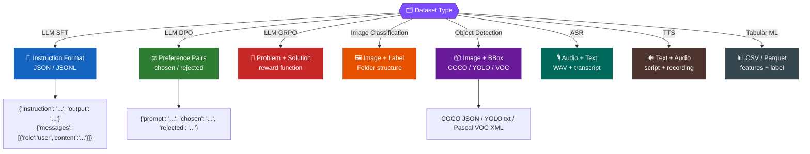

# 🔍 AI Datasets Explorer — Complete Guide

> AI Model အမျိုးအစားအားလုံးအတွက် Dataset ရှာဖွေနိုင်တဲ့ Platform များနှင့် Dataset များ

---

## 📖 Table of Contents

- [Dataset Search Platforms](#-dataset-search-platforms)
- [LLM / NLP Datasets](#-llm--nlp-datasets)
- [Computer Vision Datasets](#-computer-vision-datasets)
- [Audio / Speech Datasets](#-audio--speech-datasets)
- [Multimodal Datasets](#-multimodal-datasets)
- [Reinforcement Learning Datasets](#-reinforcement-learning-datasets)
- [Tabular / Traditional ML Datasets](#-tabular--traditional-ml-datasets)
- [Domain-Specific Datasets](#-domain-specific-datasets)
- [Dataset Format Reference](#-dataset-format-reference)

---

## 🌐 Dataset Search Platforms

### 🏆 Primary Platforms (အဓိက)

| Platform | Link | Datasets | Specialty |
|---|---|---|---|
| **🤗 Hugging Face Datasets** | [huggingface.co/datasets](https://huggingface.co/datasets) | 900,000+ | NLP, LLM, Audio, Vision — အကြီးဆုံး Hub |
| **📊 Kaggle Datasets** | [kaggle.com/datasets](https://www.kaggle.com/datasets) | 300,000+ | Tabular, CV, NLP — Competitions + Notebooks |
| **🔍 Google Dataset Search** | [datasetsearch.research.google.com](https://datasetsearch.research.google.com/) | Billions | Web-wide Dataset Search Engine |
| **🏫 UCI ML Repository** | [archive.ics.uci.edu](https://archive.ics.uci.edu/) | 689 | Classic ML Datasets — Benchmarks |
| **🔬 OpenML** | [openml.org](https://www.openml.org/search?type=data) | 6,383+ | Structured ML Datasets + Benchmarks |
| **📦 TensorFlow Datasets** | [tensorflow.org/datasets](https://www.tensorflow.org/datasets/catalog/overview) | 1,000+ | tf.data compatible — Ready to use |
| **🔥 PyTorch Datasets** | [pytorch.org/vision/datasets](https://docs.pytorch.org/vision/stable/datasets.html) | 100+ | torchvision built-in datasets |

### 🔧 Specialized Platforms

| Platform | Link | Focus |
|---|---|---|
| **🤖 Roboflow Universe** | [universe.roboflow.com](https://universe.roboflow.com/) | Computer Vision — 575K+ datasets, 750M+ images |
| **📚 Papers With Code** | [paperswithcode.com/datasets](https://paperswithcode.com/datasets) | Research Paper Datasets + Benchmarks |
| **☁️ AWS Open Data** | [registry.opendata.aws](https://registry.opendata.aws/) | Large-scale Cloud Datasets |
| **🌍 Common Crawl** | [commoncrawl.org](https://commoncrawl.org/) | Web Crawl Data — 300B+ pages |
| **🎙️ OpenSLR** | [openslr.org](https://openslr.org/resources.php) | Speech & Language Resources |
| **🏛️ Mozilla Common Voice** | [commonvoice.mozilla.org](https://commonvoice.mozilla.org/) | Crowdsourced Voice Data — 100+ Languages |
| **🔗 ModelScope Datasets** | [modelscope.cn/datasets](https://modelscope.cn/datasets) | Chinese AI Community Datasets |
| **📈 Data.gov** | [data.gov](https://data.gov/) | US Government Open Data |
| **🇪🇺 EU Open Data** | [data.europa.eu](https://data.europa.eu/) | European Open Data Portal |

---

## 📝 LLM / NLP Datasets

### Fine-Tuning Datasets (Instruction / Chat)

| Dataset | Link | Size | Use Case |
|---|---|---|---|
| **Alpaca GPT-4** | [HF: AI-ModelScope/alpaca-gpt4-data-en](https://huggingface.co/datasets/AI-ModelScope/alpaca-gpt4-data-en) | 52K | Instruction Following |
| **OpenAssistant** | [HF: OpenAssistant/oasst2](https://huggingface.co/datasets/OpenAssistant/oasst2) | 161K | Multi-turn Chat |
| **ShareGPT** | [HF: anon8231489123/ShareGPT_Vicuna_unfiltered](https://huggingface.co/datasets/anon8231489123/ShareGPT_Vicuna_unfiltered) | 90K | Chat Conversations |
| **Dolly** | [HF: databricks/databricks-dolly-15k](https://huggingface.co/datasets/databricks/databricks-dolly-15k) | 15K | Human-written Instructions |
| **UltraChat** | [HF: stingning/ultrachat](https://huggingface.co/datasets/stingning/ultrachat) | 1.5M | Large-scale Chat |
| **WildChat** | [HF: allenai/WildChat-1M](https://huggingface.co/datasets/allenai/WildChat-1M) | 1M | Real User Conversations |
| **Magpie** | [HF: Magpie-Align](https://huggingface.co/Magpie-Align) | Varies | Self-synthesized SFT Data |

### Pre-Training Datasets

| Dataset | Link | Size | Use Case |
|---|---|---|---|
| **The Pile** | [HF: EleutherAI/pile](https://huggingface.co/datasets/EleutherAI/pile) | 825 GB | English Text Pre-training |
| **RedPajama** | [HF: togethercomputer/RedPajama-Data-V2](https://huggingface.co/datasets/togethercomputer/RedPajama-Data-V2) | 30T tokens | Llama-style Pre-training |
| **FineWeb** | [HF: HuggingFaceFW/fineweb](https://huggingface.co/datasets/HuggingFaceFW/fineweb) | 15T tokens | High-quality Web Data |
| **SlimPajama** | [HF: cerebras/SlimPajama-627B](https://huggingface.co/datasets/cerebras/SlimPajama-627B) | 627B tokens | Deduplicated Training Data |
| **C4** | [HF: allenai/c4](https://huggingface.co/datasets/allenai/c4) | 305 GB | Cleaned Common Crawl |
| **Common Crawl** | [commoncrawl.org](https://commoncrawl.org/) | 300B+ pages | Raw Web Data |

### RLHF / Preference Datasets

| Dataset | Link | Size | Use Case |
|---|---|---|---|
| **HH-RLHF** | [HF: Anthropic/hh-rlhf](https://huggingface.co/datasets/Anthropic/hh-rlhf) | 170K | Helpfulness & Harmlessness |
| **UltraFeedback** | [HF: openbmb/UltraFeedback](https://huggingface.co/datasets/openbmb/UltraFeedback) | 64K | GPT-4 Preference Ratings |
| **Nectar** | [HF: berkeley-nest/Nectar](https://huggingface.co/datasets/berkeley-nest/Nectar) | 183K | Multi-model Ranked Responses |
| **ShareGPT-DPO** | [HF: hjh0119/shareAI-Llama3-DPO-zh-en-emoji](https://huggingface.co/datasets/hjh0119/shareAI-Llama3-DPO-zh-en-emoji) | 10K+ | DPO Training |
| **Orca DPO Pairs** | [HF: Intel/orca_dpo_pairs](https://huggingface.co/datasets/Intel/orca_dpo_pairs) | 13K | DPO Chosen/Rejected Pairs |

### Math / Reasoning Datasets

| Dataset | Link | Size | Use Case |
|---|---|---|---|
| **NuminaMath** | [HF: AI-MO/NuminaMath-TIR](https://huggingface.co/datasets/AI-MO/NuminaMath-TIR) | 72K+ | GRPO Math Reasoning |
| **GSM8K** | [HF: openai/gsm8k](https://huggingface.co/datasets/openai/gsm8k) | 8.5K | Grade School Math |
| **MATH** | [HF: lighteval/MATH](https://huggingface.co/datasets/lighteval/MATH) | 12.5K | Competition Math |
| **MetaMathQA** | [HF: meta-math/MetaMathQA](https://huggingface.co/datasets/meta-math/MetaMathQA) | 395K | Augmented Math QA |
| **OpenMathInstruct** | [HF: nvidia/OpenMathInstruct-2](https://huggingface.co/datasets/nvidia/OpenMathInstruct-2) | 14M | Large-scale Math |

### Code Datasets

| Dataset | Link | Size | Use Case |
|---|---|---|---|
| **The Stack v2** | [HF: bigcode/the-stack-v2](https://huggingface.co/datasets/bigcode/the-stack-v2) | 67.5 TB | Code Pre-training |
| **CodeAlpaca** | [HF: sahil2801/CodeAlpaca-20k](https://huggingface.co/datasets/sahil2801/CodeAlpaca-20k) | 20K | Code Instruction |
| **CodeFeedback** | [HF: m-a-p/CodeFeedback-Filtered-Instruction](https://huggingface.co/datasets/m-a-p/CodeFeedback-Filtered-Instruction) | 157K | Code Fine-tuning |
| **CoderForge** | [HF: togethercomputer/CoderForge-Preview](https://huggingface.co/datasets/togethercomputer/CoderForge-Preview) | 827K+ | Code Training |

### Evaluation / Benchmark Datasets

| Dataset | Link | Purpose |
|---|---|---|
| **MMLU** | [HF: cais/mmlu](https://huggingface.co/datasets/cais/mmlu) | Multi-task Language Understanding |
| **ARC** | [HF: allenai/ai2_arc](https://huggingface.co/datasets/allenai/ai2_arc) | Science Q&A |
| **HellaSwag** | [HF: Rowan/hellaswag](https://huggingface.co/datasets/Rowan/hellaswag) | Common Sense Reasoning |
| **TruthfulQA** | [HF: truthfulqa/truthful_qa](https://huggingface.co/datasets/truthfulqa/truthful_qa) | Truthfulness |
| **HumanEval** | [HF: openai/openai_humaneval](https://huggingface.co/datasets/openai/openai_humaneval) | Code Generation |
| **MT-Bench** | [HF: HuggingFaceH4/mt_bench_prompts](https://huggingface.co/datasets/HuggingFaceH4/mt_bench_prompts) | Multi-turn Chat Quality |

---

## 👁️ Computer Vision Datasets

### Image Classification

| Dataset | Link | Size | Classes |
|---|---|---|---|
| **ImageNet** | [image-net.org](https://www.image-net.org/) | 14M images | 21K+ categories |
| **CIFAR-10/100** | [cs.toronto.edu](https://www.cs.toronto.edu/~kriz/cifar.html) | 60K images | 10/100 classes |
| **MNIST** | [yann.lecun.com](http://yann.lecun.com/exdb/mnist/) | 70K images | 10 digits |
| **Fashion-MNIST** | [github.com/zalandoresearch](https://github.com/zalandoresearch/fashion-mnist) | 70K images | 10 clothing types |
| **Food-101** | [HF: ethz/food101](https://huggingface.co/datasets/ethz/food101) | 101K images | 101 food classes |
| **Flowers-102** | [robots.ox.ac.uk](https://www.robots.ox.ac.uk/~vgg/data/flowers/102/) | 8K images | 102 flower species |
| **Stanford Cars** | [ai.stanford.edu](http://ai.stanford.edu/~jkrause/cars/car_dataset.html) | 16K images | 196 car models |

### Object Detection

| Dataset | Link | Size | Use Case |
|---|---|---|---|
| **COCO** | [cocodataset.org](https://cocodataset.org/) | 330K images | 80 categories — Detection, Segmentation, Captioning |
| **Pascal VOC** | [host.robots.ox.ac.uk](http://host.robots.ox.ac.uk/pascal/VOC/) | 11K images | 20 classes |
| **Open Images v7** | [storage.googleapis.com](https://storage.googleapis.com/openimages/web/index.html) | 9M images | 600+ classes |
| **LVIS** | [lvisdataset.org](https://www.lvisdataset.org/) | 164K images | 1203 categories (long-tail) |
| **Roboflow Universe** | [universe.roboflow.com](https://universe.roboflow.com/) | 575K+ datasets | Custom Object Detection |

### Segmentation

| Dataset | Link | Size | Use Case |
|---|---|---|---|
| **ADE20K** | [groups.csail.mit.edu](https://groups.csail.mit.edu/vision/datasets/ADE20K/) | 25K images | Semantic Segmentation |
| **Cityscapes** | [cityscapes-dataset.com](https://www.cityscapes-dataset.com/) | 5K fine + 20K coarse | Urban Scene Segmentation |
| **SA-1B (SAM)** | [segment-anything.com](https://segment-anything.com/dataset/index.html) | 11M images | 1B+ masks |
| **KITTI** | [cvlibs.net](https://www.cvlibs.net/datasets/kitti/) | Varies | Autonomous Driving |

### Face / Person

| Dataset | Link | Size | Use Case |
|---|---|---|---|
| **CelebA** | [mmlab.ie.cuhk.edu.hk](https://mmlab.ie.cuhk.edu.hk/projects/CelebA.html) | 200K images | Face Attributes |
| **WIDERFace** | [shuoyang1213.me](http://shuoyang1213.me/WIDERFACE/) | 32K images | Face Detection |
| **LFW** | [vis-www.cs.umass.edu](http://vis-www.cs.umass.edu/lfw/) | 13K images | Face Verification |

### Video

| Dataset | Link | Size | Use Case |
|---|---|---|---|
| **Kinetics-700** | [deepmind.com](https://www.deepmind.com/open-source/kinetics) | 650K clips | Action Recognition |
| **UCF-101** | [crcv.ucf.edu](https://www.crcv.ucf.edu/data/UCF101.php) | 13K clips | 101 Actions |
| **ActivityNet** | [activity-net.org](http://activity-net.org/) | 20K videos | Activity Understanding |

---

## 🎙️ Audio / Speech Datasets

### Speech Recognition (ASR)

| Dataset | Link | Hours | Language |
|---|---|---|---|
| **LibriSpeech** | [openslr.org/12](https://openslr.org/12/) | 1,000h | English |
| **Common Voice** | [commonvoice.mozilla.org](https://commonvoice.mozilla.org/) | 20,000h+ | 100+ Languages |
| **GigaSpeech** | [HF: speechcolab/gigaspeech](https://huggingface.co/datasets/speechcolab/gigaspeech) | 10,000h | English |
| **WenetSpeech** | [openslr.org/121](https://openslr.org/121/) | 10,000h+ | Mandarin Chinese |
| **AISHELL** | [openslr.org/33](https://openslr.org/33/) | 178h | Mandarin Chinese |
| **AISHELL-3** | [openslr.org/93](https://openslr.org/93/) | 85h | Mandarin Multi-speaker TTS |
| **MLS** | [openslr.org/94](https://openslr.org/94/) | 50,000h+ | 8 Languages |
| **Multilingual TEDx** | [openslr.org/100](https://openslr.org/100/) | Varies | Multilingual |
| **FLEURS** | [HF: google/fleurs](https://huggingface.co/datasets/google/fleurs) | 12h/lang | 102 Languages |

### Text-to-Speech (TTS)

| Dataset | Link | Hours | Language |
|---|---|---|---|
| **LibriTTS** | [openslr.org/60](https://openslr.org/60/) | 585h | English |
| **LibriTTS-R** | [openslr.org/141](https://openslr.org/141/) | 585h | English (Enhanced) |
| **Hi-Fi TTS** | [openslr.org/109](https://openslr.org/109/) | 292h | English Multi-speaker |
| **CML-TTS** | [openslr.org/146](https://openslr.org/146/) | Varies | Multilingual Low-resource |
| **LJSpeech** | [keithito.com/LJ-Speech-Dataset](https://keithito.com/LJ-Speech-Dataset/) | 24h | English Single-speaker |
| **VCTK** | [datashare.ed.ac.uk](https://datashare.ed.ac.uk/handle/10283/3443) | 44h | English 110 speakers |

### Speaker / Audio

| Dataset | Link | Size | Use Case |
|---|---|---|---|
| **VoxCeleb1/2** | [robots.ox.ac.uk](https://www.robots.ox.ac.uk/~vgg/data/voxceleb/) | 2,000h+ | Speaker Recognition |
| **AudioSet** | [research.google.com](https://research.google.com/audioset/) | 5,800h | Audio Event Classification |
| **MUSAN** | [openslr.org/17](https://openslr.org/17/) | Varies | Music, Speech, Noise |
| **ESC-50** | [github.com/karolpiczak](https://github.com/karolpiczak/ESC-50) | 2000 clips | Environmental Sound |

### Music

| Dataset | Link | Size | Use Case |
|---|---|---|---|
| **MusicCaps** | [HF: google/MusicCaps](https://huggingface.co/datasets/google/MusicCaps) | 5.5K | Music Captioning |
| **MUSDB18** | [sigsep.github.io](https://sigsep.github.io/datasets/musdb.html) | 150 tracks | Music Source Separation |
| **MagnaTagATune** | [mirg.city.ac.uk](https://mirg.city.ac.uk/codeapps/the-magnatagatune-dataset) | 25K clips | Music Tagging |

---

## 🖼️+📝 Multimodal Datasets

### Vision-Language

| Dataset | Link | Size | Use Case |
|---|---|---|---|
| **LAION-5B** | [laion.ai](https://laion.ai/blog/laion-5b/) | 5.85B pairs | Image-Text Pre-training |
| **COCO Captions** | [cocodataset.org](https://cocodataset.org/#captions-2015) | 330K images | Image Captioning (5 captions/image) |
| **Visual Genome** | [visualgenome.org](https://visualgenome.org/) | 108K images | Scene Graphs, QA |
| **VQAv2** | [visualqa.org](https://visualqa.org/) | 265K images | Visual Question Answering |
| **TextVQA** | [textvqa.org](https://textvqa.org/) | 28K images | OCR + VQA |
| **LLaVA-Instruct** | [HF: liuhaotian/LLaVA-Instruct-150K](https://huggingface.co/datasets/liuhaotian/LLaVA-Instruct-150K) | 150K | Multimodal Instruction |
| **ShareGPT4V** | [HF: Lin-Chen/ShareGPT4V](https://huggingface.co/datasets/Lin-Chen/ShareGPT4V) | 100K | High-quality Image Descriptions |

### Audio-Language

| Dataset | Link | Size | Use Case |
|---|---|---|---|
| **WavCaps** | [HF: cvssp/WavCaps](https://huggingface.co/datasets/cvssp/WavCaps) | 403K | Audio Captioning |
| **AudioCaps** | [audiocaps.github.io](https://audiocaps.github.io/) | 50K | Audio Captioning |
| **Clotho** | [zenodo.org](https://zenodo.org/record/3490684) | 5K clips | Audio Captioning |

### Video-Language

| Dataset | Link | Size | Use Case |
|---|---|---|---|
| **WebVid-10M** | [maxbain.com/webvid-dataset](https://maxbain.com/webvid-dataset/) | 10M clips | Video-Text Pre-training |
| **MSR-VTT** | [microsoft.com](https://www.microsoft.com/en-us/research/publication/msr-vtt-a-large-video-description-dataset-for-bridging-video-and-language/) | 10K clips | Video Captioning |
| **HowTo100M** | [howto100m.github.io](https://www.di.ens.fr/willow/research/howto100m/) | 136M clips | Instructional Videos |

---

## 🎮 Reinforcement Learning Datasets

| Dataset | Link | Use Case |
|---|---|---|
| **D4RL** | [github.com/Farama-Foundation/D4RL](https://github.com/Farama-Foundation/D4RL) | Offline RL Benchmarks |
| **Gymnasium (OpenAI Gym)** | [gymnasium.farama.org](https://gymnasium.farama.org/) | RL Environments (CartPole, Atari, MuJoCo) |
| **Minari** | [minari.farama.org](https://minari.farama.org/) | Offline RL Dataset Standard |
| **RLBench** | [sites.google.com/view/rlbench](https://sites.google.com/view/rlbench) | Robot Learning Benchmark |
| **Open X-Embodiment** | [robotics-transformer-x.github.io](https://robotics-transformer-x.github.io/) | Robotics Foundation Model Data |

---

## 📊 Tabular / Traditional ML Datasets

### Best Platforms

| Platform | Link | Best For |
|---|---|---|
| **UCI ML Repository** | [archive.ics.uci.edu](https://archive.ics.uci.edu/) | Classic ML — Iris, Wine, Heart Disease |
| **OpenML** | [openml.org](https://www.openml.org/search?type=data) | 6,383+ Structured Datasets |
| **Kaggle** | [kaggle.com/datasets](https://www.kaggle.com/datasets) | Competitions + Real-world Data |

### Popular Datasets

| Dataset | Source | Instances | Use Case |
|---|---|---|---|
| **Iris** | [UCI](https://archive.ics.uci.edu/dataset/53/iris) | 150 | Classification (Beginner) |
| **Titanic** | [Kaggle](https://www.kaggle.com/c/titanic) | 891 | Binary Classification |
| **Heart Disease** | [UCI](https://archive.ics.uci.edu/dataset/45/heart+disease) | 303 | Medical Classification |
| **Wine Quality** | [UCI](https://archive.ics.uci.edu/dataset/186/wine+quality) | 4,898 | Regression |
| **Adult Income** | [UCI](https://archive.ics.uci.edu/dataset/2/adult) | 48K | Income Prediction |
| **Bank Marketing** | [UCI](https://archive.ics.uci.edu/dataset/222/bank+marketing) | 45K | Marketing |
| **Boston Housing** | [Kaggle](https://www.kaggle.com/datasets/vikrishnan/boston-house-prices) | 506 | Regression (Beginner) |

---

## 🏥 Domain-Specific Datasets

### Medical / Healthcare

| Dataset | Link | Type |
|---|---|---|
| **MIMIC-III/IV** | [physionet.org](https://physionet.org/content/mimiciv/2.2/) | Clinical Records |
| **CheXpert** | [stanfordmlgroup.github.io](https://stanfordmlgroup.github.io/competitions/chexpert/) | Chest X-Ray |
| **PubMedQA** | [HF: qiaojin/PubMedQA](https://huggingface.co/datasets/qiaojin/PubMedQA) | Medical QA |
| **MedQA** | [github.com/jind11/MedQA](https://github.com/jind11/MedQA) | Medical Exam QA |

### Legal

| Dataset | Link | Type |
|---|---|---|
| **Pile of Law** | [HF: pile-of-law/pile-of-law](https://huggingface.co/datasets/pile-of-law/pile-of-law) | Legal Documents |
| **LegalBench** | [HF: nguha/legalbench](https://huggingface.co/datasets/nguha/legalbench) | Legal Reasoning |

### Finance

| Dataset | Link | Type |
|---|---|---|
| **FinQA** | [github.com/czyssrs/FinQA](https://github.com/czyssrs/FinQA) | Financial QA |
| **Financial PhraseBank** | [HF: takala/financial_phrasebank](https://huggingface.co/datasets/takala/financial_phrasebank) | Sentiment |
| **Yahoo Finance** | [kaggle.com](https://www.kaggle.com/datasets?search=yahoo+finance) | Stock / Time Series |

### Science

| Dataset | Link | Type |
|---|---|---|
| **SciQ** | [HF: allenai/sciq](https://huggingface.co/datasets/allenai/sciq) | Science QA |
| **PubMed** | [pubmed.ncbi.nlm.nih.gov](https://pubmed.ncbi.nlm.nih.gov/) | Biomedical Literature |
| **arXiv** | [kaggle.com/datasets/Cornell-University/arxiv](https://www.kaggle.com/datasets/Cornell-University/arxiv) | Academic Papers |

### Myanmar / Southeast Asian

| Dataset | Link | Type |
|---|---|---|
| **Burmese Speech (OpenSLR-80)** | [openslr.org/80](https://openslr.org/80/) | Myanmar ASR |
| **FLORES-200** | [HF: facebook/flores](https://huggingface.co/datasets/facebook/flores) | Myanmar Translation (200 langs) |
| **SEACrowd** | [github.com/SEACrowd](https://github.com/SEACrowd) | SE Asian NLP Collection |

---

## 📋 Dataset Format Reference

### Common Formats by Task



### LLM SFT Dataset Format Example

```json
// Alpaca Format
{"instruction": "Translate to French", "input": "Hello", "output": "Bonjour"}

// ShareGPT / Messages Format
{"messages": [
    {"role": "system", "content": "You are helpful."},
    {"role": "user", "content": "Hello"},
    {"role": "assistant", "content": "Hi! How can I help?"}
]}
```

### Quick Load with 🤗 Datasets

```python
from datasets import load_dataset

# Load from Hugging Face Hub
dataset = load_dataset("AI-ModelScope/alpaca-gpt4-data-en")

# Load local file
dataset = load_dataset("json", data_files="my_data.jsonl")

# Load with streaming (for large datasets)
dataset = load_dataset("HuggingFaceFW/fineweb", streaming=True)

# Load specific split and subset
dataset = load_dataset("cais/mmlu", "anatomy", split="test")
```

---

## 🔍 Dataset ရှာဖွေခြင်း Tips

| Step | Action | Tool |
|---|---|---|
| 1️⃣ | Task type ကို ဆုံးဖြတ်ပါ (NLP, CV, Audio...) | — |
| 2️⃣ | Hugging Face Hub မှာ keyword နဲ့ ရှာပါ | [HF Datasets](https://huggingface.co/datasets) |
| 3️⃣ | Kaggle မှာ competition datasets ရှာပါ | [Kaggle](https://www.kaggle.com/datasets) |
| 4️⃣ | Google Dataset Search နဲ့ broader search လုပ်ပါ | [Dataset Search](https://datasetsearch.research.google.com/) |
| 5️⃣ | Papers With Code မှာ SOTA benchmarks ကြည့်ပါ | [PwC](https://paperswithcode.com/datasets) |
| 6️⃣ | Domain-specific repos ကို စစ်ဆေးပါ (OpenSLR, Roboflow...) | Above links |
