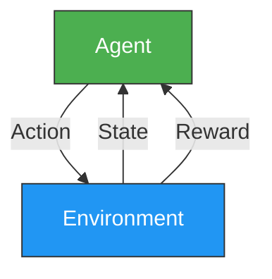
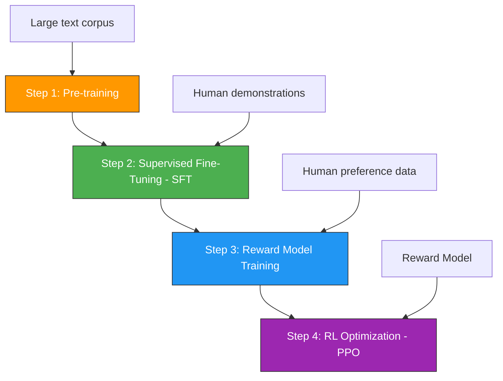
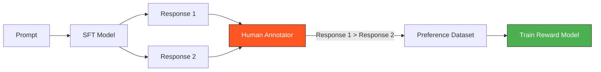
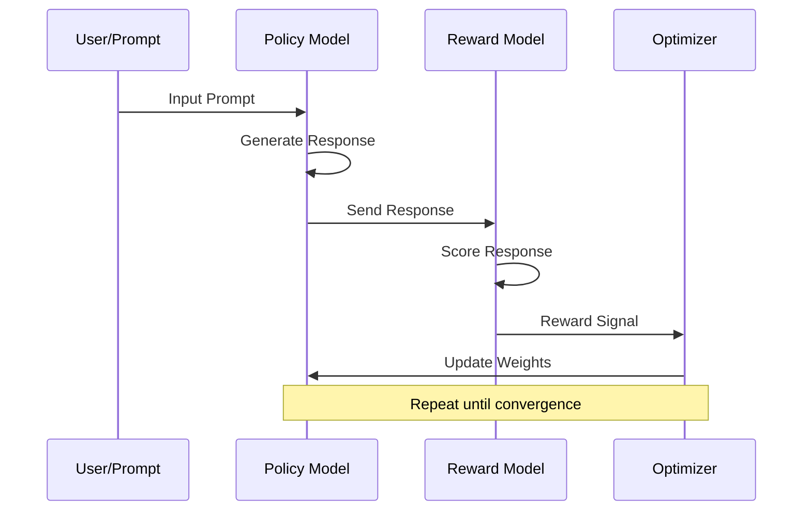
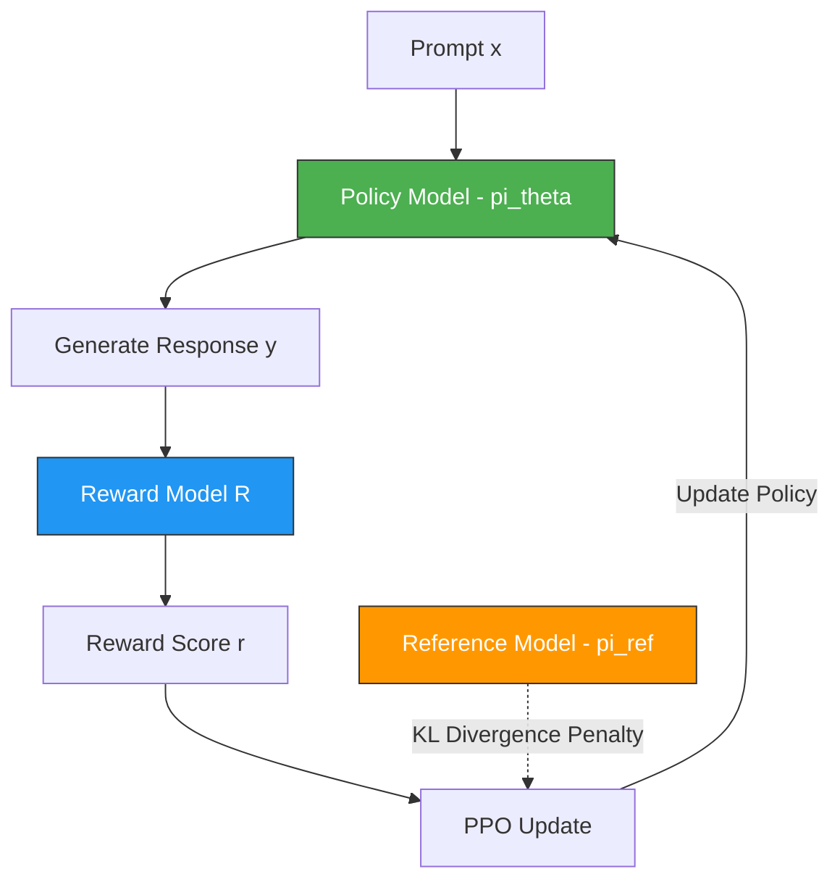
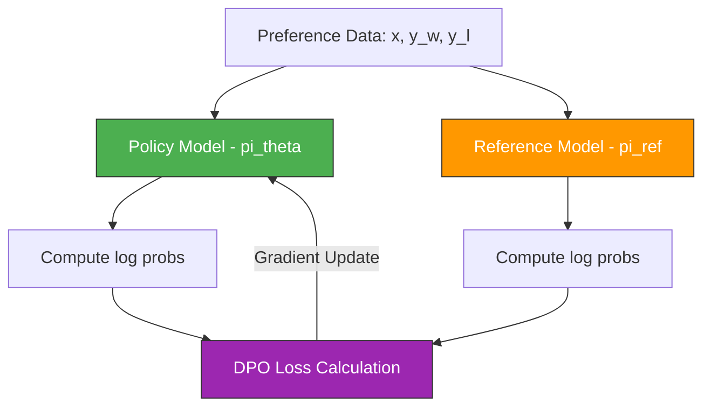
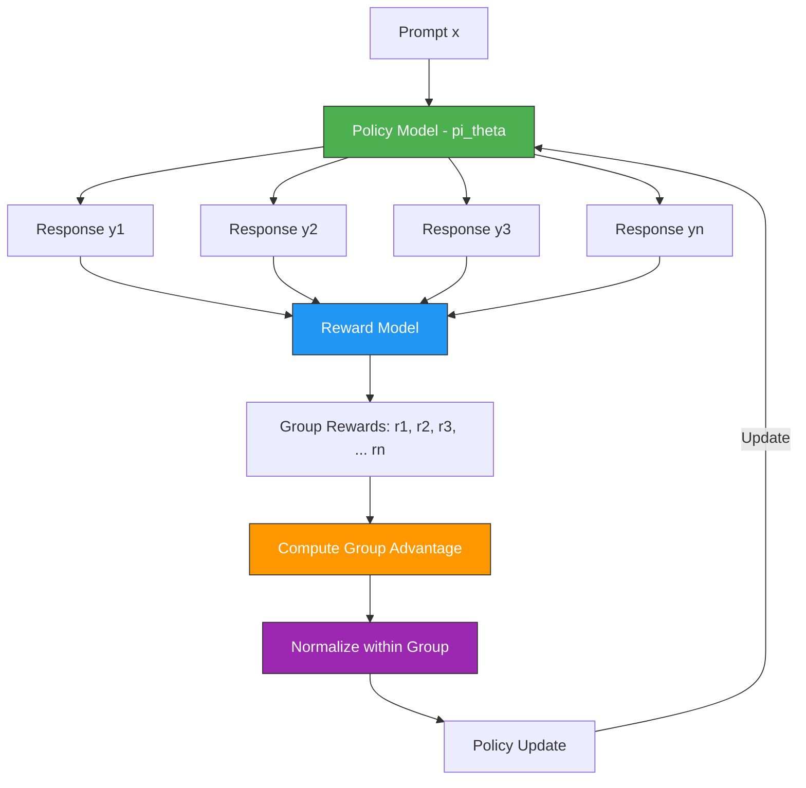

# Reinforcement Learning in Large Language Models (LLMs)

## မာတိကာ (Table of Contents)

- [1. Reinforcement Learning (RL) အခြေခံ](#1-reinforcement-learning-rl-အခြေခံ)
- [2. LLMs မှာ RL ဘာကြောင့်လိုအပ်သလဲ](#2-llms-မှာ-rl-ဘာကြောင့်လိုအပ်သလဲ)
- [3. RLHF - Reinforcement Learning from Human Feedback](#3-rlhf---reinforcement-learning-from-human-feedback)
- [4. Reward Model Training](#4-reward-model-training)
- [5. PPO - Proximal Policy Optimization](#5-ppo---proximal-policy-optimization)
- [6. DPO - Direct Preference Optimization](#6-dpo---direct-preference-optimization)
- [7. GRPO - Group Relative Policy Optimization](#7-grpo---group-relative-policy-optimization)
- [8. KTO - Kahneman-Tversky Optimization](#8-kto---kahneman-tversky-optimization)
- [9. RLHF Full Pipeline Workflow](#9-rlhf-full-pipeline-workflow)
- [10. Methods Comparison](#10-methods-comparison)
- [11. Practical Considerations](#11-practical-considerations)

---

## 1. Reinforcement Learning (RL) အခြေခံ

### RL ဆိုတာ ဘာလဲ

Reinforcement Learning (RL) ဆိုတာ Machine Learning ရဲ့ paradigm တစ်ခုဖြစ်ပြီး **agent** တစ်ခုက **environment** ထဲမှာ **action** တွေလုပ်ဆောင်ပြီး **reward** signal ကိုအခြေခံပြီး ကောင်းမွန်တဲ့ **policy** ကို သင်ယူတဲ့ နည်းစနစ်ဖြစ်ပါတယ်။

### Core Concepts

| Concept | Description (Myanmar) | LLM Context |
|---------|----------------------|-------------|
| **Agent** | ဆုံးဖြတ်ချက်ချတဲ့ entity | LLM Model |
| **Environment** | Agent ရဲ့ ပတ်ဝန်းကျင် | User prompts + conversation context |
| **State (s)** | လက်ရှိအခြေအနေ | Input prompt + generated tokens so far |
| **Action (a)** | Agent လုပ်ဆောင်တဲ့ အရာ | Next token to generate |
| **Reward (r)** | Action ကောင်းမကောင်း feedback | Reward model score / human preference |
| **Policy (π)** | State ပေါ်မူတည်ပြီး action ရွေးတဲ့ strategy | LLM's probability distribution over tokens |

### RL Basic Loop



### RL ရဲ့ Goal

RL ရဲ့ ရည်ရွယ်ချက်က **expected cumulative reward ကို maximize** လုပ်ဖို့ optimal policy $\pi^*$ ကို ရှာတာဖြစ်ပါတယ်။

$$\pi^* = \arg\max_{\pi} \mathbb{E}_{\tau \sim \pi} \left[ \sum_{t=0}^{T} \gamma^t r_t \right]$$

- $\gamma$ - discount factor (0 < γ ≤ 1)
- $r_t$ - time step t မှာ ရတဲ့ reward
- $\tau$ - trajectory (state-action sequence)

---

## 2. LLMs မှာ RL ဘာကြောင့်လိုအပ်သလဲ

### Pre-training ရဲ့ ကန့်သတ်ချက်များ

LLM တွေကို pre-train လုပ်တဲ့အခါ **next token prediction** (causal language modeling) နဲ့ train ပါတယ်။ ဒါပေမယ့် ဒီနည်းနဲ့ train ထားတဲ့ model တွေမှာ **အားနည်းချက်တွေ** ရှိပါတယ်:

1. **Helpfulness** - User ကိုအသုံးဝင်တဲ့ အဖြေပေးဖို့ explicitly train မထားဘူး
2. **Harmlessness** - Toxic/harmful content generate လုပ်နိုင်တယ်
3. **Honesty** - Hallucination လုပ်ပြီး မှားတဲ့ information ပေးနိုင်တယ်
4. **Instruction Following** - User ရဲ့ instruction ကို တိကျစွာ follow မလုပ်နိုင်ဘူး

### RL က ဘယ်လိုကူညီသလဲ

RL ကိုသုံးပြီး model ကို **human preferences** အတိုင်း align လုပ်ပါတယ်:

- ✅ User ကိုအသုံးဝင်တဲ့ response generate လုပ်ဖို့ optimize
- ✅ Harmful/toxic content ကို ရှောင်ဖို့ learn
- ✅ Factual accuracy ကို improve
- ✅ Instruction following capability ကို enhance

### LLM Training Pipeline



---

## 3. RLHF - Reinforcement Learning from Human Feedback

### RLHF ဆိုတာ ဘာလဲ

RLHF ဆိုတာ **human feedback ကို reward signal** အဖြစ်သုံးပြီး LLM ကို optimize လုပ်တဲ့ method ဖြစ်ပါတယ်။ OpenAI ရဲ့ InstructGPT paper (2022) မှာ ပထမဆုံး widely adopted ဖြစ်ခဲ့ပြီး ChatGPT, Claude, Gemini စတဲ့ modern LLMs အားလုံးမှာ အသုံးပြုပါတယ်။

### RLHF ရဲ့ 3 Stages

#### Stage 1: Supervised Fine-Tuning (SFT)

Pre-trained model ကို high-quality demonstration data နဲ့ fine-tune လုပ်ပါတယ်:

```
Input: "ပြည်ထောင်စုမြန်မာနိုင်ငံရဲ့ မြို့တော်ကဘာလဲ?"
Output: "ပြည်ထောင်စုမြန်မာနိုင်ငံရဲ့ မြို့တော်ကတော့ နေပြည်တော် ဖြစ်ပါတယ်။"
```

**SFT ရဲ့ Loss Function:**

$$\mathcal{L}_{\text{SFT}} = -\sum_{t=1}^{T} \log \pi_\theta(y_t | x, y_{<t})$$

- $x$ = input prompt
- $y_t$ = target token at position t
- $\pi_\theta$ = model with parameters θ

#### Stage 2: Reward Model Training

Human annotators ကနေ preference data ကို collect ပြီး Reward Model ကို train ပါတယ်:



#### Stage 3: RL Optimization (PPO)

Reward Model ကိုသုံးပြီး Policy (LLM) ကို optimize ပါတယ်:



---

## 4. Reward Model Training

### Reward Model ဆိုတာ ဘာလဲ

Reward Model (RM) ဆိုတာ (prompt, response) pair ကို input အဖြစ်ယူပြီး **scalar reward score** ကို output ထုတ်ပေးတဲ့ model ဖြစ်ပါတယ်။ Human preferences ကို approximate လုပ်ဖို့ train ပါတယ်။

### Data Collection

Human annotators ကနေ comparison data ကို collect ပါတယ်:

```
Prompt: "Python မှာ list ကို reverse ဘယ်လိုလုပ်မလဲ?"

Response A: "my_list.reverse() ဒါမှမဟုတ် my_list[::-1] ကိုသုံးပါ။"
Response B: "Python ကတော့ programming language တစ်ခုပါ။"

Human Preference: A > B  (A is preferred over B)
```

### Bradley-Terry Model

Reward Model ကို train ရာမှာ **Bradley-Terry preference model** ကိုသုံးပါတယ်:

$$P(y_w \succ y_l | x) = \sigma(r_\theta(x, y_w) - r_\theta(x, y_l))$$

- $y_w$ = preferred (winning) response
- $y_l$ = rejected (losing) response
- $r_\theta$ = reward model
- $\sigma$ = sigmoid function

### Reward Model Loss

$$\mathcal{L}_{\text{RM}} = -\mathbb{E}_{(x, y_w, y_l) \sim \mathcal{D}} \left[ \log \sigma(r_\theta(x, y_w) - r_\theta(x, y_l)) \right]$$

ဒီ loss ကို minimize လုပ်ခြင်းအားဖြင့် reward model က preferred response ကို higher score ပေးဖို့ learn ပါတယ်။

### Reward Model Architecture

Reward Model ကို typically SFT model ကနေ initialize လုပ်ပြီး:
- Last token ရဲ့ hidden state ကို **linear projection** ပြုလုပ်ပြီး scalar reward ထုတ်ပါတယ်
- Model size က usually policy model ရဲ့ size နဲ့ comparable ဖြစ်ပါတယ်

```
Input: [prompt + response] → Transformer → Last Hidden State → Linear → Scalar Reward
```

---

## 5. PPO - Proximal Policy Optimization

### PPO ဆိုတာ ဘာလဲ

PPO ဆိုတာ OpenAI ကတီထွင်ခဲ့တဲ့ **policy gradient method** ဖြစ်ပြီး RLHF မှာ **အသုံးအများဆုံး** RL algorithm ဖြစ်ပါတယ်။ Training ကို stable ဖြစ်စေဖို့ policy update ကို clip (ကန့်သတ်) ပါတယ်။

### PPO Workflow in LLMs



### PPO ရဲ့ Objective Function

LLM context မှာ PPO ရဲ့ objective:

$$\mathcal{J}_{\text{PPO}}(\theta) = \mathbb{E}_{(x,y) \sim \pi_\theta} \left[ r_\phi(x, y) - \beta \cdot D_{\text{KL}}(\pi_\theta(y|x) \| \pi_{\text{ref}}(y|x)) \right]$$

- $r_\phi(x, y)$ — Reward Model ရဲ့ score
- $\beta$ — KL penalty coefficient
- $D_{\text{KL}}$ — KL Divergence (policy model နဲ့ reference model ကြား)
- $\pi_{\text{ref}}$ — Reference model (SFT model, frozen)

### KL Divergence Penalty ဘာကြောင့်လိုသလဲ

KL penalty ကို ထည့်ရတဲ့ အကြောင်းအရင်းတွေ:

1. **Reward Hacking Prevention** — Model က reward model ကို "hack" လုပ်ပြီး meaningless but high-reward outputs generate မလုပ်အောင်
2. **Stability** — Policy update တွေ too large မဖြစ်အောင်
3. **Quality Maintenance** — SFT model ရဲ့ language quality ကို maintain ထားဖို့

### PPO Clipped Objective

PPO ရဲ့ core idea က ratio clipping ဖြစ်ပါတယ်:

$$\mathcal{L}^{\text{CLIP}}(\theta) = \mathbb{E}_t \left[ \min \left( r_t(\theta) \hat{A}_t, \; \text{clip}(r_t(\theta), 1-\epsilon, 1+\epsilon) \hat{A}_t \right) \right]$$

- $r_t(\theta) = \frac{\pi_\theta(a_t|s_t)}{\pi_{\theta_{\text{old}}}(a_t|s_t)}$ — probability ratio
- $\hat{A}_t$ — estimated advantage
- $\epsilon$ — clipping parameter (typically 0.1 ~ 0.2)

### PPO Training Loop (Pseudocode)

```python
# PPO Training Loop for LLM
for iteration in range(num_iterations):
    # 1. Collect experiences
    prompts = sample_prompts(dataset)
    responses = policy_model.generate(prompts)
    
    # 2. Compute rewards
    rewards = reward_model(prompts, responses)
    
    # 3. Compute KL penalty
    kl_div = compute_kl(policy_model, reference_model, prompts, responses)
    adjusted_rewards = rewards - beta * kl_div
    
    # 4. Compute advantages using GAE
    advantages = compute_gae(adjusted_rewards, values)
    
    # 5. PPO update (multiple epochs on same batch)
    for epoch in range(ppo_epochs):
        ratio = policy_model.log_prob(responses) - old_log_probs
        ratio = torch.exp(ratio)
        
        # Clipped objective
        surr1 = ratio * advantages
        surr2 = torch.clamp(ratio, 1 - epsilon, 1 + epsilon) * advantages
        policy_loss = -torch.min(surr1, surr2).mean()
        
        # Update policy
        optimizer.zero_grad()
        policy_loss.backward()
        optimizer.step()
```

### PPO ရဲ့ Components (4 Models Required)

| Model | Role | Trainable? |
|-------|------|------------|
| **Policy Model** ($\pi_\theta$) | Response generate လုပ်ပြီး optimize ခံရမယ့် model | ✅ Yes |
| **Reference Model** ($\pi_{\text{ref}}$) | KL divergence compute ဖို့ SFT model ရဲ့ copy | ❌ Frozen |
| **Reward Model** ($r_\phi$) | Response quality ကို score ပေးတဲ့ model | ❌ Frozen |
| **Value Model** ($V_\psi$) | Advantage estimation အတွက် value function | ✅ Yes |

> ⚠️ **Note:** PPO ဟာ 4 models လိုအပ်တဲ့အတွက် memory intensive ဖြစ်ပြီး training infrastructure ရှုပ်ထွေးပါတယ်။

---

## 6. DPO - Direct Preference Optimization

### DPO ဆိုတာ ဘာလဲ

DPO (Rafailov et al., 2023) ဆိုတာ **Reward Model ကို separately train မလိုဘဲ** preference data ကနေ directly policy ကို optimize လုပ်တဲ့ method ဖြစ်ပါတယ်။ RLHF ရဲ့ **simpler alternative** ဖြစ်ပါတယ်။

### DPO ရဲ့ Key Insight

RLHF objective ရဲ့ optimal solution ကို closed-form expression အဖြစ် ရေးနိုင်ပါတယ်:

$$\pi^*(y|x) = \frac{1}{Z(x)} \pi_{\text{ref}}(y|x) \exp\left(\frac{1}{\beta} r(x, y)\right)$$

ဒီ relationship ကို rearrange လုပ်ပြီး reward ကို policy terms နဲ့ express လုပ်နိုင်ပါတယ်:

$$r(x, y) = \beta \log \frac{\pi_\theta(y|x)}{\pi_{\text{ref}}(y|x)} + \beta \log Z(x)$$

### DPO Loss Function

$$\mathcal{L}_{\text{DPO}}(\theta) = -\mathbb{E}_{(x, y_w, y_l) \sim \mathcal{D}} \left[ \log \sigma \left( \beta \log \frac{\pi_\theta(y_w|x)}{\pi_{\text{ref}}(y_w|x)} - \beta \log \frac{\pi_\theta(y_l|x)}{\pi_{\text{ref}}(y_l|x)} \right) \right]$$

- $y_w$ = preferred response
- $y_l$ = rejected response
- $\beta$ = temperature parameter
- $\pi_{\text{ref}}$ = reference policy (frozen SFT model)

### DPO Workflow



### DPO Training (Pseudocode)

```python
# DPO Training Loop
for batch in dataloader:
    prompts, chosen, rejected = batch
    
    # Forward pass through policy model
    chosen_logprobs = policy_model.log_prob(prompts, chosen)
    rejected_logprobs = policy_model.log_prob(prompts, rejected)
    
    # Forward pass through reference model (no grad)
    with torch.no_grad():
        ref_chosen_logprobs = ref_model.log_prob(prompts, chosen)
        ref_rejected_logprobs = ref_model.log_prob(prompts, rejected)
    
    # Compute DPO loss
    chosen_rewards = beta * (chosen_logprobs - ref_chosen_logprobs)
    rejected_rewards = beta * (rejected_logprobs - ref_rejected_logprobs)
    
    loss = -F.logsigmoid(chosen_rewards - rejected_rewards).mean()
    
    # Update policy
    optimizer.zero_grad()
    loss.backward()
    optimizer.step()
```

### DPO vs PPO Comparison

| Aspect | PPO (RLHF) | DPO |
|--------|-----------|-----|
| **Reward Model** | Separately trained RM required | RM မလို - implicit |
| **Models needed** | 4 (Policy, Ref, RM, Value) | 2 (Policy, Ref) |
| **Memory** | Very high (4 models) | Lower (2 models) |
| **Training Stability** | Hyperparameter sensitive | More stable |
| **Implementation** | Complex RL loop | Simple supervised loss |
| **Performance** | Strong with careful tuning | Comparable to PPO |
| **Online/Offline** | Online (generates new data) | Offline (fixed dataset) |
| **Scalability** | Harder to scale | Easier to scale |

---

## 7. GRPO - Group Relative Policy Optimization

### GRPO ဆိုတာ ဘာလဲ

GRPO (DeepSeek, 2024) ဆိုတာ PPO ရဲ့ **simplified variant** ဖြစ်ပြီး **Value Model (critic) ကို ဖယ်ရှားပြီး** group-level advantage estimation ကိုသုံးတဲ့ method ဖြစ်ပါတယ်။ DeepSeek-R1 model မှာ အသုံးပြုခဲ့ပါတယ်။

### GRPO ရဲ့ Key Innovation

PPO မှာ value model ($V_\psi$) ကိုသုံးပြီး advantage estimate လုပ်ရပေမယ့်၊ GRPO မှာ:

1. Prompt တစ်ခုအတွက် **multiple responses (group)** generate လုပ်ပါတယ်
2. Group ထဲက responses တွေရဲ့ **rewards ကို normalize** လုပ်ပြီး advantage အဖြစ်သုံးပါတယ်
3. **Value model မလိုအပ်ဘူး** — memory နဲ့ computation သက်သာပါတယ်

### GRPO Workflow



### GRPO Advantage Calculation

PPO ရဲ့ GAE-based advantage အစား GRPO က group statistics ကိုသုံးပါတယ်:

$$\hat{A}_i = \frac{r_i - \text{mean}(\{r_1, r_2, ..., r_G\})}{\text{std}(\{r_1, r_2, ..., r_G\})}$$

- $G$ = group size (prompt တစ်ခုအတွက် generate လုပ်ထားတဲ့ response အရေအတွက်)
- $r_i$ = response $i$ ရဲ့ reward

### GRPO Objective

$$\mathcal{J}_{\text{GRPO}}(\theta) = \mathbb{E}_{x \sim \mathcal{D}, \{y_i\}_{i=1}^G \sim \pi_{\theta_{\text{old}}}(\cdot|x)} \left[ \frac{1}{G} \sum_{i=1}^{G} \min \left( \frac{\pi_\theta(y_i|x)}{\pi_{\theta_{\text{old}}}(y_i|x)} \hat{A}_i, \; \text{clip}(\cdot, 1-\epsilon, 1+\epsilon) \hat{A}_i \right) - \beta \cdot D_{\text{KL}}(\pi_\theta \| \pi_{\text{ref}}) \right]$$

### GRPO vs PPO

| Aspect | PPO | GRPO |
|--------|-----|------|
| **Value Model** | Required | ❌ Not needed |
| **Models needed** | 4 | 3 (Policy, Ref, RM) |
| **Advantage** | GAE with value model | Group normalization |
| **Memory** | Very high | Lower than PPO |
| **Sampling** | 1 response per prompt | G responses per prompt |
| **Used in** | ChatGPT, etc. | DeepSeek-R1 |

---

## 8. KTO - Kahneman-Tversky Optimization

### KTO ဆိုတာ ဘာလဲ

KTO (Ethayarajh et al., 2024) ဆိုတာ **paired preference data မလိုဘဲ** individual response-level feedback (thumbs up/down) ကနေ directly optimize လုပ်နိုင်တဲ့ method ဖြစ်ပါတယ်။

### KTO ရဲ့ Motivation

- DPO/RLHF မှာ (chosen, rejected) **pairs** လိုအပ်ပါတယ်
- Real-world data မှာ paired comparisons ထက် **individual ratings** (like/dislike) ကပို collect လုပ်ရလွယ်ပါတယ်
- KTO ဟာ Kahneman & Tversky ရဲ့ **Prospect Theory** ကို RL alignment မှာ apply ပါတယ်

### KTO Loss Function

$$\mathcal{L}_{\text{KTO}}(\theta) = \mathbb{E}_{(x,y) \sim \mathcal{D}} \left[ w(y) \cdot \left(1 - v_\theta(x, y) \right) \right]$$

where:

$$v_\theta(x, y) = \begin{cases} \sigma(\beta \cdot r_\theta(x,y) - z_{\text{ref}}) & \text{if } y \text{ is desirable} \\ \sigma(z_{\text{ref}} - \beta \cdot r_\theta(x,y)) & \text{if } y \text{ is undesirable} \end{cases}$$

- $r_\theta(x,y) = \log \frac{\pi_\theta(y|x)}{\pi_{\text{ref}}(y|x)}$ — implicit reward
- $z_{\text{ref}}$ — reference point (KL divergence)

### DPO vs KTO Data Requirements

| Aspect | DPO | KTO |
|--------|-----|-----|
| **Data format** | (prompt, chosen, rejected) triples | (prompt, response, label) |
| **Pairing** | Must be paired | No pairing needed |
| **Label** | Implicit (chosen > rejected) | Binary (good/bad) |
| **Data collection** | Harder | Easier |

---

## 9. RLHF Full Pipeline Workflow

### End-to-End Pipeline

LLM တစ်ခုကို pre-training ကနေ alignment ထိ full pipeline ကို ဒီလိုမြင်ယောင်နိုင်ပါတယ်:

```
┌─────────────────────────────────────────────────────────────────────┐
│                    LLM Alignment Pipeline                          │
├─────────────────────────────────────────────────────────────────────┤
│                                                                     │
│  ┌──────────────┐    ┌──────────────┐    ┌───────────────────────┐  │
│  │ Pre-training  │───▶│     SFT      │───▶│   Alignment (RL)     │  │
│  │              │    │              │    │                       │  │
│  │ • Next token │    │ • Instruct   │    │ • RLHF (PPO)         │  │
│  │   prediction │    │   tuning     │    │ • DPO                │  │
│  │ • Massive    │    │ • Demo data  │    │ • GRPO               │  │
│  │   corpus     │    │              │    │ • KTO                │  │
│  └──────────────┘    └──────────────┘    └───────────────────────┘  │
│                                                                     │
│  Data:                Data:                Data:                     │
│  Web crawl,           Human-written        Human preferences,       │
│  books, code          demonstrations       comparison data           │
│                                                                     │
│  Scale:               Scale:               Scale:                    │
│  Trillions of         10K - 100K           10K - 1M                 │
│  tokens               examples             comparisons              │
└─────────────────────────────────────────────────────────────────────┘
```

### Method Selection Guide

ဘယ် method ကိုသုံးမလဲ ရွေးချယ်ဖို့:

```
📋 Decision Tree:

Q1: Paired preference data ရှိသလား?
├── YES → Q2: Compute resource များများ ရှိသလား?
│   ├── YES → Q3: Online learning လိုသလား?
│   │   ├── YES → ✅ PPO (RLHF)
│   │   └── NO  → ✅ DPO
│   └── NO  → ✅ DPO
└── NO  → Q4: Individual ratings (good/bad) ရှိသလား?
    ├── YES → ✅ KTO
    └── NO  → Preference data collect လုပ်ပါ
```

---

## 10. Methods Comparison

### Comprehensive Comparison Table

| Feature | PPO (RLHF) | DPO | GRPO | KTO |
|---------|-----------|-----|------|-----|
| **Paper Year** | 2017/2022 | 2023 | 2024 | 2024 |
| **Reward Model** | ✅ Required | ❌ Implicit | ✅ Required | ❌ Implicit |
| **Value Model** | ✅ Required | ❌ Not needed | ❌ Not needed | ❌ Not needed |
| **Models in Memory** | 4 | 2 | 3 | 2 |
| **Data Type** | Preferences | Paired Preferences | Preferences | Binary Feedback |
| **Online/Offline** | Online | Offline | Online | Offline |
| **Training Stability** | ⚠️ Sensitive | ✅ Stable | ✅ Stable | ✅ Stable |
| **Implementation** | Complex | Simple | Medium | Simple |
| **Memory Usage** | 🔴 Very High | 🟢 Low | 🟡 Medium | 🟢 Low |
| **Notable Users** | ChatGPT, Claude | Llama, Zephyr | DeepSeek-R1 | Research |

### Performance Characteristics

```
Memory Usage (relative):

PPO:  ████████████████████ (4 models)
GRPO: ███████████████      (3 models)  
DPO:  ██████████           (2 models)
KTO:  ██████████           (2 models)

Training Complexity:

PPO:  ████████████████████ (RL loop + 4 models)
GRPO: ██████████████       (Simplified RL)
DPO:  ██████               (Supervised-like)
KTO:  ██████               (Supervised-like)
```

---

## 11. Practical Considerations

### Hardware Requirements

| Method | Minimum GPU Memory (7B model) | Recommended Setup |
|--------|------------------------------|-------------------|
| **PPO** | 4 × 80GB (A100) | Multi-node cluster |
| **GRPO** | 3 × 80GB (A100) | Multi-GPU server |
| **DPO** | 2 × 48GB (A6000) | Single multi-GPU server |
| **KTO** | 2 × 48GB (A6000) | Single multi-GPU server |

> 💡 **Tip:** LoRA/QLoRA ကိုသုံးပြီး memory requirement ကို significantly reduce လုပ်နိုင်ပါတယ်

### Popular Frameworks

| Framework | Supported Methods | Notes |
|-----------|------------------|-------|
| **TRL (HuggingFace)** | PPO, DPO, KTO, ORPO | Most popular, well-documented |
| **OpenRLHF** | PPO, DPO, GRPO | Distributed training support |
| **DeepSpeed-Chat** | PPO | Microsoft, good scaling |
| **Axolotl** | DPO, ORPO | Easy config-based setup |
| **LLaMA-Factory** | PPO, DPO, KTO, ORPO | Multi-method support |

### TRL DPO Training Example

```python
from trl import DPOTrainer, DPOConfig
from transformers import AutoModelForCausalLM, AutoTokenizer
from datasets import load_dataset

# Load model and tokenizer
model = AutoModelForCausalLM.from_pretrained("meta-llama/Llama-3.2-1B-Instruct")
ref_model = AutoModelForCausalLM.from_pretrained("meta-llama/Llama-3.2-1B-Instruct")
tokenizer = AutoTokenizer.from_pretrained("meta-llama/Llama-3.2-1B-Instruct")

# Load preference dataset
# Format: {"prompt": "...", "chosen": "...", "rejected": "..."}
dataset = load_dataset("your_preference_dataset")

# DPO Config
training_args = DPOConfig(
    output_dir="./dpo_output",
    num_train_epochs=3,
    per_device_train_batch_size=4,
    gradient_accumulation_steps=4,
    learning_rate=5e-7,
    beta=0.1,  # Temperature parameter
    logging_steps=10,
    bf16=True,
)

# Initialize DPO Trainer
trainer = DPOTrainer(
    model=model,
    ref_model=ref_model,
    args=training_args,
    train_dataset=dataset["train"],
    processing_class=tokenizer,
)

# Train
trainer.train()
```

### Common Pitfalls & Solutions

| Problem | Cause | Solution |
|---------|-------|----------|
| **Reward Hacking** | Model exploits RM weaknesses | KL penalty ကို tune, RM ကို improve |
| **Mode Collapse** | Policy generates same responses | KL penalty increase, temperature tuning |
| **Training Instability** | Learning rate too high | LR reduce, gradient clipping |
| **Catastrophic Forgetting** | RL overwrites SFT capabilities | KL penalty, moderate training steps |
| **Reward Over-optimization** | Goodhart's Law | Multiple RMs, regularization |

### Best Practices

1. **SFT First** — RL alignment မလုပ်ခင် good SFT model ရှိရမယ်
2. **Quality Data** — Preference data ရဲ့ quality က method ထက်ပိုအရေးကြီးတယ်
3. **Start Simple** — DPO နဲ့ စပြီး PPO ကိုလိုအပ်မှ ပြောင်းပါ
4. **Monitor KL** — KL divergence ကို closely monitor လုပ်ပါ
5. **Eval Frequently** — Training ကို regularly evaluate လုပ်ပါ
6. **Use LoRA** — Full fine-tuning ထက် LoRA/QLoRA ကသုံးရလွယ်ပြီး ထိရောက်တယ်

---

## References

1. Ouyang et al. (2022) - [Training language models to follow instructions with human feedback](https://arxiv.org/abs/2203.02155) (InstructGPT/RLHF)
2. Schulman et al. (2017) - [Proximal Policy Optimization Algorithms](https://arxiv.org/abs/1707.06347) (PPO)
3. Rafailov et al. (2023) - [Direct Preference Optimization](https://arxiv.org/abs/2305.18290) (DPO)
4. Shao et al. (2024) - [DeepSeekMath: Pushing the Limits of Mathematical Reasoning](https://arxiv.org/abs/2402.03300) (GRPO)
5. Ethayarajh et al. (2024) - [KTO: Model Alignment as Prospect Theoretic Optimization](https://arxiv.org/abs/2402.01306) (KTO)
6. Christiano et al. (2017) - [Deep Reinforcement Learning from Human Preferences](https://arxiv.org/abs/1706.03741)
7. Bai et al. (2022) - [Training a Helpful and Harmless Assistant with RLHF](https://arxiv.org/abs/2204.05862) (Anthropic)
