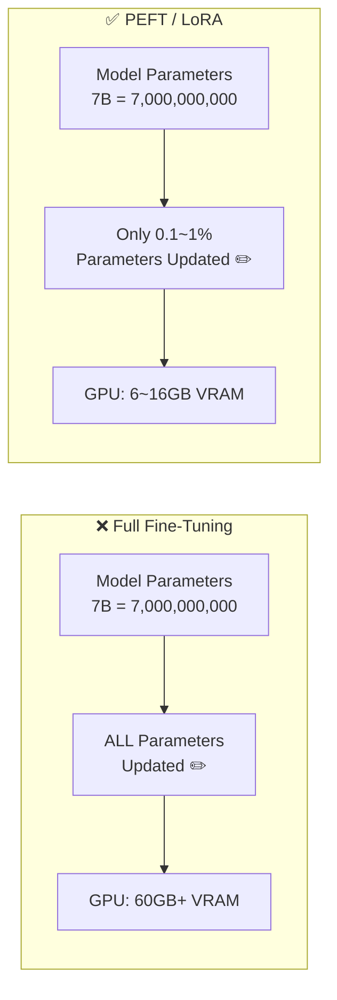
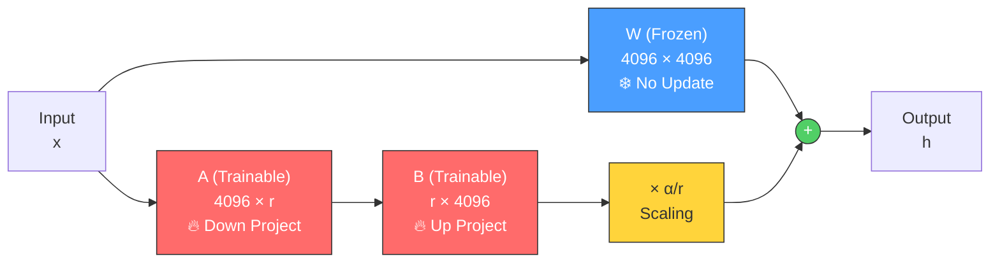
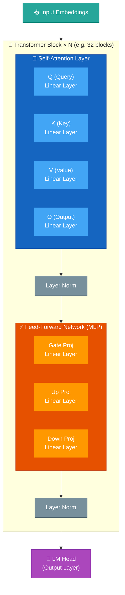
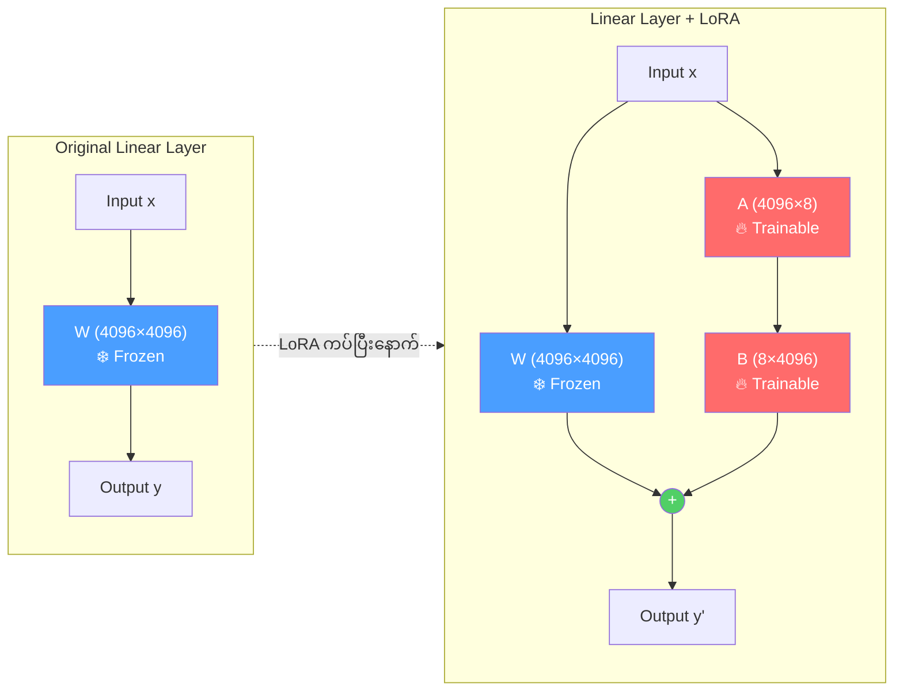
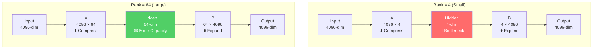
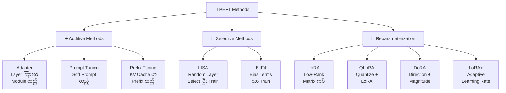
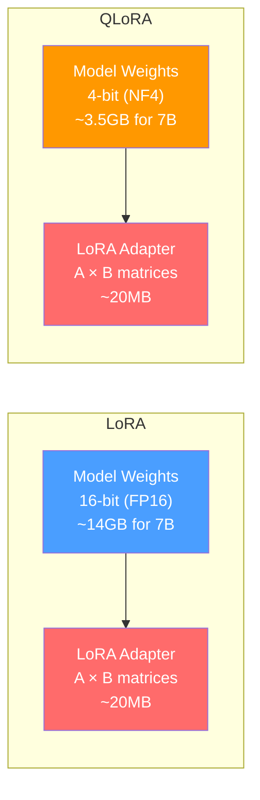
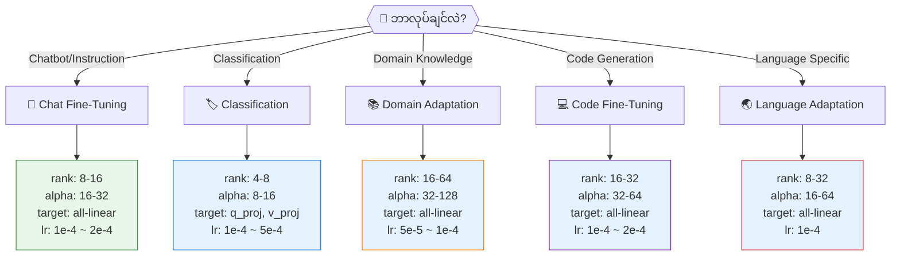
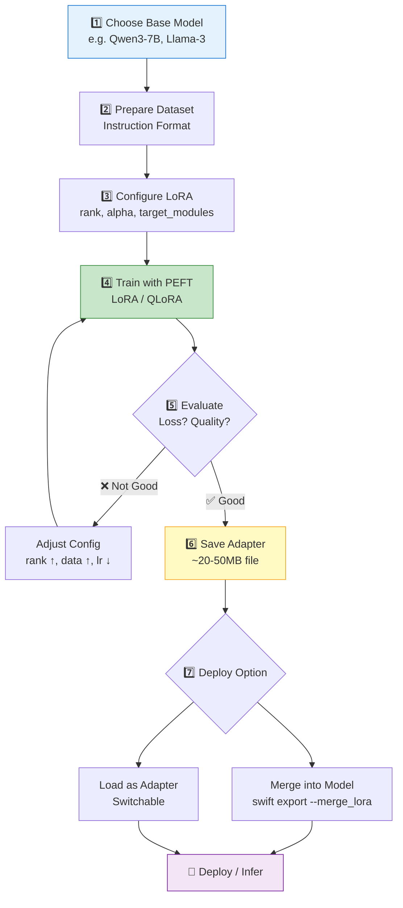

# PEFT (Parameter-Efficient Fine-Tuning) — Complete Guide

> Beginner-Friendly Guide — ML အသစ်စလေ့လာသူများအတွက်

---

## 📖 Table of Contents

- [PEFT ဆိုတာ ဘာလဲ](#peft-ဆိုတာ-ဘာလဲ)
- [Full Fine-Tuning vs PEFT](#full-fine-tuning-vs-peft)
- [LoRA အလုပ်လုပ်ပုံ](#lora-အလုပ်လုပ်ပုံ)
- [LLM Model ရဲ့ Architecture](#llm-model-ရဲ့-architecture)
- [LoRA ကပ်တဲ့ Layers](#lora-ကပ်တဲ့-layers)
- [LoRA Dimension & Rank ရှင်းပြချက်](#lora-dimension--rank-ရှင်းပြချက်)
- [LoRA Variants နှင့် ဘယ်အခါ ဘာသုံးမလဲ](#lora-variants-နှင့်-ဘယ်အခါ-ဘာသုံးမလဲ)
- [Golden Rules](#golden-rules)

---

## PEFT ဆိုတာ ဘာလဲ

PEFT ဆိုတာ Model တစ်ခုလုံးကို Train လုပ်စရာမလိုဘဲ **Parameter အနည်းငယ်ကိုသာ** ပြောင်းလဲပြီး Fine-Tune လုပ်တဲ့ နည်းပညာဖြစ်ပါတယ်။

LLM Model တစ်ခုမှာ Parameter သန်းပေါင်းများစွာ (billions) ရှိပါတယ်။ Full Fine-Tuning လုပ်ရင် Parameter အားလုံးကို Update လုပ်ရတဲ့အတွက် GPU Memory အများကြီးလိုပြီး အချိန်လည်းကြာပါတယ်။ PEFT ကတော့ Model ရဲ့ Original Weight တွေကို **Freeze** (ခဲသွားစေ) လုပ်ပြီး **အသေးစားသော Trainable Parameters** တွေကိုသာ ထပ်ထည့်ပေးပါတယ်။



> 💡 **Beginner Tip**: PEFT ကို "Model ကို ခွဲစိတ်စရာမလိုဘဲ ဆေးထိုးပေးလိုက်တာ" လို့ မြင်ယောင်ကြည့်ပါ။ Model ကိုယ်ထည်ကို ဖြတ်စရာမလို၊ ဆေးနည်းနည်းလေးနဲ့ သက်ရောက်မှုရပါတယ်။

---

## Full Fine-Tuning vs PEFT

| Feature | Full Fine-Tuning | PEFT (LoRA) |
|---|---|---|
| Trainable Parameters | 100% (All) | 0.1% ~ 2% |
| GPU Memory (7B Model) | ~60GB+ | ~6-16GB |
| Training Speed | နှေး | မြန် |
| Catastrophic Forgetting | ဖြစ်နိုင်ခြေ မြင့် | ဖြစ်နိုင်ခြေ နိမ့် |
| Storage | Model တစ်ခုလုံး Save | Adapter file သေးသေးလေး Save |
| Multiple Tasks | Task တစ်ခုလျှင် Model တစ်ခု | Adapter ပြောင်းရုံ |

> **Catastrophic Forgetting** ဆိုတာ Model ကို Task အသစ်နဲ့ Train တဲ့အခါ အရင်သိထားတာတွေကို မေ့သွားတာဖြစ်ပါတယ်။ PEFT မှာ Original Weight တွေကို Freeze ထားတဲ့အတွက် ဒီပြဿနာ နည်းပါတယ်။

---

## LoRA အလုပ်လုပ်ပုံ

### LoRA ဆိုတာ ဘာလဲ

**LoRA (Low-Rank Adaptation)** ဆိုတာ PEFT နည်းလမ်းတွေထဲက အရေးအပါဆုံး နည်းလမ်းဖြစ်ပါတယ်။ Model ရဲ့ Weight Matrix ကြီးတွေကို တိုက်ရိုက်ပြင်မယ့်အစား **Rank နိမ့်တဲ့ Matrix သေးသေးလေး ၂ ခု** ကို ကပ်ပေးလိုက်ပါတယ်။

### Math ရှင်းပြချက် (ရိုးရှင်းဆုံး)

Original Weight Matrix `W` ရဲ့ size က `d × d` ဖြစ်တယ်ဆိုပါစို့ (ဥပမာ `4096 × 4096`)။

LoRA က ဒီ Matrix ကြီးကို တိုက်ရိုက်မပြင်ဘဲ **ΔW = A × B** ဆိုတဲ့ ပြောင်းလဲမှုတန်ဖိုးကို ထပ်ပေါင်းထည့်ပါတယ်။

$$W' = W + \Delta W = W + A \times B$$

- **W** = Original Weight (Frozen, Train မလုပ်)  `[d × d]` = `[4096 × 4096]`
- **A** = Down-projection matrix (Trainable)       `[d × r]` = `[4096 × 8]`
- **B** = Up-projection matrix (Trainable)          `[r × d]` = `[8 × 4096]`
- **r** = Rank (LoRA rank — typically 4, 8, 16, 32, 64)

> 💡 **Beginner Tip**: Original Matrix `W` ရဲ့ size က 4096 × 4096 = **16,777,216** parameters ရှိပါတယ်။ LoRA rank=8 ဆိုရင် A + B = (4096×8) + (8×4096) = **65,536** parameters ပဲရှိပါတယ်။ ဒါက Original ရဲ့ **0.39%** ပဲ ဖြစ်ပါတယ်!

### LoRA ရဲ့ Weight ထပ်ပေါင်းပုံ Diagram



**ရှင်းပြချက်:**

1. Input `x` ဝင်လာရင် **လမ်းကြောင်း ၂ ခု** ခွဲသွားပါတယ်
2. **လမ်းကြောင်း ၁** — Original Weight `W` ကနေ ဖြတ်သွားတယ် (Frozen — Train မလုပ်)
3. **လမ်းကြောင်း ၂** — LoRA ရဲ့ `A → B` ကနေ ဖြတ်သွားတယ် (Trainable — Train လုပ်)
4. ၂ ခုလုံးရဲ့ Output ကို **ပေါင်း** ပြီး Final Output ထွက်ပါတယ်

> 💡 `α (alpha)` ကတော့ LoRA ရဲ့ output ကို ဘယ်လောက်အတိုင်းအတာနဲ့ Original output ပေါ် သက်ရောက်စေမလဲ ဆိုတာကို ထိန်းတဲ့ scaling factor ဖြစ်ပါတယ်။ `α/r` ကို output မှာ မြှောက်ပါတယ်။

---

## LLM Model ရဲ့ Architecture

LoRA ဘယ်မှာ ကပ်လဲ နားလည်ဖို့ LLM Model ရဲ့ Structure ကို အရင်နားလည်ဖို့ လိုပါတယ်။

### Transformer Block Structure

LLM Model တစ်ခုမှာ **Transformer Block** တွေ အများကြီး ပြည့်နေပါတယ် (ဥပမာ Llama-7B မှာ 32 blocks)။ Block တစ်ခုချင်းစီမှာ Layer ၂ ပိုင်း ပါပါတယ်:


### Linear Layer တွေ ရှင်းပြချက်

**Self-Attention** ထဲက Linear Layers:

| Layer | Role | ရှင်းပြချက် |
|---|---|---|
| **Q (Query)** | "ဘာကိုရှာချင်လဲ" | Input ကို Query vector အဖြစ်ပြောင်းပေးတယ် |
| **K (Key)** | "ဘာတွေရှိလဲ" | Input ကို Key vector အဖြစ်ပြောင်းပေးတယ် |
| **V (Value)** | "တကယ့်အကြောင်းအရာ" | Attention weight နဲ့ ပြန်ယူဖို့ Value vector ဖြစ်တယ် |
| **O (Output)** | "ရလဒ်ထုတ်ပေး" | Attention output ကို ပြန်ပုံဖော်ပေးတယ် |

**Feed-Forward Network (MLP)** ထဲက Linear Layers:

| Layer | Role | ရှင်းပြချက် |
|---|---|---|
| **Gate Proj** | "ဘယ်အချက်အလက်ကို ဖြတ်ပေးမလဲ" | Gating mechanism (SwiGLU activation) |
| **Up Proj** | "Dimension တိုးပေး" | Hidden size ကို Intermediate size သို့ တိုးပေးတယ် |
| **Down Proj** | "Dimension ပြန်လျှော့" | Intermediate size ကနေ Hidden size သို့ ပြန်ချတယ် |

> 💡 **Beginner Tip**: Linear Layer ဆိုတာ ရိုးရိုး Matrix Multiplication ဖြစ်ပါတယ်: `output = input × W + bias`။ LoRA ကပ်တယ်ဆိုတာ ဒီ `W` matrix ကို ပြောင်းလဲဖို့ `A × B` ကို ထပ်ပေါင်းထည့်လိုက်တာဖြစ်ပါတယ်။

---

## LoRA ကပ်တဲ့ Layers

### LoRA ဘယ် Layer တွေမှာ ကပ်လဲ — Overview

```mermaid
flowchart TD
    subgraph MODEL["🤖 LLM Model (e.g. Llama-7B)"]
        direction TB

        subgraph BLOCK["🔁 Each Transformer Block"]
            direction TB

            subgraph ATTN["🧠 Self-Attention"]
                direction TB
                Q["✅ Q Projection — LoRA ကပ်"]
                K["✅ K Projection — LoRA ကပ်"]
                V["✅ V Projection — LoRA ကပ်"]
                O["✅ O Projection — LoRA ကပ်"]
            end

            subgraph FFN["⚡ Feed-Forward (MLP)"]
                direction TB
                GATE["✅ Gate Projection — LoRA ကပ်"]
                UP["✅ Up Projection — LoRA ကပ်"]
                DOWN["✅ Down Projection — LoRA ကပ်"]
            end

            EMB["❌ Embedding Layer — ကပ်လေ့မရှိ"]
            LN["❌ Layer Norm — ကပ်လေ့မရှိ"]
            HEAD["⚠️ LM Head — Special Case"]
        end
    end

    style Q fill:#2e7d32,stroke:#1b5e20,color:#ffffff
    style K fill:#2e7d32,stroke:#1b5e20,color:#ffffff
    style V fill:#2e7d32,stroke:#1b5e20,color:#ffffff
    style O fill:#2e7d32,stroke:#1b5e20,color:#ffffff
    style GATE fill:#2e7d32,stroke:#1b5e20,color:#ffffff
    style UP fill:#2e7d32,stroke:#1b5e20,color:#ffffff
    style DOWN fill:#2e7d32,stroke:#1b5e20,color:#ffffff
    style EMB fill:#c62828,stroke:#b71c1c,color:#ffffff
    style LN fill:#c62828,stroke:#b71c1c,color:#ffffff
    style HEAD fill:#f9a825,stroke:#f57f17,color:#000000
    style ATTN fill:#1565c0,stroke:#0d47a1,color:#ffffff
    style FFN fill:#e65100,stroke:#bf360c,color:#ffffff
```



### Target Modules — ဘယ် Layer တွေမှာ LoRA ကပ်သလဲ

LoRA ကပ်တဲ့ Layer ကို `target_modules` parameter နဲ့ သတ်မှတ်ပါတယ်။ Common configurations:

| Setting | ကပ်တဲ့ Layers | Use Case |
|---|---|---|
| `q_proj, v_proj` | Q နဲ့ V ပဲ | Memory အနည်းဆုံး၊ အခြေခံ Fine-Tuning |
| `q_proj, k_proj, v_proj, o_proj` | Attention အကုန် | Attention behavior ပြောင်းချင်ရင် |
| `all-linear` | Linear Layer အားလုံး | အကောင်းဆုံး Performance (Recommended ✅) |
| `gate_proj, up_proj, down_proj` | MLP Layers ပဲ | Knowledge-focused Fine-Tuning |

### LoRA ကပ်ပုံ — Layer Level Detail



> 💡 **Beginner Tip**: LoRA "ကပ်တယ်" ဆိုတာ Original Layer ကို ဖျက်တာ မဟုတ်ပါ။ Layer ဘေးမှာ **bypass လမ်းကြောင်းသေးသေးလေး** တစ်ခုထပ်ဆောက်ပေးလိုက်တာပါ။ Original Layer ကတော့ ဒီအတိုင်းပဲ ရှိနေပါတယ်။

---

## LoRA Dimension & Rank ရှင်းပြချက်

### Rank (r) ဆိုတာ ဘာလဲ

Rank ဆိုတာ LoRA Matrix `A` နဲ့ `B` ရဲ့ **ကြားခံ Dimension အရွယ်အစား** ဖြစ်ပါတယ်။ Rank ကြီးရင် Learn လုပ်နိုင်စွမ်းပိုများပေမယ့် Parameter ပိုများပြီး Memory ပိုကုန်ပါတယ်။

| Rank (r) | A Matrix Size | B Matrix Size | Total Params per Layer | Use Case |
|---|---|---|---|---|
| **4** | 4096 × 4 | 4 × 4096 | 32,768 | Simple task, Resource Limited |
| **8** | 4096 × 8 | 8 × 4096 | 65,536 | General purpose ✅ |
| **16** | 4096 × 16 | 16 × 4096 | 131,072 | Complex task |
| **32** | 4096 × 32 | 32 × 4096 | 262,144 | Domain adaptation |
| **64** | 4096 × 64 | 64 × 4096 | 524,288 | Maximum expressiveness |
| **128** | 4096 × 128 | 128 × 4096 | 1,048,576 | Very complex, near full FT |

### Alpha (α) ဆိုတာ ဘာလဲ

Alpha ဆိုတာ LoRA output ကို **ဘယ်လောက် Strength** နဲ့ Original Output ပေါ်ထပ်ပေါင်းမလဲ ဆိုတာကို ထိန်းတဲ့ Value ဖြစ်ပါတယ်။

$$\text{Effective Scaling} = \frac{\alpha}{r}$$

| Rank (r) | Alpha (α) | Scaling (α/r) | Effect |
|---|---|---|---|
| 8 | 8 | 1.0 | Normal strength |
| 8 | 16 | 2.0 | Stronger LoRA effect |
| 8 | 32 | 4.0 | Very strong (overfitting risk) |
| 16 | 32 | 2.0 | Common setting ✅ |
| 32 | 64 | 2.0 | Large rank, balanced |

> 💡 **Rule of Thumb**: `alpha = 2 × rank` ဆိုတာ အသုံးများဆုံး setting ဖြစ်ပါတယ်။ ဥပမာ `rank=8, alpha=16` (သို့) `rank=16, alpha=32`။

### LoRA Parameters Visualization



> Rank ကြီးရင် **Bottleneck ကျယ်**ပြီး ပိုပြီး Express လုပ်နိုင်ပါတယ်။ ဒါပေမယ့် Rank ကြီးလွန်းရင် **Overfitting** ဖြစ်နိုင်ပြီး Original Model ရဲ့ Knowledge ကိုလည်း ပျက်စီးစေနိုင်ပါတယ်။

---

## LoRA Variants နှင့် ဘယ်အခါ ဘာသုံးမလဲ

### PEFT Methods Overview



### LoRA Variant Comparison

| Variant | ဘယ်လိုအလုပ်လုပ်လဲ | ဘယ်အခါသုံးမလဲ | GPU Memory |
|---|---|---|---|
| **LoRA** | Low-rank A×B matrix ကပ်ပေး | General fine-tuning, ပုံမှန်သုံး ✅ | Medium |
| **QLoRA** | Model ကို 4-bit quantize ပြီး LoRA ကပ် | GPU Memory နည်းတဲ့အခါ ✅ | Low ⭐ |
| **DoRA** | Weight ကို Direction + Magnitude ခွဲပြီး LoRA | Full FT quality နီးချင်ရင် | Medium-High |
| **LoRA+** | A, B matrix ရဲ့ Learning Rate ကို ခွဲသတ်မှတ် | Better convergence လိုရင် | Medium |
| **rsLoRA** | Rank-Stabilized scaling သုံး | High rank (r≥32) သုံးတဲ့အခါ | Medium |
| **LongLoRA** | Attention pattern ပြောင်းပြီး Long context | Long context training | Medium |
| **LoRA-GA** | Gradient-based initialization | Better starting point လိုရင် | Medium |

### LoRA vs QLoRA ကွာခြားချက်



> 💡 **QLoRA** က Model ကို 4-bit quantize လုပ်ပြီးမှ LoRA ကပ်တာဖြစ်ပါတယ်။ GPU Memory အရမ်းသက်သာပြီး Performance က LoRA နဲ့ နီးပါးတူပါတယ်။ **GPU Memory နည်းတဲ့ Begineer** များအတွက် QLoRA ကို Recommend ပါတယ်။

---

## Golden Rules

### 🏆 Rule 1: Target Modules ရွေးပုံ

| Goal | Recommended target_modules | Reason |
|---|---|---|
| **အကောင်းဆုံး Result** | `all-linear` | Layer အကုန်လုံးမှာ LoRA ကပ် |
| **Memory သက်သာချင်** | `q_proj, v_proj` | Attention ရဲ့ Q,V ၂ ခုပဲ ကပ် |
| **Attention ပြောင်းချင်** | `q_proj, k_proj, v_proj, o_proj` | Attention layers အားလုံး |
| **Knowledge ထည့်ချင်** | `gate_proj, up_proj, down_proj` | MLP layers ပဲ ကပ် |

### 🏆 Rule 2: Rank ရွေးပုံ

```
Task ရိုးရှင်း (sentiment, classification)  → rank = 4 ~ 8
Task ပုံမှန် (chatbot, instruction following) → rank = 8 ~ 16  ✅
Task ရှုပ်ထွေး (domain adaptation, coding)   → rank = 16 ~ 64
Task အရမ်းရှုပ် (full domain shift)         → rank = 64 ~ 128
```

### 🏆 Rule 3: Alpha ရွေးပုံ

```
alpha = 2 × rank    ← Recommended default ✅
alpha = rank         ← Conservative (stable training)
alpha = 4 × rank     ← Aggressive (fast but risky)
```

### 🏆 Rule 4: Dataset Size နဲ့ Rank ဆက်စပ်ပုံ

| Dataset Size | Recommended Rank | Reasoning |
|---|---|---|
| < 1K samples | 4 ~ 8 | Data နည်းလို့ rank ကြီးရင် Overfit ဖြစ်မယ် |
| 1K ~ 10K samples | 8 ~ 16 | Balanced ✅ |
| 10K ~ 100K samples | 16 ~ 32 | Data များလို့ rank ကြီးမှ Learn နိုင်မယ် |
| > 100K samples | 32 ~ 64 | Data အများကြီးရှိလို့ Capacity လိုမယ် |

### 🏆 Rule 5: LoRA ကို ဘယ် Task Type အတွက် ဘယ်လို Config သုံးမလဲ



### 🏆 Rule 6: Common Mistakes ရှောင်ရန်

| ❌ Mistake | ✅ Correct |
|---|---|
| Rank ကြီးကြီး rank=128 သုံးတာ | Task အရ rank=8~16 ကနေ စပါ |
| Alpha ကို rank နဲ့ ကိုက်မညှိတာ | `alpha = 2 × rank` ကနေ စပါ |
| Learning Rate ကြီးကြီး 1e-3 သုံး | LoRA အတွက် 1e-4 ~ 2e-4 သုံးပါ |
| Epoch များများ Train | 1~3 epochs ကနေ စပါ |
| Eval မလုပ်ဘဲ Train ဆက် | eval_steps ထည့်ပြီး Loss tracking လုပ်ပါ |
| Layer တစ်ခုထဲ LoRA ကပ်တာ | `all-linear` (သို့) Attention+MLP ကပ်ပါ |

---

## Full Workflow — LoRA Fine-Tuning Pipeline



> 💡 **Adapter Save** လုပ်တဲ့အခါ LoRA Weight File က **20-50MB** ပဲ ရှိပါတယ်။ 7B Model တစ်ခုလုံး (~14GB) ကို Save စရာမလိုတဲ့အတွက် Task ပေါင်းများစွာအတွက် Adapter ပေါင်းများစွာ သိမ်းထားလို့ရပါတယ်။ Task ပြောင်းချင်ရင် Adapter ပြောင်းတပ်ရုံပါပဲ!

---

## Summary — အနှစ်ချုပ်

| Concept | Key Takeaway |
|---|---|
| **PEFT** | Model Parameter အနည်းငယ်ပဲ Train — Memory, Time သက်သာ |
| **LoRA** | Weight Matrix ဘေးမှာ Low-Rank Matrix ကပ်ပေး |
| **LoRA ကပ်တဲ့နေရာ** | Attention (Q,K,V,O) နှင့် MLP (Gate,Up,Down) Linear Layers |
| **Rank** | LoRA ရဲ့ Capacity — 8~16 recommended for most tasks |
| **Alpha** | LoRA effect ရဲ့ strength — alpha = 2 × rank |
| **QLoRA** | 4-bit quantize + LoRA = GPU Memory အသက်သာဆုံး |
| **target_modules** | `all-linear` recommended for best performance |
