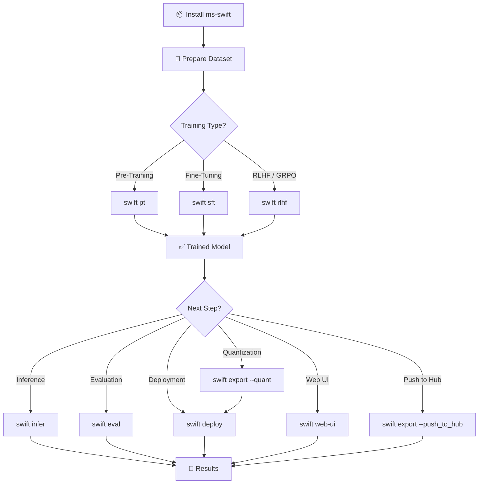
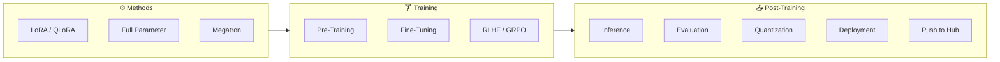

# SWIFT (Scalable lightWeight Infrastructure for Fine-Tuning)

> ModelScope Community မှ ဖန်တီးထားတဲ့ Large Model နဲ့ Multimodal Large Model တွေကို Fine-Tuning လုပ်ဖို့ Framework တစ်ခုဖြစ်ပါတယ်။

- 📦 **GitHub**: [modelscope/ms-swift](https://github.com/modelscope/ms-swift)
- 📄 **Paper**: [arxiv.org/abs/2408.05517](https://arxiv.org/abs/2408.05517)
- 📖 **Docs**: [swift.readthedocs.io](https://swift.readthedocs.io/en/latest/)

---

## MS-Swift နဲ့ ဘာတွေလုပ်လို့ရလဲ

| Feature | Description |
|---|---|
| **Pre-Training** | Model ကို အစကနေ Train လုပ်ခြင်း |
| **SFT (Supervised Fine-Tuning)** | Dataset နဲ့ Model ကို Fine-Tune လုပ်ခြင်း |
| **RLHF** | DPO, KTO, CPO, SimPO, ORPO - Human Alignment |
| **GRPO Family** | GRPO, DAPO, GSPO, SAPO, CISPO, CHORD, RLOO, Reinforce++ |
| **Inference** | Transformers, vLLM, SGLang, LMDeploy နဲ့ Inference |
| **Evaluation** | EvalScope backend နဲ့ 100+ Evaluation Datasets |
| **Quantization** | AWQ, GPTQ, FP8, BNB Quantization Export |
| **Deployment** | OpenAI-compatible API Server တင်ခြင်း |
| **Web-UI** | Gradio-based UI နဲ့ Train/Infer/Eval လုပ်ခြင်း |

---

## Support လုပ်တဲ့ Models

| Type | Count | Examples |
|---|---|---|
| **Text LLMs** | 600+ | Qwen3, DeepSeek-R1, Llama4, InternLM3, GLM4.5, Mistral |
| **Multimodal LLMs** | 400+ | Qwen3-VL, Qwen3-Omni, InternVL3.5, Llava, MiniCPM-V |

---

## Lightweight Training Methods

LoRA, QLoRA, DoRA, LoRA+, LLaMAPro, LongLoRA, LoRA-GA, ReFT, RS-LoRA, Adapter, LISA

---

## Memory & Distributed Training

| Category | Technologies |
|---|---|
| **Memory Optimization** | GaLore, UnSloth, Liger-Kernel, Flash-Attention 2/3 |
| **Distributed** | DDP, DeepSpeed ZeRO2/ZeRO3, FSDP/FSDP2 |
| **Megatron Parallelism** | TP, PP, SP, CP, EP, VPP |

---

## Workflow Diagram



---

## Quick Start

### 1. Install

```bash
pip install ms-swift -U
```

### 2. Fine-Tune (LoRA)

```bash
CUDA_VISIBLE_DEVICES=0 swift sft \
    --model Qwen/Qwen3-4B-Instruct-2507 \
    --tuner_type lora \
    --dataset 'AI-ModelScope/alpaca-gpt4-data-en#500' \
    --output_dir output
```

### 3. Inference

```bash
CUDA_VISIBLE_DEVICES=0 swift infer \
    --adapters output/vx-xxx/checkpoint-xxx \
    --stream true
```

### 4. Deploy

```bash
CUDA_VISIBLE_DEVICES=0 swift deploy \
    --model Qwen/Qwen2.5-7B-Instruct \
    --infer_backend vllm
```

### 5. Evaluate

```bash
CUDA_VISIBLE_DEVICES=0 swift eval \
    --model Qwen/Qwen2.5-7B-Instruct \
    --eval_dataset ARC_c
```

### 6. Quantize & Export

```bash
CUDA_VISIBLE_DEVICES=0 swift export \
    --model Qwen/Qwen2.5-7B-Instruct \
    --quant_bits 4 --quant_method awq \
    --dataset AI-ModelScope/alpaca-gpt4-data-zh \
    --output_dir Qwen2.5-7B-Instruct-AWQ
```

---

## Full Pipeline Diagram


