# 🤖 Generative AI — Decoder Model အပြည့်အစုံ လေ့လာရန် လမ်းညွှန်

> **ဒီ document မှာ** Generative AI ရဲ့ အခြေခံ concepts တွေကနေ Decoder-Only Transformer architecture ရဲ့ အတွင်းပိုင်း component တစ်ခုချင်းစီအထိ အဆင့်ဆင့် ရှင်းပြထားပါတယ်။  
> **ရည်ရွယ်ချက်:** Decoder model ကိုလေ့လာမယ့်သူတွေအတွက် သိသင့်သမျှ အကုန်စုံ တစ်နေရာတည်းမှာ ဖတ်ရှုနိုင်ဖို့ပါ။

---

## 📋 Table of Contents

1. [Generative AI ဆိုတာ ဘာလဲ?](#1-generative-ai-ဆိုတာ-ဘာလဲ)
2. [Language Model အမျိုးအစားများ](#2-language-model-အမျိုးအစားများ)
3. [Transformer Architecture — အခြေခံ](#3-transformer-architecture--အခြေခံ)
4. [Decoder-Only Architecture — အသေးစိတ်](#4-decoder-only-architecture--အသေးစိတ်)
5. [Tokenization — စာလုံးကို ဂဏန်းပြောင်းခြင်း](#5-tokenization--စာလုံးကို-ဂဏန်းပြောင်းခြင်း)
6. [Token Embedding — ဂဏန်းကို Vector ပြောင်းခြင်း](#6-token-embedding--ဂဏန်းကို-vector-ပြောင်းခြင်း)
7. [Self-Attention Mechanism — Model ရဲ့ "အာရုံစူးစိုက်မှု"](#7-self-attention-mechanism--model-ရဲ့-အာရုံစူးစိုက်မှု)
8. [Causal Masking — အနာဂတ်ကို မကြည့်ရ Rule](#8-causal-masking--အနာဂတ်ကို-မကြည့်ရ-rule)
9. [Positional Encoding — တည်နေရာ သတင်းအချက်အလက်](#9-positional-encoding--တည်နေရာ-သတင်းအချက်အလက်)
10. [Feed-Forward Network (MLP) — သတင်းအချက်အလက် ပြောင်းလဲခြင်း](#10-feed-forward-network-mlp--သတင်းအချက်အလက်-ပြောင်းလဲခြင်း)
11. [Normalization — တန်ဖိုးများ ညှိခြင်း](#11-normalization--တန်ဖိုးများ-ညှိခြင်း)
12. [Residual Connection — Gradient လမ်းကြောင်း](#12-residual-connection--gradient-လမ်းကြောင်း)
13. [Output Layer & Token Generation](#13-output-layer--token-generation)
14. [KV Cache — Inference Optimization](#14-kv-cache--inference-optimization)
15. [Training — Model ကို ဘယ်လိုသင်ပေးလဲ](#15-training--model-ကို-ဘယ်လိုသင်ပေးလဲ)
16. [Modern Decoder Models ယှဉ်ချက်](#16-modern-decoder-models-ယှဉ်ချက်)
17. [Key Takeaways](#17-key-takeaways)

---

## 1. Generative AI ဆိုတာ ဘာလဲ?

**Generative AI** ဆိုတာ data အသစ်တွေ (စာ၊ ပုံ၊ အသံ၊ code) ကို **ဖန်တီးနိုင်တဲ့** AI system တွေပါ။

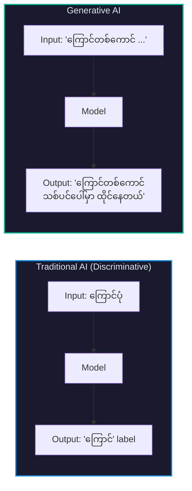

| AI အမျိုးအစား | လုပ်ဆောင်ချက် | ဥပမာ |
|:---:|:---:|:---:|
| **Discriminative** | Input ကို classify/label လုပ်ခြင်း | Spam detector, Image classifier |
| **Generative** | Content အသစ် ဖန်တီးခြင်း | ChatGPT, DALL·E, Midjourney |

### Generative AI ရဲ့ အခြေခံ Idea

Language Model (LM) ဆိုတာ **နောက်ထွက်လာမယ့် စကားလုံးကို ခန့်မှန်းတဲ့ probability model** ပါ:

$$P(\text{next token} \mid \text{previous tokens})$$

ဥပမာ — "The cat sat on the" ဆိုပြီး ပေးလိုက်ရင် model က:

$$P(\text{"mat"} \mid \text{"The cat sat on the"}) = 0.35$$
$$P(\text{"floor"} \mid \text{"The cat sat on the"}) = 0.20$$
$$P(\text{"roof"} \mid \text{"The cat sat on the"}) = 0.08$$

ဒီလိုပဲ token တစ်ခုပြီးတစ်ခု ဆက်တိုက် ခန့်မှန်းပြီး ဖန်တီးသွားတာဖြစ်ပါတယ်။

---

## 2. Language Model အမျိုးအစားများ

Transformer-based language models မှာ architecture ပေါ်မူတည်ပြီး အမျိုးအစား ၃ မျိုး ရှိပါတယ်:

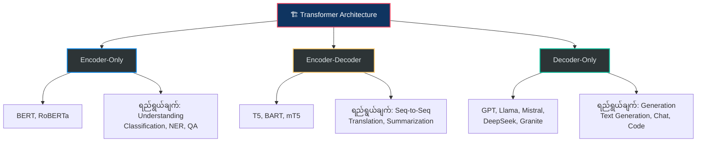

| Feature | Encoder-Only | Encoder-Decoder | Decoder-Only |
|:--------|:---:|:---:|:---:|
| **Attention Type** | Bidirectional | Bi (enc) + Causal (dec) | Causal (left-to-right) |
| **Input ကြည့်ပုံ** | အကုန်လုံး တစ်ပြိုင်နက် | Input အကုန် → Output တစ်လုံးချင်း | ဘယ်ဘက်က ညာဘက်ကို |
| **ကိုယ်စားပြု Model** | BERT | T5 | GPT, Llama |
| **အဓိက Task** | Understanding | Translation, Summary | **Text Generation** |

> **ဒီ document မှာ** Generative AI ရဲ့ core ဖြစ်တဲ့ **Decoder-Only Architecture** ကို အဓိက focus လုပ်ပါမယ်။

---

## 3. Transformer Architecture — အခြေခံ

2017 ခုနှစ် "Attention Is All You Need" paper မှာ မိတ်ဆက်ခဲ့တဲ့ **Transformer** ဟာ modern AI ရဲ့ foundation ဖြစ်ပါတယ်။

### 3.1 Original Transformer (Encoder-Decoder)

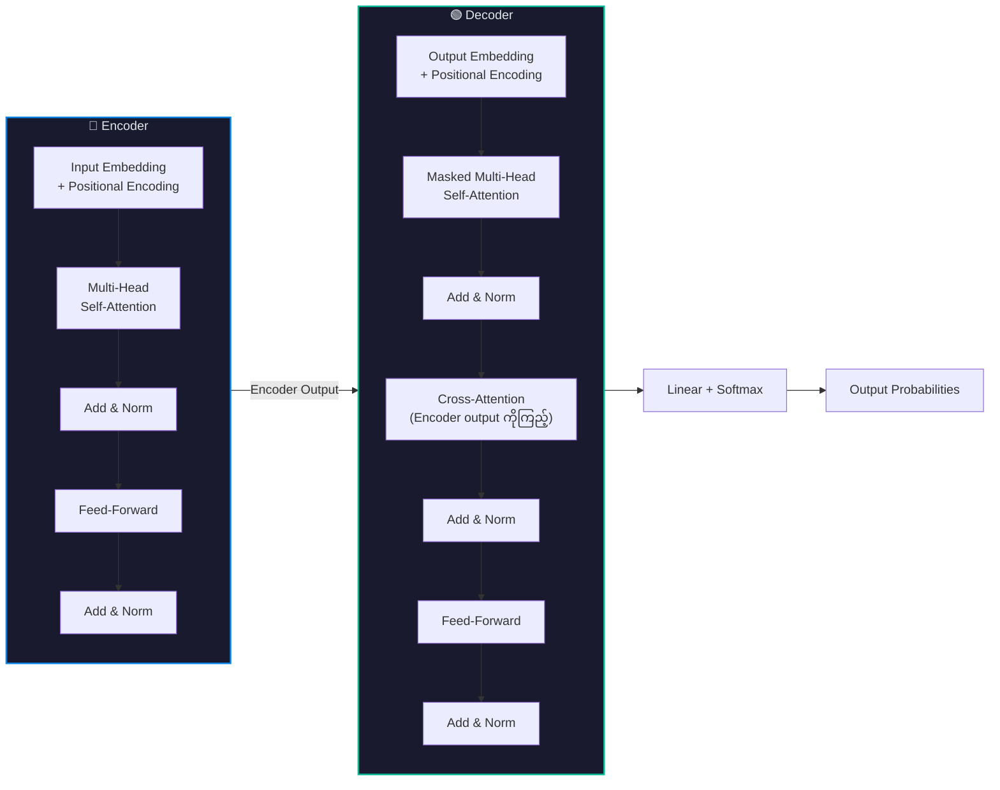

### 3.2 Transformer ရဲ့ Core Components

Decoder model မှာ ပါဝင်တဲ့ အဓိက building blocks:

| Component | ရှင်းလင်းချက် | Section |
|:----------|:-------------|:-------:|
| **Tokenization** | Text ကို ဂဏန်း (token IDs) အဖြစ်ပြောင်းခြင်း | [§5](#5-tokenization--စာလုံးကို-ဂဏန်းပြောင်းခြင်း) |
| **Embedding** | Token ID ကို vector (numbers list) ပြောင်းခြင်း | [§6](#6-token-embedding--ဂဏန်းကို-vector-ပြောင်းခြင်း) |
| **Self-Attention** | Token တစ်ခုက အခြား tokens ကို ဘယ်လောက် ဂရုစိုက်ရမလဲ | [§7](#7-self-attention-mechanism--model-ရဲ့-အာရုံစူးစိုက်မှု) |
| **Causal Mask** | အနာဂတ် tokens ကို ကြည့်ခွင့်မရှိအောင် ပိတ်ခြင်း | [§8](#8-causal-masking--အနာဂတ်ကို-မကြည့်ရ-rule) |
| **Positional Encoding** | Token ရဲ့ position (ဘယ်နေရာ) သတင်းထည့်ခြင်း | [§9](#9-positional-encoding--တည်နေရာ-သတင်းအချက်အလက်) |
| **Feed-Forward (MLP)** | Feature transformation လုပ်ခြင်း | [§10](#10-feed-forward-network-mlp--သတင်းအချက်အလက်-ပြောင်းလဲခြင်း) |
| **Normalization** | တန်ဖိုးတွေ ကြီးလွန်း/သေးလွန်း မဖြစ်အောင် ညှိခြင်း | [§11](#11-normalization--တန်ဖိုးများ-ညှိခြင်း) |
| **Residual Connection** | Layer ကို skip ပြီး gradient flow ကောင်းအောင် | [§12](#12-residual-connection--gradient-လမ်းကြောင်း) |
| **Output Projection** | Vector ကို vocabulary probabilities ပြောင်းခြင်း | [§13](#13-output-layer--token-generation) |

---

## 4. Decoder-Only Architecture — အသေးစိတ်

GPT, Llama, Mistral, DeepSeek စတဲ့ modern LLMs အားလုံးဟာ **Decoder-Only** architecture ကို သုံးပါတယ်။ Original Transformer ရဲ့ Encoder ကို ဖယ်ထုတ်ပြီး Decoder blocks တွေကိုပဲ stack လုပ်ထားပါတယ်။

### 4.1 Decoder-Only End-to-End Data Flow

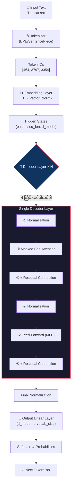

### 4.2 ဘာကြောင့် Decoder-Only ကို ရွေးချယ်ရတာလဲ?

| အကြောင်းပြချက် | ရှင်းလင်းချက် |
|:---:|:---|
| **ရိုးရှင်းမှု** | Encoder-Decoder ထက် architecture ပိုရိုးရှင်း → train/deploy လွယ် |
| **Scaling** | Parameters တိုးရင် performance ကောင်းလာကြောင်း Scaling Laws ပြ |
| **Versatility** | Generation, QA, Translation, Coding — task တိုင်း prompt engineering နဲ့ လုပ်နိုင် |
| **Efficiency** | KV Cache နဲ့ inference ကို optimize လုပ်ရ ပိုလွယ် |

### 4.3 Llama 3.2-1B-Instruct ဥပမာ

```
LlamaForCausalLM
├── model (LlamaModel)
│   ├── embed_tokens          → Token Embedding (128,256 × 2,048)
│   ├── layers[0..15]         → Decoder Layers × 16
│   │   ├── input_layernorm   → RMSNorm (Pre-Attention)
│   │   ├── self_attn         → Grouped-Query Attention (GQA)
│   │   ├── post_attention_layernorm → RMSNorm (Pre-FFN)
│   │   └── mlp               → SwiGLU Feed-Forward Network
│   └── norm                  → Final RMSNorm
└── lm_head                   → Linear (2,048 → 128,256) [tied with embed_tokens]
```

---

## 5. Tokenization — စာလုံးကို ဂဏန်းပြောင်းခြင်း

Model ဟာ စာလုံးတွေကို ကိုယ်တိုင် မနားလည်ပါဘူး။ **ဂဏန်း** (numbers) ကိုပဲ process လုပ်တတ်ပါတယ်။ Text ကို ဂဏန်းအဖြစ် ပြောင်းလဲတဲ့ process ကို **Tokenization** လို့ခေါ်ပါတယ်။

### 5.1 Tokenization Process


### 5.2 Tokenizer အမျိုးအစားများ

| Method | ရှင်းလင်းချက် | သုံးတဲ့ Model |
|:------:|:-------------|:---:|
| **Word-level** | စကားလုံး တစ်လုံးချင်း → token တစ်ခု | အစောပိုင်း models |
| **Character-level** | အက္ခရာ တစ်လုံးချင်း → token တစ်ခု | အသုံးနည်း |
| **BPE** (Byte-Pair Encoding) | မကြာခဏ ပေါ်တဲ့ character pairs ကို merge | GPT-2, GPT-3, Llama 3 |
| **WordPiece** | BPE နဲ့ ဆင်တူ, likelihood-based | BERT |
| **SentencePiece** | Language-independent, raw text ပေါ်မှာ train | Llama 2, Mistral |
| **Unigram** | Probability-based subword selection | T5, mT5 |

### 5.3 BPE (Byte-Pair Encoding) — အသုံးအများဆုံး

BPE ရဲ့ algorithm:

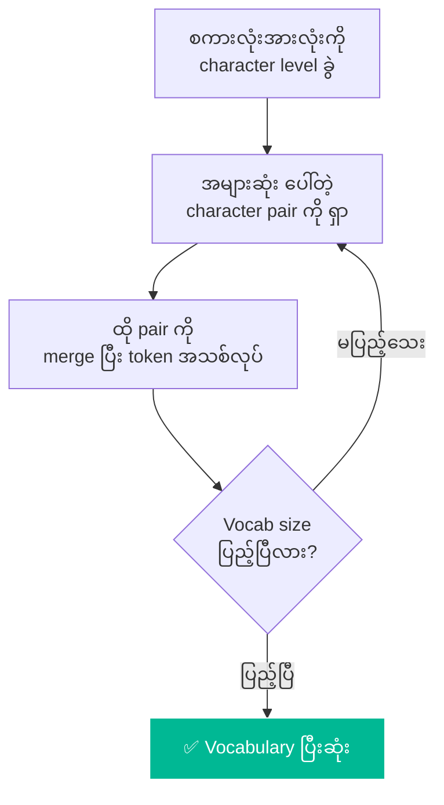

**ဥပမာ:**

| Step | Action | Result |
|:----:|:-------|:-------|
| 0 | "lower" → characters | `l o w e r` |
| 1 | `e` + `r` → `er` (အများဆုံး pair) | `l o w er` |
| 2 | `l` + `o` → `lo` | `lo w er` |
| 3 | `lo` + `w` → `low` | `low er` |
| 4 | `low` + `er` → `lower` | `lower` |

### 5.4 Special Tokens

| Token | ရည်ရွယ်ချက် | ဥပမာ |
|:-----:|:-------------|:------|
| `<BOS>` / `<s>` | Sequence အစ | Beginning of Sequence |
| `<EOS>` / `</s>` | Sequence အဆုံး | End of Sequence |
| `<PAD>` | Sequence length ညီအောင် ဖြည့် | Padding |
| `<UNK>` | Vocabulary မှာ မရှိတဲ့ token | Unknown |

### 5.5 Vocab Size ကို ဘာကြောင့် ဂရုစိုက်ရလဲ?

$$\text{Embedding Parameters} = \text{vocab\_size} \times \text{d\_model}$$

| Model | Vocab Size | Embed Dim | Embedding Params |
|:------|:---------:|:---------:|:----------------:|
| GPT-2 | 50,257 | 768 | ~38.6M |
| Llama 3.2-1B | 128,256 | 2,048 | ~262.7M |
| Mistral 7B | 32,000 | 4,096 | ~131.1M |

> **Key Insight:** Vocab size ကြီးလေ language coverage ကောင်းလေ (multilingual support)။ ဒါပေမဲ့ embedding layer ရဲ့ parameters count ကလည်း ကြီးလာပါတယ်။

---

## 6. Token Embedding — ဂဏန်းကို Vector ပြောင်းခြင်း

Token ID (integer) ကို model process လုပ်နိုင်တဲ့ **dense vector** (continuous numbers list) ပြောင်းတာကို **Embedding** လို့ ခေါ်ပါတယ်။

### 6.1 Embedding ဘယ်လိုအလုပ်လုပ်လဲ?

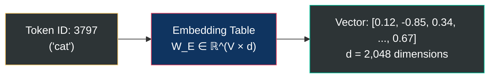

Embedding ဆိုတာ **lookup table** ပါပဲ:

$$e = W_E[\text{token\_id}]$$

- $W_E \in \mathbb{R}^{V \times d}$ — Embedding matrix (V = vocab size, d = dimension)
- Row တစ်ခုချင်းစီက token တစ်ခုကို represent လုပ်
- Training process မှာ ဒီ vectors တွေကို **learn** လုပ်ပါတယ် (random values ကနေ meaningful values ဖြစ်လာ)

### 6.2 Embedding Space ရဲ့ သဘော

Training ပြီးတဲ့အခါ — **meaning ဆင်တူတဲ့ words** တွေက **vector space မှာ နီးကပ်လာ**ပါတယ်:

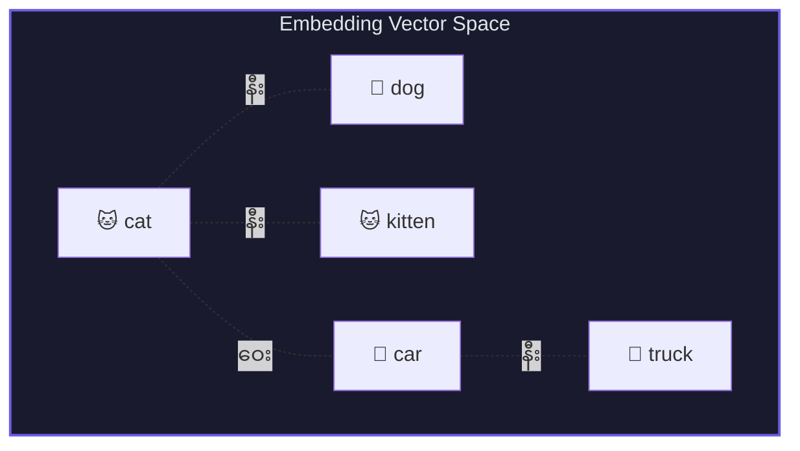

Famous ဥပမာ:

$$\vec{\text{king}} - \vec{\text{man}} + \vec{\text{woman}} \approx \vec{\text{queen}}$$

### 6.3 Weight Tying (Embedding Sharing)

Model တချို့မှာ embedding matrix ကို input (embed_tokens) ရော output (lm_head) ရောမှာ **share** သုံးပါတယ်:

$$\text{Input:} \quad e = W_E[\text{token}] \quad \text{(row lookup)}$$
$$\text{Output:} \quad \text{logits} = W_E^T \cdot h \quad \text{(matrix multiply)}$$

| Model | Weight Tying | ကျိုးကြောင်း |
|:------|:---:|:---|
| Llama 3.2-1B | ✅ Yes | Parameters သက်သာ (~263M save) — small model မို့ |
| GPT-2 | ✅ Yes | Small model — efficiency |
| GPT-3 (175B) | ❌ No | Large model — separate weights က performance ပိုကောင်း |
| Mistral 7B | ❌ No | Large enough — weight tying မလို |

---

## 7. Self-Attention Mechanism — Model ရဲ့ "အာရုံစူးစိုက်မှု"

Self-Attention ဟာ Transformer ရဲ့ **အရေးအကြီးဆုံး component** ဖြစ်ပြီး token တစ်ခုက **အခြား tokens တွေကို ဘယ်လောက် ဂရုစိုက်ရမလဲ** ဆိုတာ ဆုံးဖြတ်ပေးပါတယ်။

### 7.1 Q, K, V ဆိုတာ ဘာတွေလဲ?

Library စာကြည့်တိုက် ဥပမာနဲ့ ရှင်းပြပါမယ်:

| Concept | Library ဥပမာ | Attention မှာ |
|:-------:|:-------------|:-------------|
| **Query (Q)** | "ငါ AI စာအုပ် ရှာနေတယ်" — ရှာနေတဲ့ အကြောင်းအရာ | ဒီ token က ဘာကို ရှာနေလဲ |
| **Key (K)** | စာအုပ်တစ်ခုချင်းရဲ့ title/description | Token တစ်ခုချင်းရဲ့ "ရှာဖွေနိုင်တဲ့ description" |
| **Value (V)** | စာအုပ်ထဲက content | Token ထဲက actual information |

### 7.2 Attention ဘယ်လိုတွက်လဲ?

**Step 1:** Input ကနေ Q, K, V ဖန်တီး

$$Q = xW^Q, \quad K = xW^K, \quad V = xW^V$$

**Step 2:** Q နဲ့ K ရဲ့ similarity ကို dot product နဲ့တွက် (ဘယ် key က query နဲ့ ကိုက်ညီလဲ)

$$\text{score} = QK^T$$

**Step 3:** Scale လုပ် (dimension ကြီးရင် scores ကြီးလွန်းမှာစိုးလို့)

$$\text{scaled\_score} = \frac{QK^T}{\sqrt{d_k}}$$

**Step 4:** Softmax နဲ့ probabilities ပြောင်း (0 နဲ့ 1 ကြားထဲ, ပေါင်းလဒ် = 1)

$$\text{attention\_weights} = \text{softmax}\left(\frac{QK^T}{\sqrt{d_k}}\right)$$

**Step 5:** Weights နဲ့ V ကို multiply (important values ကို ပိုယူ)

$$\text{Attention}(Q, K, V) = \text{softmax}\left(\frac{QK^T}{\sqrt{d_k}}\right) V$$

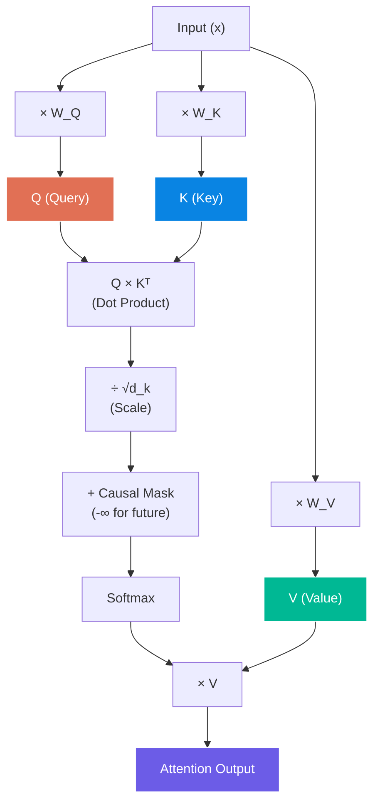

### 7.3 Multi-Head Attention (MHA) — ဘာကြောင့် head အများကြီး လိုလဲ?

Head **တစ်ခုတည်း**ဆိုရင် relationship type **တစ်မျိုး**ပဲ ဖမ်းနိုင်ပါတယ်။ Head **အများကြီး**ဆိုရင် relationship **အမျိုးမျိုး** ဖမ်းနိုင်ပါတယ်:

| Head | ဖမ်းနိုင်တဲ့ Relationship ဥပမာ |
|:----:|:---|
| Head 1 | Syntax — subject-verb agreement |
| Head 2 | Semantics — meaning similarity |
| Head 3 | Positional — nearby words |
| Head 4 | Coreference — "he" → "John" |

$$\text{MultiHead}(Q, K, V) = \text{Concat}(\text{head}_1, ..., \text{head}_h) W^O$$

$$\text{head}_i = \text{Attention}(QW_i^Q, KW_i^K, VW_i^V)$$

### 7.4 Attention Variants — MHA vs MQA vs GQA vs MLA

Model တွေအကြားမှာ attention mechanism ကွာခြားပါတယ်:

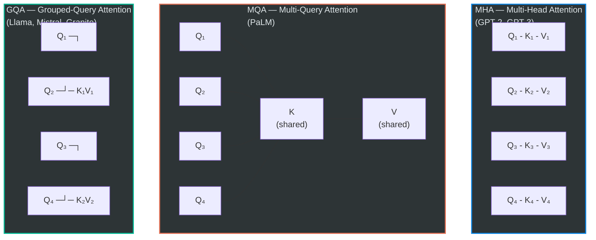

| Variant | Q Heads | KV Heads | KV Cache | Quality | Speed |
|:-------:|:-------:|:--------:|:--------:|:-------:|:-----:|
| **MHA** | h | h | ❌ အများဆုံး | ✅ အကောင်းဆုံး | ❌ နှေး |
| **MQA** | h | 1 | ✅ အနည်းဆုံး | ⚠️ quality ကျ | ✅ အမြန်ဆုံး |
| **GQA** | h | g (1 < g < h) | ✅ ပိုနည်း | ✅ MHA နီးပါးကောင်း | ✅ ပိုမြန် |
| **MLA** | h | compressed | ✅✅ compress ထား | ✅ ကောင်း | ✅ ပိုမြန် |

### 7.5 GQA — Llama 3.2 ဥပမာ

Llama 3.2-1B ရဲ့ GQA configuration:

- **Q heads = 32**, **KV heads = 8**
- Group size = 32 ÷ 8 = **4** (Q head 4 ခု → KV head 1 ခု share)

$$Q \in \mathbb{R}^{n \times 32 \times 64}, \quad K \in \mathbb{R}^{n \times 8 \times 64}, \quad V \in \mathbb{R}^{n \times 8 \times 64}$$

**KV Cache savings:**

| | MHA (32 KV heads) | GQA (8 KV heads) | Savings |
|:-|:---:|:---:|:---:|
| KV params/layer | 8,388,608 | 2,097,152 | **75%** |
| Cache (16 layers, seq=1024, FP16) | 134.22 MB | 33.55 MB | **75%** |

### 7.6 MLA — DeepSeek ရဲ့ Compressed Attention

DeepSeek-V2 က KV ကို **compress** လုပ်ပြီး latent vector $c_{KV}$ အနေနဲ့ cache ပါတယ်:

$$c_{KV} = W^{DKV} h \in \mathbb{R}^{d_c} \quad (d_c \ll n_h \times d_h)$$
$$K = W^{UK} c_{KV}, \quad V = W^{UV} c_{KV}$$

> GQA ထက် memory ပိုသက်သာပေမဲ့ decompression computation ပိုလိုပါတယ်။

---

## 8. Causal Masking — အနာဂတ်ကို မကြည့်ရ Rule

Decoder model ဟာ text ကို **ဘယ်ကနေ ညာ** (left-to-right) generate လုပ်ပါတယ်။ ဒါကြောင့် token တစ်ခုက **သူ့နောက်ကလာမယ့် tokens** ကို ကြည့်ခွင့် **မရှိပါဘူး**။ ဒါကို **Causal Masking** (Autoregressive Masking) လို့ခေါ်ပါတယ်။

### 8.1 Causal Mask ဘယ်လိုအလုပ်လုပ်လဲ?

"The cat sat" ဆိုတဲ့ sequence အတွက်:

```
Attention Matrix (mask applied):

              The    cat    sat
    The    [  ✅     ❌     ❌  ]    ← "The" က ကိုယ့်ကိုယ်ကိုပဲ ကြည့်ရ
    cat    [  ✅     ✅     ❌  ]    ← "cat" က "The" ရော ကိုယ့်ကိုယ်ကိုရော ကြည့်ရ
    sat    [  ✅     ✅     ✅  ]    ← "sat" က အကုန်လုံး ကြည့်ရ
```

$$\text{Mask} = \begin{pmatrix} 0 & -\infty & -\infty \\ 0 & 0 & -\infty \\ 0 & 0 & 0 \end{pmatrix}$$

$-\infty$ ကို score မှာ ပေါင်းလိုက်ရင် softmax ပြီးတဲ့အခါ $e^{-\infty} = 0$ ဖြစ်ပါတယ် → future tokens ကို **completely ignore** လုပ်ပါတယ်။

$$\text{CausalAttention} = \text{softmax}\left(\frac{QK^T}{\sqrt{d_k}} + \text{Mask}\right) V$$

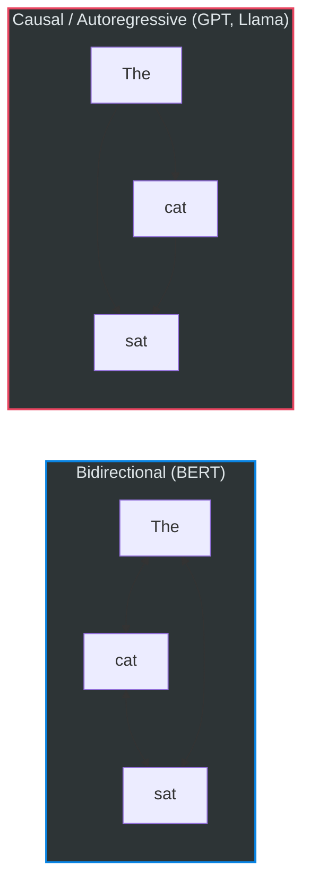

> **ဘာကြောင့် Mask လိုလဲ?** Training time မှာ sequence တစ်ခုလုံးကို parallel process လုပ်ပါတယ်။ Mask မရှိရင် model က "cheating" — answer ကို ကြိုမြင်ပြီးသား ဖြစ်သွားမှာပါ။

---

## 9. Positional Encoding — တည်နေရာ သတင်းအချက်အလက်

Self-Attention ဟာ **position ကို မသိပါဘူး** (permutation invariant) — "cat sat" ရော "sat cat" ရော attention score တူညီပါတယ်။ ဒါကြောင့် **position information** ကို explicitly ထည့်ပေးရပါတယ်။

### 9.1 Positional Encoding Methods

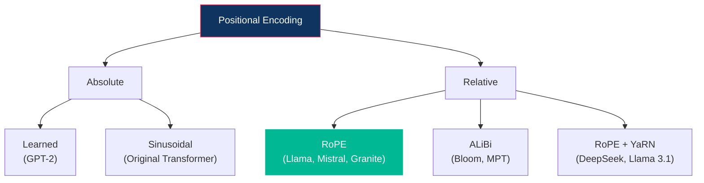

### 9.2 Learned Absolute — GPT-2

$$h_0 = W_E[\text{token}] + W_P[\text{position}]$$

- $W_P \in \mathbb{R}^{L_{\max} \times d}$ — position embedding ကို learn
- **အားနည်းချက်:** Maximum length ($L_{\max}$) ထက် ရှည်ရင် handle မရ

### 9.3 RoPE (Rotary Position Embedding) — Modern Standard

Llama, Mistral, Granite, DeepSeek စသည်ဖြင့် modern models အားလုံးနီးပါး RoPE ကို သုံးပါတယ်။

**Core Idea:** Q, K vectors ကို **rotation** (လှည့်ခြင်း) လုပ်ပြီး position encode:

$$\tilde{q}_m = R_\Theta(m) \cdot q_m, \quad \tilde{k}_n = R_\Theta(n) \cdot k_n$$

2D pair တစ်ခုအတွက် rotation:

$$R_\theta(m) = \begin{pmatrix} \cos(m\theta) & -\sin(m\theta) \\ \sin(m\theta) & \cos(m\theta) \end{pmatrix}$$

**ဘာကြောင့် Rotation ကောင်းလဲ?**

Dot product ကို ကြည့်ရင်:

$$\tilde{q}_m^T \tilde{k}_n = q_m^T R_\Theta(n - m) k_n$$

Attention score သည် **relative position $(n-m)$** ပေါ်မှာပဲ depend ဖြစ်ပါတယ်! Position 3 နဲ့ 5 ကြားက relationship ဟာ Position 100 နဲ့ 102 ကြားက relationship နဲ့ **ဆင်တူပါတယ်**။

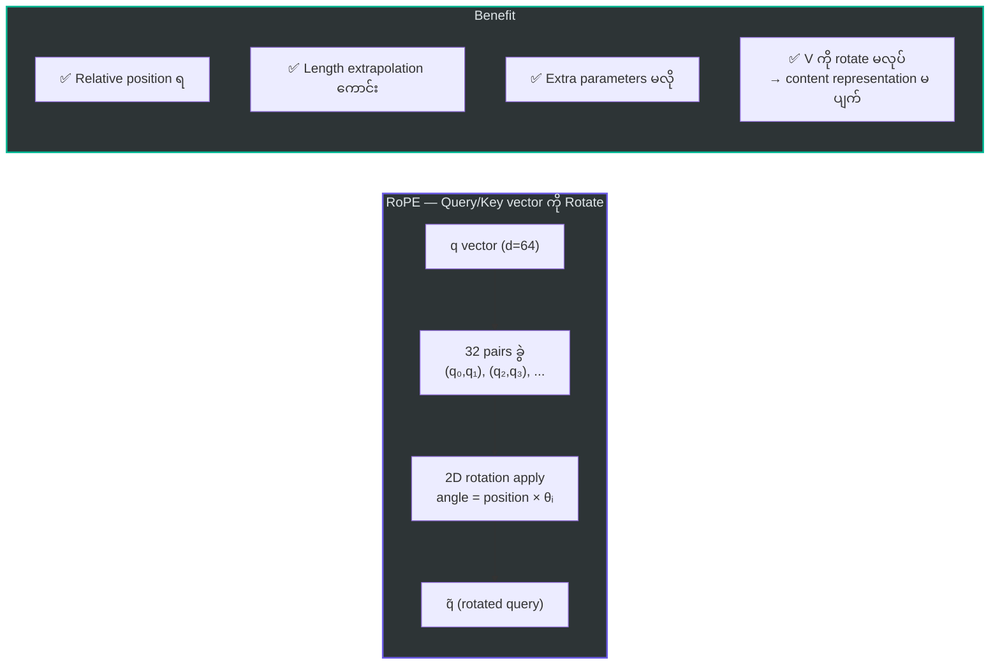

### 9.4 Cross-Model Positional Encoding Comparison

| Method | Model | Relative? | Extrapolation | Applied to |
|:------:|:-----:|:---------:|:-------------:|:----------:|
| Learned Absolute | GPT-2 | ❌ | ❌ Poor | Embedding layer |
| Sinusoidal | Original Transformer | ❌ | ⚠️ Limited | Embedding layer |
| **RoPE** | Llama, Mistral, Granite | ✅ | ✅ Good | Q, K only |
| RoPE + SWA | Mistral | ✅ | ✅ Excellent | Q, K only |
| ALiBi | Bloom, MPT | ✅ | ✅ Good | Attention bias |
| RoPE + YaRN | DeepSeek, Llama 3.1 | ✅ | ✅ Excellent | Q, K only |

---

## 10. Feed-Forward Network (MLP) — သတင်းအချက်အလက် ပြောင်းလဲခြင်း

Attention ပြီးတဲ့အခါ token တစ်ခုချင်းစီကို **Feed-Forward Network (FFN / MLP)** ကို ဖြတ်ပို့ပါတယ်။ ဒီ layer က **feature transformation** လုပ်ပြီး model ရဲ့ "thinking" / "reasoning" capacity ကို တိုးပေးပါတယ်။

### 10.1 FFN Evolution

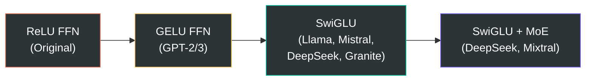

### 10.2 Standard FFN — GPT-2/3

$$\text{FFN}(x) = W_2 \cdot \text{GELU}(W_1 x + b_1) + b_2$$

- Dimension ကို expand → activation → shrink

### 10.3 SwiGLU — Modern Standard (Llama, Mistral, Granite)

$$\text{SwiGLU}(x) = W_{\text{down}} \cdot \left[\text{SiLU}(W_{\text{gate}} x) \odot (W_{\text{up}} x)\right]$$

$$\text{SiLU}(x) = \frac{x}{1 + e^{-x}}$$

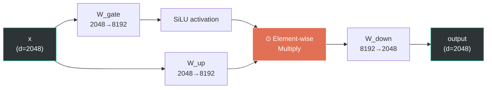

**SwiGLU ရဲ့ Gating Mechanism — ရိုးရှင်းစွာ ရှင်းပြချက်:**

| Gate Value | ဖြစ်ရပ် |
|:---:|:---|
| ≈ 0 | Information ကို **block** (မရေးပါနဲ့ ပိတ်ပေးမယ်) |
| ≈ x | Information ကို **pass through** (ဖြတ်ခွင့်ပေးမယ်) |

Gate က input-dependent ဖြစ်လို့ **dynamic feature selection** — token တစ်ခုချင်းစီအတွက် ဘယ် features ကို emphasize / suppress လုပ်မလဲ ဆုံးဖြတ်ပါတယ်။

### 10.4 ဘာကြောင့် SwiGLU က ကောင်းလဲ?

| Feature | ReLU | GELU | SwiGLU |
|:--------|:----:|:----:|:------:|
| Dead neurons | ❌ ရှိ | ⚠️ နည်း | ✅ မရှိ |
| Smooth gradient | ❌ | ✅ | ✅ |
| Gating mechanism | ❌ | ❌ | ✅ Dynamic |
| Matrices per layer | 2 | 2 | 3 (gate, up, down) |
| Empirical quality | ── | ── | **Best** |

> **Trade-off:** SwiGLU မှာ matrix 3 ခု သုံးရလို့ parameters ~50% ပိုများပါတယ်။ ဒါပေမဲ့ quality improvement က ပိုတန်ဖိုးရှိပါတယ်။

### 10.5 Mixture of Experts (MoE) — DeepSeek, Mixtral

MoE ဟာ FFN layer မှာ **expert network** အများကြီးထားပြီး token တစ်ခုအတွက် experts အနည်းငယ်ကိုပဲ activate ပါတယ်:

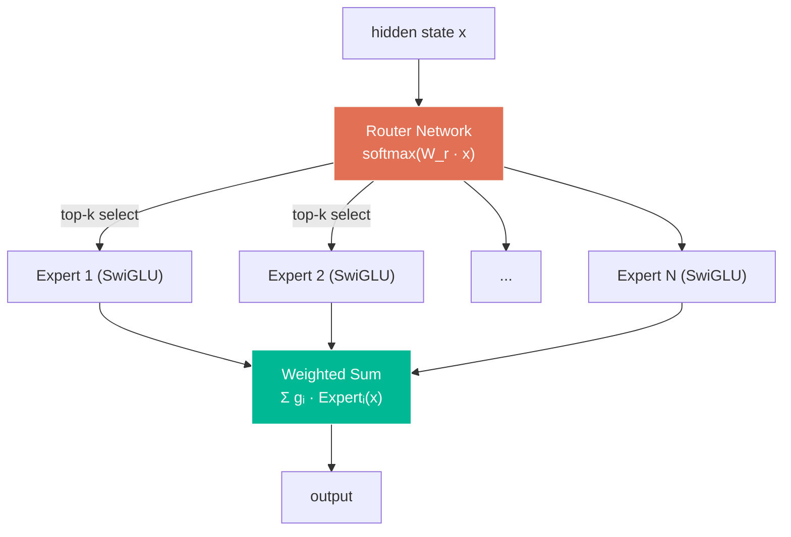

$$\text{MoE-FFN}(x) = \sum_{i \in \text{Top-}k} g_i(x) \cdot E_i(x)$$

> **Advantage:** Total parameters 236B ရှိပေမဲ့ token တစ်ခုအတွက် 21B ပဲ activate → **speed ပိုမြန်**

---

## 11. Normalization — တန်ဖိုးများ ညှိခြင်း

Deep neural network မှာ layer တွေ ပိုများလာတာနဲ့ values တွေ ကြီးလွန်း (explode) / သေးလွန်း (vanish) တတ်ပါတယ်။ **Normalization** က ဒီပြဿနာကို ဖြေရှင်းပါတယ်။

### 11.1 LayerNorm — GPT-2, GPT-3

$$\text{LayerNorm}(x) = \frac{x - \mu}{\sqrt{\sigma^2 + \epsilon}} \cdot \gamma + \beta$$

- $\mu$ = mean (ပျမ်းမျှ), $\sigma^2$ = variance (ဖြန့်ကြက်)
- $\gamma$ = scale (learnable), $\beta$ = shift (learnable)
- Operations: **Mean → Variance → Normalize → Scale & Shift**

### 11.2 RMSNorm — Llama, Mistral, DeepSeek, Granite (Modern Standard)

$$\text{RMSNorm}(x) = \frac{x}{\sqrt{\frac{1}{d}\sum_{i=1}^{d}x_i^2 + \epsilon}} \cdot \gamma$$

- Mean ကို **မတွက်ပါ** — RMS (Root Mean Square) ပဲ တွက်
- Bias ($\beta$) **မရှိပါ** — scale ($\gamma$) ပဲ ရှိ
- Operations: **RMS → Normalize → Scale** (ပိုနည်း, ပိုမြန်)

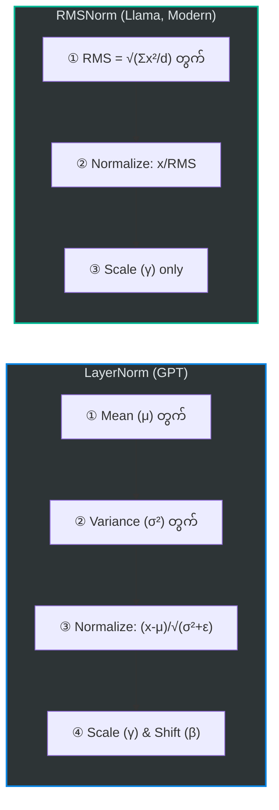

### 11.3 ဘာကြောင့် RMSNorm ပိုကောင်းလဲ?

| Feature | LayerNorm | RMSNorm |
|:--------|:---------:|:-------:|
| Mean computation | ✅ လို | ❌ မလို |
| Bias parameter ($\beta$) | ✅ ရှိ | ❌ မရှိ |
| Speed | Baseline | **~33% ပိုမြန်** |
| Training stability | ကောင်း | **ပိုကောင်း** |
| Learnable params | $2d$ | $d$ |

> **Research finding:** "Re-centering (mean subtraction) is not as important as re-scaling" — Zhang & Sennrich (2019)

### 11.4 Pre-Norm vs Post-Norm

Normalization ကို attention/FFN ရဲ့ **အရင်** (Pre) လုပ်မလား **အပြီး** (Post) လုပ်မလား ဆိုတာ အရေးကြီးပါတယ်:

| Position | Formula | Model |
|:--------:|:--------|:------|
| **Post-Norm** | $\text{Norm}(x + \text{SubLayer}(x))$ | GPT-2, Original Transformer |
| **Pre-Norm** ✅ | $x + \text{SubLayer}(\text{Norm}(x))$ | Llama, Mistral, GPT-3, DeepSeek, Granite |

> **Pre-Norm ကောင်းတဲ့ အကြောင်း:** Residual connection ကနေ gradient ဟာ normalization ကို skip ပြီး direct flow ဖြစ်လို့ **deep network train လုပ်ရ ပိုလွယ်**ပါတယ်။

---

## 12. Residual Connection — Gradient လမ်းကြောင်း

**Residual (Skip) Connection** ဟာ input ကို layer output နဲ့ **ပေါင်းထည့်**ခြင်း ဖြစ်ပါတယ်:

$$\text{output} = x + \text{SubLayer}(x)$$

### 12.1 ဘာကြောင့် Residual Connection လိုလဲ?

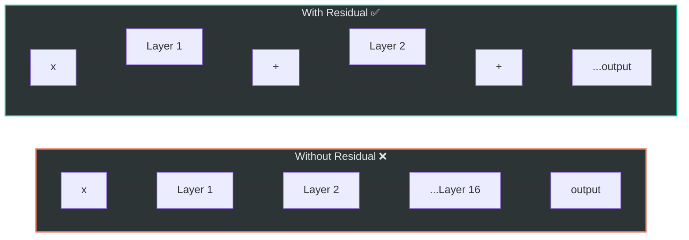

| Problem | Without Residual | With Residual |
|:--------|:---:|:---:|
| **Vanishing Gradient** | Layer များရင် gradient → 0 ဖြစ်တတ် | Gradient shortcut ရ |
| **Training Difficulty** | Deep network train ခက် | Layer 100+ ပဲဖြစ်ဖြစ် train ရ |
| **Information Loss** | Layer တွေကနေ info ပျောက်တတ် | Skip connection ကနေ original info ထိန်း |

### 12.2 Residual Stream Perspective

Modern LLMs ကို **"residual stream"** (main highway) perspective နဲ့ ကြည့်ရင်:

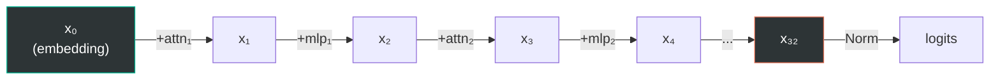

> **Intuition:** Hidden state $x$ ဟာ "highway" ပေါ်မှာ စီးဆင်းနေပြီး layer တစ်ခုချင်းစီက information ကို **ပေါင်းထည့်** (additive update) ပါတယ်။ Layer က information ကို **replace** မလုပ်ဘဲ **refine** လုပ်ပါတယ်။

$$x_{l+1} = x_l + \text{Attn}(\text{Norm}(x_l)) + \text{MLP}(\text{Norm}(\ldots))$$

---

## 13. Output Layer & Token Generation

Decoder layers အကုန်လုံး ဖြတ်ပြီးတဲ့ hidden state ကို **vocabulary probabilities** ပြောင်းပြီး next token ကို ရွေးပါတယ်။

### 13.1 Output Pipeline

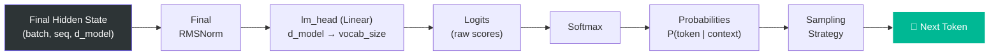

$$\text{logits} = W_{\text{lm\_head}} \cdot \text{RMSNorm}(h_{\text{final}}) \in \mathbb{R}^{|V|}$$

$$P(\text{token}_i) = \frac{e^{\text{logit}_i}}{\sum_j e^{\text{logit}_j}}$$

### 13.2 Sampling Strategies — Next Token ရွေးနည်းများ

| Strategy | ရှင်းလင်းချက် | Use Case |
|:--------:|:-------------|:---------|
| **Greedy** | Probability အမြင့်ဆုံး token ကိုပဲ ရွေး | Deterministic, ပုံသေ output |
| **Top-k** | Probability အမြင့်ဆုံး k ခုထဲကပဲ ရွေး | Creative output with limit |
| **Top-p (Nucleus)** | Cumulative probability p% ရောက်တဲ့ tokens ထဲကပဲ | Dynamic vocabulary size |
| **Temperature** | Probability distribution ကို sharp/flat လုပ် | T < 1: focused, T > 1: creative |

**Temperature ရဲ့ အကျိုးသက်ရောက်မှု:**

$$P_i = \frac{e^{\text{logit}_i / T}}{\sum_j e^{\text{logit}_j / T}}$$

| Temperature | Effect |
|:-----------:|:-------|
| T → 0 | Greedy — probability highest token ပဲ ထွက် |
| T = 1 | Original distribution — balanced |
| T > 1 | Flatter distribution — ပိုရွေးစရာ များ, ပိုcreative |

### 13.3 Autoregressive Generation Process

```mermaid
sequenceDiagram
    participant User as User
    participant Model as Decoder Model
    participant Output as Generated Text

    User ->> Model: "The cat"
    Model ->> Model: Process "The cat" → P(next)
    Model ->> Output: "sat" (highest prob)

    Note over Model: Now input = "The cat sat"
    Model ->> Model: Process "The cat sat" → P(next)
    Model ->> Output: "on" (highest prob)

    Note over Model: Now input = "The cat sat on"
    Model ->> Model: Process "The cat sat on" → P(next)
    Model ->> Output: "the" (highest prob)

    Note over Output: Final: "The cat sat on the..."
```

> Token **တစ်ခုပြီးတစ်ခု** (one-by-one) generate → ဒါကြောင့် **"Autoregressive"** လို့ ခေါ်ပါတယ်။

---

## 14. KV Cache — Inference Optimization

Autoregressive generation မှာ token အသစ်တစ်ခု generate လုပ်တိုင်း previous tokens အားလုံးကို recompute လုပ်ရပါတယ်။ **KV Cache** က ဒီ redundant computation ကို ဖြေရှင်းပါတယ်။

### 14.1 Problem — KV Cache မရှိရင်

| Step | Input | Compute K,V for |
|:----:|:------|:------|
| 1 | "The" | The |
| 2 | "The cat" | **The**, cat (The ထပ်တွက်) |
| 3 | "The cat sat" | **The, cat**, sat (ထပ်တွက်) |
| 4 | "The cat sat on" | **The, cat, sat**, on (ထပ်ထပ်တွက်) |

### 14.2 Solution — KV Cache ရှိရင်

```mermaid
sequenceDiagram
    participant Gen as Generator
    participant Cache as KV Cache
    participant Attn as Attention

    Note over Gen: Step 1: "The"
    Gen ->> Cache: Store K₁, V₁
    Gen ->> Attn: q₁ × [K₁] → attention

    Note over Gen: Step 2: "cat"
    Gen ->> Cache: Append K₂, V₂ (K₁ ထပ်မတွက်)
    Gen ->> Attn: q₂ × [K₁, K₂] → attention

    Note over Gen: Step 3: "sat"
    Gen ->> Cache: Append K₃, V₃ (K₁,K₂ ထပ်မတွက်)
    Gen ->> Attn: q₃ × [K₁, K₂, K₃] → attention

    Note over Cache: Cache grows linearly with sequence!
```

> Previous tokens ရဲ့ K, V ကို **cache ထားပြီး** new token ရဲ့ K, V ကိုပဲ compute → **အချိန် အများကြီး သက်သာ**

### 14.3 KV Cache Memory Formula

$$\text{Cache Size} = 2 \times L \times n_{kv} \times d_h \times S \times \text{bytes\_per\_element}$$

- $L$ = number of layers
- $n_{kv}$ = KV heads count
- $d_h$ = head dimension
- $S$ = sequence length

### 14.4 Cross-Model KV Cache Comparison (seq=4096, FP16)

| Model | KV Heads | Layers | Cache Size |
|:------|:--------:|:------:|:----------:|
| **Llama 3.2-1B** (GQA) | 8 | 16 | **64 MB** |
| **GPT-3 (175B)** (MHA) | 96 | 96 | **9,216 MB** |
| **Mistral 7B** (GQA) | 8 | 32 | **256 MB** |
| **Mistral 7B + SWA** | 8 | 32 | **~64 MB** |
| **DeepSeek-V2** (MLA) | compressed | 60 | **~60 MB** |

> **GQA ရဲ့ advantage:** KV heads ကို share လို့ cache size **75%** လျှော့ချနိုင်ပါတယ်။

---

## 15. Training — Model ကို ဘယ်လိုသင်ပေးလဲ

### 15.1 Pre-training — အခြေခံသင်

Internet ပေါ်က text (books, web pages, code) ကို **next token prediction** task နဲ့ train:

$$\mathcal{L} = -\sum_{t=1}^{T} \log P(x_t \mid x_1, ..., x_{t-1}; \theta)$$

```mermaid
graph TD
    subgraph Pretraining ["Pre-training"]
        direction TB
        D["📚 Massive Text Data<br/>(Trillions of tokens)"] --> M["Decoder Model"]
        M --> PRED["Next Token Prediction"]
        PRED --> LOSS["Cross-Entropy Loss"]
        LOSS --> |"Backpropagation"| M
    end

    subgraph SFT ["Supervised Fine-Tuning (SFT)"]
        direction TB
        INST["📝 Instruction-Response Pairs<br/>(Human-curated)"] --> M2["Pre-trained Model"]
        M2 --> RESP["Follow Instructions"]
    end

    subgraph RLHF ["RLHF / DPO"]
        direction TB
        PREF["👍👎 Human Preferences"] --> M3["SFT Model"]
        M3 --> ALIGN["Align with Human Values"]
    end

    Pretraining --> SFT --> RLHF

    style Pretraining fill:#1a1a2e,stroke:#0984e3,stroke-width:2px,color:#dfe6e9
    style SFT fill:#1a1a2e,stroke:#fdcb6e,stroke-width:2px,color:#dfe6e9
    style RLHF fill:#1a1a2e,stroke:#00b894,stroke-width:2px,color:#dfe6e9
```

### 15.2 Training Stages

| Stage | Data | ရည်ရွယ်ချက် | ဥပမာ |
|:------|:-----|:-------------|:------|
| **Pre-training** | Web text, Books, Code (Trillions of tokens) | Language understanding & generation | "The cat sat on the ___" → "mat" |
| **SFT** | (Instruction, Response) pairs | Instructions ကို follow တတ်အောင် | "Summarize this..." → summary |
| **RLHF** | Human preference rankings | Human values နဲ့ align | ❌ harmful content ← ✅ helpful content |
| **DPO** | Chosen vs Rejected pairs | RLHF ထက် ရိုးရှင်းတဲ့ alignment | reward model မလို |

### 15.3 Backpropagation — အရိုးရှင်းဆုံး ရှင်းပြချက်

| Step | လုပ်ဆောင်ချက် |
|:----:|:-------------|
| ① | Input text ကို model ထဲ ဖြတ် → predicted token ရ (Forward Pass) |
| ② | Predicted vs Actual token ယှဉ် → Loss (error) တွက် |
| ③ | Loss ကနေ gradient (ဘယ် weight ကို ဘယ်လောက် ပြင်ရမလဲ) ပြန်တွက် (Backward Pass) |
| ④ | Weights ကို gradient အတိုင်း update (Optimizer — Adam, AdamW) |
| ⑤ | Data batch အသစ်နဲ့ ① ကနေ ပြန်စလုပ် |

> **"Instruct" model** (e.g., Llama-3.2-1B-**Instruct**) ဆိုတာ Pre-training + SFT + RLHF/DPO အဆင့်တွေ အကုန် ပြီးပြီးသား model ဖြစ်ပါတယ်။

---

## 16. Modern Decoder Models ယှဉ်ချက်

### 16.1 Full Architecture Comparison

| Feature | Llama 3.2-1B | GPT-2 (124M) | GPT-3 (175B) | Mistral 7B | DeepSeek-V2 (236B) | Granite 3B |
|:--------|:---:|:---:|:---:|:---:|:---:|:---:|
| **Parameters** | 1.24B | 124M | 175B | 7.3B | 236B (21B active) | 3B |
| **Layers** | 16 | 12 | 96 | 32 | 60 | 32 |
| **Hidden Size** | 2,048 | 768 | 12,288 | 4,096 | 5,120 | 2,560 |
| **Attention** | GQA | MHA | MHA | GQA+SWA | MLA | GQA |
| **Q/KV Heads** | 32/8 | 12/12 | 96/96 | 32/8 | 128/— | 32/8 |
| **Pos Encoding** | RoPE | Learned | Learned | RoPE+SWA | RoPE+YaRN | RoPE |
| **FFN** | SwiGLU | GELU | GELU | SwiGLU | SwiGLU+MoE | SwiGLU |
| **Normalization** | RMSNorm | LayerNorm | LayerNorm | RMSNorm | RMSNorm | RMSNorm |
| **Norm Position** | Pre | Post | Pre | Pre | Pre | Pre |
| **Vocab Size** | 128K | 50K | 100K | 32K | 102K | 49K |
| **Max Context** | 131K | 1K | 2-32K | 32K | 128K | 4-128K |
| **Weight Tying** | ✅ | ✅ | ❌ | ❌ | ❌ | ✅ |

### 16.2 Architecture Evolution Timeline

```mermaid
timeline
    title Transformer Decoder Architecture Evolution
    2017 : Original Transformer
         : Sinusoidal PE
         : LayerNorm (Post)
         : ReLU FFN, MHA
    2019 : GPT-2
         : Learned PE
         : LayerNorm (Post)
         : GELU FFN, MHA
    2020 : GPT-3
         : Learned PE
         : LayerNorm (Pre)
         : GELU FFN, MHA
    2023 : Llama 2
         : RoPE, RMSNorm (Pre)
         : SwiGLU, GQA
    2023 : Mistral 7B
         : RoPE + Sliding Window
         : SwiGLU, GQA
    2024 : DeepSeek-V2
         : RoPE + YaRN
         : SwiGLU + MoE, MLA
    2024 : Llama 3.2
         : RoPE (θ=500K)
         : SwiGLU, GQA
    2024 : Granite 3
         : RoPE, RMSNorm (Pre)
         : SwiGLU, GQA
```

### 16.3 Modern LLM Trends

```mermaid
graph TD
    subgraph Attention_Trend ["🎯 Attention Evolution"]
        MHA_T["MHA (GPT)"] --> GQA_T["GQA (Llama, Mistral)"]
        GQA_T --> MLA_T["MLA (DeepSeek)"]
        MHA_T --> SWA_T["+ Sliding Window (Mistral)"]
    end

    subgraph FFN_Trend ["⚡ FFN Evolution"]
        RELU_T["ReLU"] --> GELU_T["GELU (GPT)"]
        GELU_T --> SWIGLU_T["SwiGLU (Modern)"]
        SWIGLU_T --> MOE_T["+ MoE (DeepSeek, Mixtral)"]
    end

    subgraph Norm_Trend ["📐 Normalization Evolution"]
        LN_T["LayerNorm Post (GPT-2)"] --> LN_PRE_T["LayerNorm Pre (GPT-3)"]
        LN_PRE_T --> RMS_T["RMSNorm Pre (Modern)"]
    end

    subgraph Pos_Trend ["📍 Position Encoding Evolution"]
        LEARN_T["Learned Absolute (GPT)"] --> ROPE_T["RoPE (Llama)"]
        ROPE_T --> ROPE_EXT["RoPE + Scaling (YaRN)"]
        ROPE_T --> ROPE_SWA["RoPE + SWA (Mistral)"]
    end

    style Attention_Trend fill:#1a1a2e,stroke:#e94560,stroke-width:2px,color:#dfe6e9
    style FFN_Trend fill:#1a1a2e,stroke:#00b894,stroke-width:2px,color:#dfe6e9
    style Norm_Trend fill:#1a1a2e,stroke:#0984e3,stroke-width:2px,color:#dfe6e9
    style Pos_Trend fill:#1a1a2e,stroke:#fdcb6e,stroke-width:2px,color:#dfe6e9
```

---

## 17. Key Takeaways

### 17.1 Decoder Model ရဲ့ Complete Forward Pass

Llama 3.2-1B-Instruct ကို ဥပမာ ယူပြီး — input ကနေ output ထိ step-by-step:

```mermaid
graph TD
    A["1️⃣ Input: 'Hello world'"] --> B["2️⃣ Tokenize → [15496, 995]"]
    B --> C["3️⃣ Embed → vectors (2×2048)"]
    C --> D["4️⃣ + RoPE (position info)"]
    D --> E["5️⃣ RMSNorm"]
    E --> F["6️⃣ GQA Attention (causal masked)"]
    F --> G["7️⃣ + Residual"]
    G --> H["8️⃣ RMSNorm"]
    H --> I["9️⃣ SwiGLU MLP"]
    I --> J["🔟 + Residual"]
    J --> K{"Steps 5-10 ×16 layers"}
    K --> L["1️⃣1️⃣ Final RMSNorm"]
    L --> M["1️⃣2️⃣ lm_head → logits (128,256)"]
    M --> N["1️⃣3️⃣ Softmax → probabilities"]
    N --> O["1️⃣4️⃣ Sample → next token"]

    style A fill:#0f3460,stroke:#e94560,color:#fff
    style O fill:#00b894,stroke:#fff,color:#fff
    style K fill:#0f3460,stroke:#fdcb6e,color:#fff
```

### 17.2 Mathematical Summary

$$\boxed{
\begin{aligned}
h_0 &= W_E[\text{tokens}] \\
\text{For layer } l &= 0, \ldots, L-1: \\
\quad \hat{h}_l &= \text{RMSNorm}(h_l) \\
\quad h_l' &= h_l + \text{GQA}(\hat{h}_l; \text{RoPE}) \\
\quad \hat{h}_l' &= \text{RMSNorm}(h_l') \\
\quad h_{l+1} &= h_l' + \text{SwiGLU}(\hat{h}_l') \\
\text{logits} &= W_{\text{lm\_head}} \cdot \text{RMSNorm}(h_L)
\end{aligned}
}$$

### 17.3 သိသင့်တဲ့ Core Concepts Summary

| # | Concept | ရိုးရှင်းတဲ့ ရှင်းလင်းချက် |
|:-:|:--------|:---|
| 1 | **Tokenization** | Text → numbers (BPE) |
| 2 | **Embedding** | Numbers → vectors (lookup table) |
| 3 | **Self-Attention** | Token တွေ အချင်းချင်း ဆက်စပ်မှု |
| 4 | **Causal Mask** | အနာဂတ် tokens ကို block |
| 5 | **Multi-Head** | Relationship အမျိုးမျိုး ဖမ်း |
| 6 | **GQA** | KV heads share → memory/speed ကောင်း |
| 7 | **RoPE** | Position info ကို rotation နဲ့ encode |
| 8 | **SwiGLU** | Gated FFN → dynamic feature selection |
| 9 | **RMSNorm** | Value normalize (LayerNorm ထက်မြန်) |
| 10 | **Residual Connection** | Gradient flow + info preservation |
| 11 | **KV Cache** | Inference time speed up |
| 12 | **Autoregressive** | Token-by-token generate |

### 17.4 ဆက်လက်လေ့လာရန်

- 📓 [Llama 3.2-1B Analysis Notebook](llama_3_2_1B_instruct_analysis.ipynb) — Hands-on code analysis
- 📓 [Decoder Model Analysis (Kaggle)](kaggle_tested/03-decoder-model-analysis.ipynb) — Kaggle GPU analysis
- 📖 [Architecture Deep Dive](llama_3_2_1B_instruct_architecture_deep_dive.md) — Mathematical details

---

> **📝 Note:** ဒီ document ဟာ Decoder-Only Transformer architecture ကို အခြေခံကနေ advanced level အထိ cover ထားပါတယ်။ Hands-on practice အတွက် notebook files တွေကို ဖွင့်ပြီး code တွေ run ကြည့်ပါ။

---

*Generated for learning purposes — Generative AI Decoder Model Study Guide*
