# 🦙 Llama 3.2-1B-Instruct — Architecture Deep Dive & Cross-Model Analysis

> **Model:** `meta-llama/Llama-3.2-1B-Instruct` · **Parameters:** ~1.24B · **Type:** Decoder-Only Causal LM  
> **ဒီ document မှာ** Llama 3.2 ရဲ့ internal architecture ကို mathematical intuitions တွေနဲ့ အသေးစိတ်ရှင်းပြပြီး GPT, Mistral, DeepSeek, Granite models တွေနဲ့ ယှဉ်ပြထားပါတယ်။

---

## 📋 Table of Contents

1. [Overall Architecture Flow](#1-overall-architecture-flow)
2. [Token Embedding](#2-token-embedding)
3. [Self-Attention: GQA vs MHA vs MQA](#3-self-attention-gqa-vs-mha-vs-mqa)
4. [Positional Encoding: RoPE vs Alternatives](#4-positional-encoding-rope-vs-alternatives)
5. [Feed-Forward Network: SwiGLU vs Alternatives](#5-feed-forward-network-swiglu-vs-alternatives)
6. [Normalization: RMSNorm vs LayerNorm](#6-normalization-rmsnorm-vs-layernorm)
7. [KV Cache & Inference Optimization](#7-kv-cache--inference-optimization)
8. [Cross-Model Architecture Comparison Table](#8-cross-model-architecture-comparison-table)
9. [Key Takeaways](#9-key-takeaways)

---

## 1. Overall Architecture Flow

Llama 3.2-1B-Instruct သည် **Decoder-Only Transformer** architecture ကို အခြေခံထားပါတယ်။ Encoder မပါဘဲ Decoder blocks တွေကိုသာ stack လုပ်ထားပါတယ်။

### 1.1 End-to-End Data Flow

```mermaid
graph TD
    A["📝 Input Text"] --> B["Tokenizer (BPE)"]
    B --> C["Token IDs<br/>(seq_len,)"]
    C --> D["embed_tokens<br/>128,256 × 2,048"]
    D --> E["Hidden States<br/>(batch, seq_len, 2048)"]

    E --> F{"Decoder Layer × 16"}

    subgraph DecoderLayer ["🔁 Single Decoder Layer"]
        direction TB
        G["input_layernorm (RMSNorm)"] --> H["GQA Self-Attention<br/>Q:32 heads, KV:8 heads"]
        H --> I["+ Residual ①"]
        I --> J["post_attention_layernorm (RMSNorm)"]
        J --> K["SwiGLU MLP<br/>2048 → 8192 → 2048"]
        K --> L["+ Residual ②"]
    end

    F --> |"repeat 16×"| DecoderLayer
    DecoderLayer --> M["Final RMSNorm"]
    M --> N["lm_head (Linear)<br/>2,048 → 128,256"]
    N --> O["Softmax → Token Probabilities"]
    O --> P["🎯 Next Token Prediction"]

    style DecoderLayer fill:#1a1a2e,stroke:#e94560,stroke-width:2px
    style F fill:#0f3460,stroke:#e94560
```

### 1.2 Residual Stream Perspective

Modern LLMs ကို "**residual stream**" perspective နဲ့ ကြည့်ရင် ပိုနားလည်ပါတယ်:

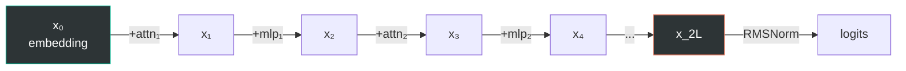

**Intuition:** Hidden state $x$ သည် "residual stream" ပေါ်မှာ စီးဆင်းနေပြီး layer တစ်ခုချင်းစီက information ကို **ပေါင်းထည့်** (additive update) လုပ်ပါတယ်။ ဒါကြောင့် gradient flow ကောင်းပြီး deep networks ကို train လုပ်နိုင်ပါတယ်။

$$x_{l+1} = x_l + \text{Attn}(\text{Norm}(x_l)) + \text{MLP}(\text{Norm}(x_l + \text{Attn}(\text{Norm}(x_l))))$$

---

## 2. Token Embedding

### 2.1 Embedding in Llama 3.2

| Property | Value |
|----------|-------|
| Vocab Size | 128,256 |
| Embedding Dim | 2,048 |
| Weight Tying | ✅ Yes (`embed_tokens` == `lm_head`) |
| Parameters | 128,256 × 2,048 = **262,668,288** (~263M) |

**Weight Tying Intuition:**

$$\text{embed-tokens}: \quad e = W_E[t] \quad (t \to \mathbb{R}^{d})$$

$$\text{lm-head}: \quad \text{logits} = W_E^T \cdot h \quad (\mathbb{R}^{d} \to \mathbb{R}^{|V|})$$

Same matrix $W_E$ ကို embed_tokens (lookup) နဲ့ lm_head (projection) နှစ်ခုလုံးမှာ share သုံးတာ — parameter count ကို ~263M သက်သာစေပါတယ်။

### 2.2 Cross-Model Embedding Comparison

| Model | Vocab Size | Embed Dim | Weight Tying |
|-------|-----------|-----------|:------------:|
| **Llama 3.2-1B** | 128,256 | 2,048 | ✅ |
| **GPT-2** | 50,257 | 768–1,600 | ✅ |
| **GPT-3/4** | 100,256+ | 12,288+ | ❌ |
| **Mistral 7B** | 32,000 | 4,096 | ❌ |
| **DeepSeek-V2** | 102,400 | 5,120 | ❌ |
| **Granite 3B** | 49,152 | 2,560 | ✅ |

> **Key Insight:** Llama 3 series က vocab size ကို 128K+ ထိ ချဲ့ထားပါတယ်။ ဒါကြောင့် embedding layer ရဲ့ parameter count က model total ရဲ့ ~21% ကို ယူပါတယ်။ Weight tying ဟာ 1B-class small model မှာ parameter efficiency အတွက် အရေးကြီးပါတယ်။

---

## 3. Self-Attention: GQA vs MHA vs MQA

### 3.1 Standard Multi-Head Attention (MHA) — GPT Series

GPT-2/3 မှာ သုံးထားတဲ့ classic MHA:

$$\text{Attention}(Q, K, V) = \text{softmax}\left(\frac{QK^T}{\sqrt{d_k}}\right) V$$

Head တစ်ခုချင်းစီမှာ:

$$Q_i = xW^Q_i, \quad K_i = xW^K_i, \quad V_i = xW^V_i \quad \text{for } i = 1, \ldots, h$$

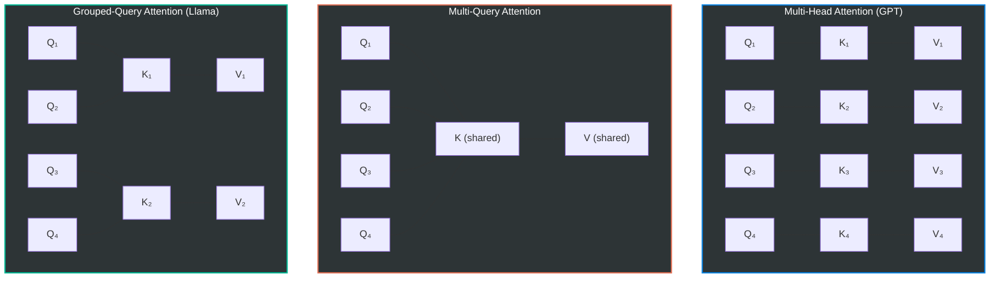

### 3.2 Grouped-Query Attention (GQA) — Llama 3.2

Llama 3.2-1B မှာ:
- **Query heads:** 32
- **KV heads:** 8
- **Group size:** 32 ÷ 8 = 4 (Q heads 4 ခုက KV head 1 ခုကို share)

**Math:**

$$Q \in \mathbb{R}^{n \times 32 \times 64}, \quad K \in \mathbb{R}^{n \times 8 \times 64}, \quad V \in \mathbb{R}^{n \times 8 \times 64}$$

GQA မှာ K, V ကို broadcast/repeat လုပ်ပြီး Q groups နဲ့ match ပါတယ်:

$$K_{\text{expanded}} = \text{repeat-kv}(K, \text{n-rep}=4) \in \mathbb{R}^{n \times 32 \times 64}$$

$$\text{Attn}_i = \text{softmax}\left(\frac{Q_i K_{\lfloor i/4 \rfloor}^T}{\sqrt{64}}\right) V_{\lfloor i/4 \rfloor}$$

### 3.3 Parameter & KV Cache Savings

**Projection Parameters per Layer:**

| | MHA (32 KV heads) | GQA (8 KV heads) | Savings |
|-|---|---|---|
| **Q proj** | 2,048 × 2,048 | 2,048 × 2,048 | — |
| **K proj** | 2,048 × 2,048 | 2,048 × 512 | **75%** |
| **V proj** | 2,048 × 2,048 | 2,048 × 512 | **75%** |
| **O proj** | 2,048 × 2,048 | 2,048 × 2,048 | — |
| **KV params total** | 8,388,608 | 2,097,152 | **75%** |

**KV Cache per Layer (seq_len=1024, FP16):**

$$\text{KV Cache} = 2 \times n_{\text{kv-heads}} \times d_{\text{head}} \times \text{seq-len} \times 2 \text{ bytes}$$

| | MHA | GQA | Savings |
|-|---|---|---|
| Per layer | 8.39 MB | 2.10 MB | 75% |
| Total (16 layers) | 134.22 MB | 33.55 MB | **75%** |

### 3.4 Cross-Model Attention Comparison

| Model | Attention Type | Q Heads | KV Heads | Head Dim | GQA Ratio |
|-------|:-------------:|--------:|--------:|---------:|----------:|
| **Llama 3.2-1B** | GQA | 32 | 8 | 64 | 4:1 |
| **Llama 3.1-8B** | GQA | 32 | 8 | 128 | 4:1 |
| **GPT-2 (124M)** | MHA | 12 | 12 | 64 | 1:1 |
| **GPT-3 (175B)** | MHA | 96 | 96 | 128 | 1:1 |
| **Mistral 7B** | GQA | 32 | 8 | 128 | 4:1 |
| **Mistral + Sliding Window** | GQA + SW | 32 | 8 | 128 | 4:1 |
| **DeepSeek-V2 (236B)** | **MLA** | 128 | — | — | N/A |
| **Granite 3B** | GQA | 32 | 8 | 80 | 4:1 |

### 3.5 DeepSeek's Multi-Head Latent Attention (MLA)

DeepSeek-V2 က GQA ထက် ပိုမိုကျစ်လစ်တဲ့ **MLA** ကို သုံးပါတယ်:

```mermaid
graph TB
    subgraph GQA_Flow ["GQA (Llama/Mistral)"]
        direction TB
        H1["hidden (d=2048)"] --> WQ1["W_Q → Q (32×64)"]
        H1 --> WK1["W_K → K (8×64)"]
        H1 --> WV1["W_V → V (8×64)"]
        WQ1 --> ATTN1["Attention"]
        WK1 --> ATTN1
        WV1 --> ATTN1
    end

    subgraph MLA_Flow ["MLA (DeepSeek-V2)"]
        direction TB
        H2["hidden (d=5120)"] --> C["W_DKV → c_KV (compressed, d_c=512)"]
        C --> WK2["W_UK → K (128 heads)"]
        C --> WV2["W_UV → V (128 heads)"]
        H2 --> WQ2["W_DQ → c_Q → W_UQ → Q"]
        WQ2 --> ATTN2["Attention"]
        WK2 --> ATTN2
        WV2 --> ATTN2
    end

    style GQA_Flow fill:#1a1a2e,stroke:#00b894,stroke-width:2px
    style MLA_Flow fill:#1a1a2e,stroke:#e94560,stroke-width:2px
```

**MLA Math:**

$$c_{KV} = W^{DKV} h \in \mathbb{R}^{d_c} \quad (d_c \ll n_h \times d_h)$$
$$K = W^{UK} c_{KV}, \quad V = W^{UV} c_{KV}$$

**KV Cache ယှဉ်ချက်:**

| Method | Cache per Token | Llama 3.2 (d=2048) | DeepSeek-V2 (d=5120) |
|--------|:-:|:-:|:-:|
| MHA | $2 \times n_h \times d_h$ | 4,096 | 32,768 |
| GQA | $2 \times n_{kv} \times d_h$ | 1,024 | — |
| MLA | $d_c$ | — | 512 |

> **Insight:** MLA က compressed latent vector $c_{KV}$ ကိုပဲ cache လုပ်ရတာဖြစ်လို့ GQA ထက် memory ပိုသက်သာပါတယ်။ ဒါပေမဲ့ decompression computation ပိုလိုပါတယ်။

---

## 4. Positional Encoding: RoPE vs Alternatives

### 4.1 Why Position Encoding?

Transformer ရဲ့ self-attention သည် **permutation invariant** ဖြစ်ပါတယ် — token order ကို သိဖို့ position information ထည့်ပေးရပါတယ်။

### 4.2 Absolute Positional Encoding — GPT-2

GPT-2 မှာ learnable absolute position embeddings:

$$h_0 = W_E[t] + W_P[\text{pos}]$$

- $W_P \in \mathbb{R}^{L_{\max} \times d}$ — position ကို direct learn
- **အားနည်းချက်:** $L_{\max}$ ထက် ရှည်တဲ့ sequences ကို handle မရ

### 4.3 Sinusoidal Positional Encoding — Original Transformer

$$PE_{(pos, 2i)} = \sin\left(\frac{pos}{10000^{2i/d}}\right), \quad PE_{(pos, 2i+1)} = \cos\left(\frac{pos}{10000^{2i/d}}\right)$$

### 4.4 RoPE (Rotary Position Embedding) — Llama, Mistral, DeepSeek, Granite

Llama 3.2 မှာ သုံးထားတဲ့ RoPE:

**Core Idea:** Position information ကို Q, K vectors ပေါ်မှာ **rotation** အနေနဲ့ apply:

$$\tilde{q}_m = R_\Theta(m) \cdot q_m, \quad \tilde{k}_n = R_\Theta(n) \cdot k_n$$

Rotation matrix (2D pair ချင်းစီအတွက်):

$$R_\theta(m) = \begin{pmatrix} \cos(m\theta) & -\sin(m\theta) \\ \sin(m\theta) & \cos(m\theta) \end{pmatrix}$$

**ဘာကြောင့် Rotation?**

Dot product ကို ကြည့်ရင်:

$$\tilde{q}_m^T \tilde{k}_n = q_m^T R_\Theta(m)^T R_\Theta(n) k_n = q_m^T R_\Theta(n - m) k_n$$

Attention score သည် **relative position** $(n - m)$ ပေါ်မှာပဲ depend ဖြစ်ပါတယ်! ဒါက RoPE ရဲ့ elegance ဖြစ်ပါတယ်။

**Llama 3.2 RoPE Frequencies:**

$$\theta_i = \frac{1}{\theta_{\text{base}}^{2i/d}} \quad \text{where } \theta_{\text{base}} = 500{,}000, \; d = 64$$

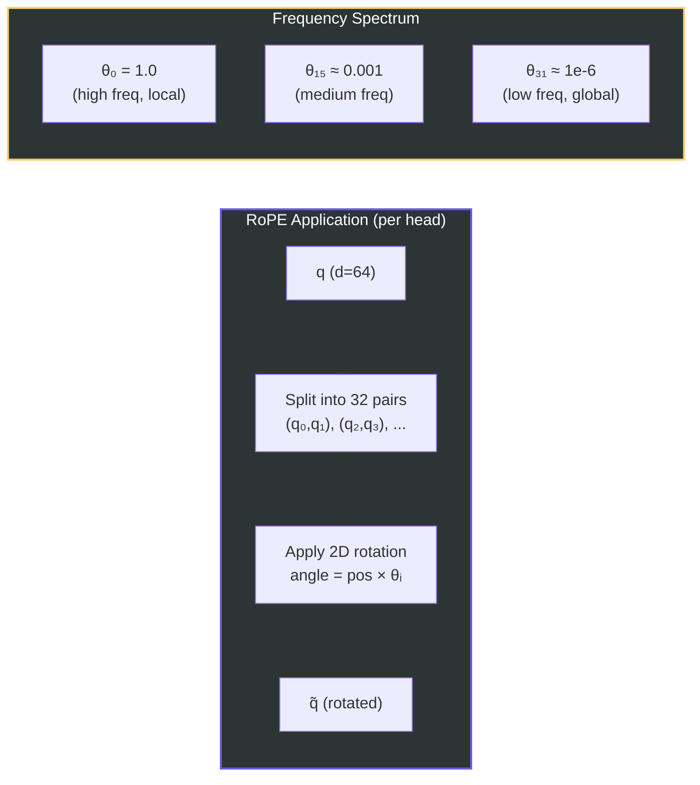

### 4.5 Mistral's Sliding Window Attention + RoPE

Mistral 7B က RoPE အပြင် **Sliding Window Attention (SWA)** ကို ပေါင်းသုံးပါတယ်:

$$\text{Attn}_{ij} = \begin{cases} \text{softmax}(\frac{q_i k_j^T}{\sqrt{d}}) & \text{if } i - j \leq W \\ 0 & \text{otherwise} \end{cases}$$

Window size $W = 4096$ ဖြစ်ပြီး layer stacking ကြောင့် effective receptive field က $W \times L$ (L = num layers) ဖြစ်ပါတယ်။

### 4.6 Positional Encoding Comparison

| Method | Model | Relative? | Extrapolation | Applied to |
|--------|-------|:---------:|:-------------:|:----------:|
| **Learned Absolute** | GPT-2 | ❌ | ❌ Poor | embed layer |
| **Sinusoidal** | Original Transformer | ❌ | ⚠️ Limited | embed layer |
| **RoPE** | Llama, Mistral, Granite | ✅ | ✅ Good | Q, K only |
| **RoPE + SWA** | Mistral | ✅ | ✅ Excellent | Q, K only |
| **ALiBi** | Bloom, MPT | ✅ | ✅ Good | attn bias |
| **RoPE + YaRN** | DeepSeek, Llama 3.1 | ✅ | ✅ Excellent | Q, K only |

> **RoPE ရဲ့ Key Advantages:**
> 1. Relative position ကို naturally encode (rotation property)
> 2. V ပေါ်မှာ apply မလုပ်လို့ value representation ကို corrupt မလုပ်
> 3. Sequence length extrapolation ကောင်း (especially with scaling)
> 4. No additional parameters (θ_base ပဲ hyperparameter)

---

## 5. Feed-Forward Network: SwiGLU vs Alternatives

### 5.1 Original FFN — GPT-2

$$\text{FFN}(x) = W_2 \cdot \text{ReLU}(W_1 x + b_1) + b_2$$

$$W_1 \in \mathbb{R}^{d \times 4d}, \quad W_2 \in \mathbb{R}^{4d \times d}$$

Parameters: $2 \times d \times 4d = 8d^2$

### 5.2 GELU FFN — GPT-3

$$\text{FFN}(x) = W_2 \cdot \text{GELU}(W_1 x)$$

$$\text{GELU}(x) = x \cdot \Phi(x) \approx 0.5x\left(1 + \tanh\left[\sqrt{2/\pi}(x + 0.044715x^3)\right]\right)$$

### 5.3 SwiGLU — Llama, Mistral, DeepSeek, Granite

$$\text{SwiGLU}(x) = W_{\text{down}} \cdot \left[\text{SiLU}(W_{\text{gate}} x) \odot (W_{\text{up}} x)\right]$$

where:

$$\text{SiLU}(x) = x \cdot \sigma(x) = \frac{x}{1 + e^{-x}}$$

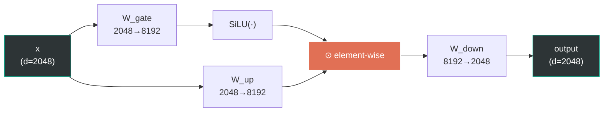

**Gating Mechanism Intuition:**

$\text{SiLU}(W_{\text{gate}} x)$ က "gate" ရဲ့ role ဆောင်ပါတယ်:
- Gate value ≈ 0 → information ကို block
- Gate value ≈ x → information ကို pass through
- Gate က input-dependent ဖြစ်လို့ **dynamic feature selection** လုပ်နိုင်

**ဘာကြောင့် SwiGLU က ReLU/GELU ထက် ကောင်းလဲ?**

1. **Gating → Expressiveness:** Matrix 2 ခု (gate + up) ရဲ့ interaction က richer representations ဖန်တီးနိုင်
2. **SiLU smoothness:** ReLU ရဲ့ dead neuron problem မရှိ (gradient ≠ 0 for negative inputs)
3. **Empirical gains:** PaLM paper (Google, 2022) မှာ SwiGLU က ReLU/GELU ထက် consistent ကောင်းကြောင်း prove ထားပါတယ်

### 5.4 Parameter Count Comparison

Llama 3.2-1B: $d = 2048$, intermediate = $8192$

| FFN Type | Matrices | Formula | Params per Layer |
|----------|:--------:|---------|:----------------:|
| **ReLU/GELU (GPT)** | 2 | $2 \times d \times 4d$ | $2 \times 2048 \times 8192 = 33.6M$ |
| **SwiGLU (Llama)** | 3 | $3 \times d \times d_{\text{ff}}$ | $3 \times 2048 \times 8192 = 50.3M$ |

> ⚠️ SwiGLU က matrix 3 ခု (gate, up, down) သုံးလို့ parameter count 50% ပိုများပါတယ်။ ဒါပေမဲ့ quality improvement က parameter cost ကို worth ဖြစ်ကြောင်း research papers တွေမှာ consistently ပြထားပါတယ်။ Intermediate size ကို ချိန်ညှိခြင်းဖြင့် (e.g., $\frac{2}{3} \times 4d$ instead of $4d$) parameter parity ထိန်းနိုင်ပါတယ်။

### 5.5 Cross-Model FFN Comparison

| Model | FFN Type | Activation | Expansion Ratio | Intermediate |
|-------|----------|:----------:|:---------------:|-------------:|
| **Llama 3.2-1B** | SwiGLU | SiLU | 4.0× | 8,192 |
| **GPT-2 (124M)** | Standard | GELU | 4.0× | 3,072 |
| **GPT-3 (175B)** | Standard | GELU | 4.0× | 49,152 |
| **Mistral 7B** | SwiGLU | SiLU | 3.5× | 14,336 |
| **DeepSeek-V2** | SwiGLU + **MoE** | SiLU | varies | **expert routing** |
| **Granite 3B** | SwiGLU | SiLU | 4.0× | 10,240 |

### 5.6 DeepSeek's Mixture of Experts (MoE) FFN

DeepSeek-V2 က FFN layer မှာ **Mixture of Experts** ကို သုံးပါတယ်:

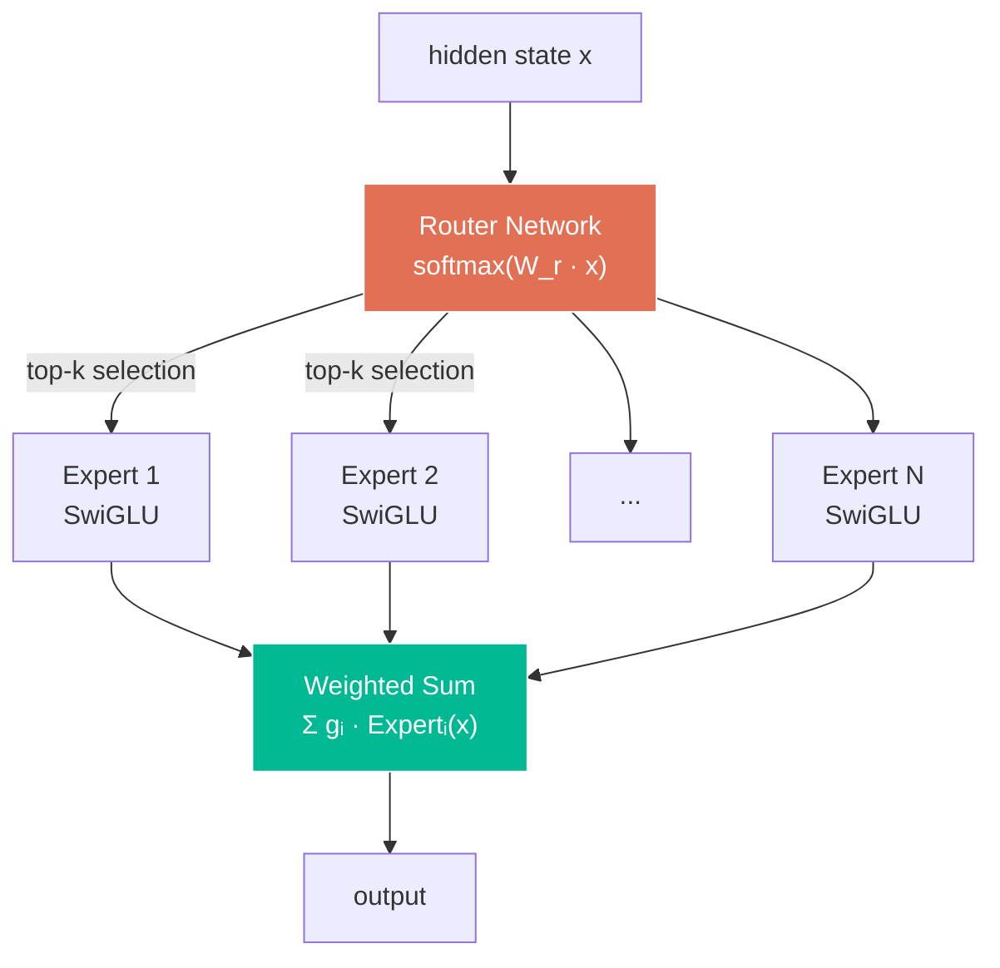

$$\text{MoE-FFN}(x) = \sum_{i \in \text{Top-}k} g_i(x) \cdot E_i(x)$$

**Advantage:** Total parameters များပေမဲ့ token တစ်ခုချင်းစီအတွက် experts အနည်းငယ်ပဲ activate လို့ **compute ပိုမြန်**ပါတယ်။

---

## 6. Normalization: RMSNorm vs LayerNorm

### 6.1 Layer Normalization — GPT-2/3

$$\text{LayerNorm}(x) = \frac{x - \mu}{\sqrt{\sigma^2 + \epsilon}} \cdot \gamma + \beta$$

where:

$$\mu = \frac{1}{d}\sum_{i=1}^{d} x_i, \quad \sigma^2 = \frac{1}{d}\sum_{i=1}^{d}(x_i - \mu)^2$$

- **Re-centering** (mean subtraction) + **Re-scaling** (variance normalization)
- Learnable parameters: $\gamma$ (scale) + $\beta$ (shift) → $2d$ params

### 6.2 RMSNorm — Llama, Mistral, DeepSeek, Granite

$$\text{RMSNorm}(x) = \frac{x}{\text{RMS}(x)} \cdot \gamma = \frac{x}{\sqrt{\frac{1}{d}\sum_{i=1}^{d}x_i^2 + \epsilon}} \cdot \gamma$$

- **Re-scaling only** (no mean subtraction, no bias)
- Learnable parameters: $\gamma$ (scale only) → $d$ params

### 6.3 Mathematical Comparison

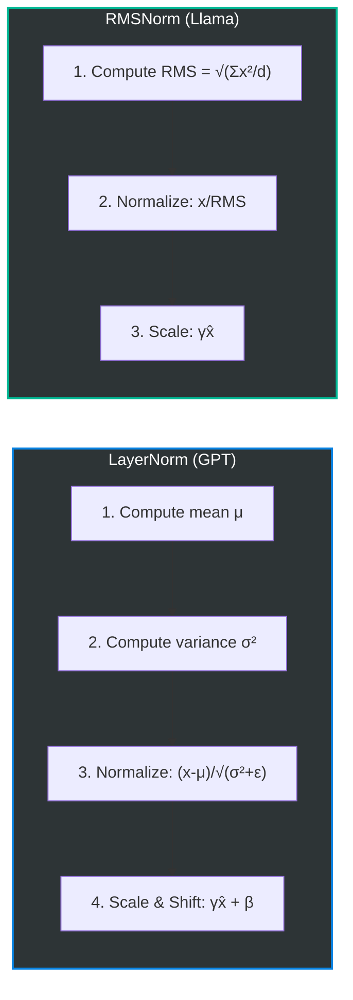

**ဘာကြောင့် RMSNorm ပိုကောင်းလဲ?**

1. **Speed:** Mean computation ကို skip (operations ~33% ပိုနည်း)
2. **Theory:** "Re-centering is not as important as re-scaling" — Zhang & Sennrich (2019)
3. **No bias ($\beta$):** Parameter ပိုနည်း, training ပိုstable

### 6.4 Pre-Norm vs Post-Norm

| Position | Formula | Used by |
|----------|---------|---------|
| **Post-Norm** | $x + \text{Attn}(\text{Norm}(x))$ ... wait, ↓ | GPT-2, Original Transformer |
| **Post-Norm (actual)** | $\text{Norm}(x + \text{Attn}(x))$ | GPT-2, Original Transformer |
| **Pre-Norm** ✅ | $x + \text{Attn}(\text{Norm}(x))$ | Llama, Mistral, DeepSeek, GPT-3, Granite |

Llama 3.2 (Pre-Norm):

$$x_{l+1} = x_l + \text{Attn}(\text{RMSNorm}(x_l))$$
$$x_{l+2} = x_{l+1} + \text{MLP}(\text{RMSNorm}(x_{l+1}))$$

> **Pre-Norm Advantage:** Gradient flow ပိုကောင်းပြီး deep networks ကို stable ဖြစ်အောင် train လုပ်နိုင်ပါတယ်။ Residual connection ကနေ gradient က normalization layer ကို skip ပြီး direct flow ဖြစ်ပါတယ်။

### 6.5 Cross-Model Normalization

| Model | Norm Type | Position | Has Bias ($\beta$) | Epsilon |
|-------|-----------|:--------:|:---------:|--------:|
| **Llama 3.2-1B** | RMSNorm | Pre-Norm | ❌ | 1e-5 |
| **GPT-2** | LayerNorm | Post-Norm | ✅ | 1e-5 |
| **GPT-3** | LayerNorm | Pre-Norm | ✅ | 1e-5 |
| **Mistral 7B** | RMSNorm | Pre-Norm | ❌ | 1e-5 |
| **DeepSeek-V2** | RMSNorm | Pre-Norm | ❌ | 1e-6 |
| **Granite 3B** | RMSNorm | Pre-Norm | ❌ | 1e-5 |

---

## 7. KV Cache & Inference Optimization

### 7.1 Autoregressive Generation Problem

Decoder model မှာ token generate လုပ်တိုင်း previous tokens အတွက် K, V ကို recompute လုပ်ရပါတယ်:

$$\text{Step } t: \quad \text{Attn}(q_t, [k_1, ..., k_t], [v_1, ..., v_t])$$

**KV Cache:** Previous steps ရဲ့ K, V values ကို cache ထားပြီး new token ရဲ့ K, V ကိုပဲ compute:

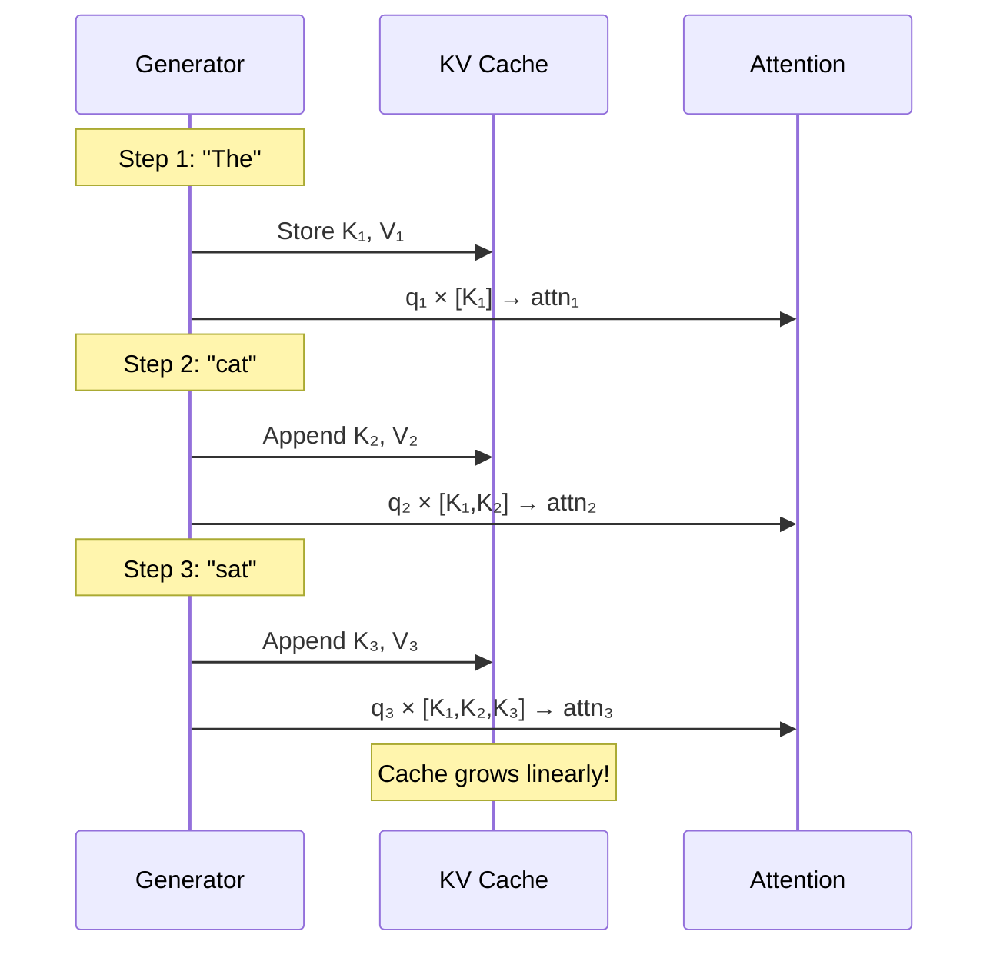

### 7.2 KV Cache Memory Formula

$$\text{Cache Memory} = 2 \times L \times n_{kv} \times d_h \times S \times \text{bytes}$$

where $L$ = layers, $n_{kv}$ = KV heads, $d_h$ = head dim, $S$ = seq length

### 7.3 Cross-Model KV Cache Comparison (seq_len=4096, FP16)

| Model | KV Heads | Head Dim | Layers | Cache Size |
|-------|:--------:|:--------:|:------:|:----------:|
| **Llama 3.2-1B** | 8 | 64 | 16 | **64 MB** |
| **GPT-3 (175B)** | 96 | 128 | 96 | **9,216 MB** |
| **Mistral 7B** | 8 | 128 | 32 | **256 MB** |
| **Mistral 7B + SWA** | 8 | 128 | 32 | **~64 MB** (window=4096) |
| **DeepSeek-V2 (MLA)** | — | — | 60 | **~60 MB** (compressed) |
| **Granite 3B** | 8 | 80 | 32 | **160 MB** |

> **Llama 3.2-1B ရဲ့ KV Cache Advantage:** 1B model ဖြစ်လို့ layers နည်းပြီး GQA ကြောင့် cache size ကိုလည်း 75% လျှော့ထားနိုင်ပါတယ်။ Edge devices / mobile deployment အတွက် practical ဖြစ်ပါတယ်။

---

## 8. Cross-Model Architecture Comparison Table

### 8.1 Full Architecture Summary

| Feature | Llama 3.2-1B | GPT-2 (124M) | GPT-3 (175B) | Mistral 7B | DeepSeek-V2 (236B) | Granite 3B |
|---------|:------------:|:------------:|:------------:|:----------:|:------------------:|:----------:|
| **Params** | 1.24B | 124M | 175B | 7.3B | 236B (21B active) | 3B |
| **Layers** | 16 | 12 | 96 | 32 | 60 | 32 |
| **Hidden** | 2,048 | 768 | 12,288 | 4,096 | 5,120 | 2,560 |
| **Attention** | GQA | MHA | MHA | GQA+SWA | MLA | GQA |
| **Q/KV Heads** | 32/8 | 12/12 | 96/96 | 32/8 | 128/— | 32/8 |
| **Pos Encoding** | RoPE | Learned | Learned | RoPE+SWA | RoPE+YaRN | RoPE |
| **FFN** | SwiGLU | GELU | GELU | SwiGLU | SwiGLU+MoE | SwiGLU |
| **Norm** | RMSNorm | LayerNorm | LayerNorm | RMSNorm | RMSNorm | RMSNorm |
| **Norm Position** | Pre | Post | Pre | Pre | Pre | Pre |
| **Vocab** | 128K | 50K | 100K | 32K | 102K | 49K |
| **Context** | 131K | 1K | 2-32K | 32K | 128K | 4-128K |
| **Weight Tying** | ✅ | ✅ | ❌ | ❌ | ❌ | ✅ |

### 8.2 Architecture Evolution Timeline

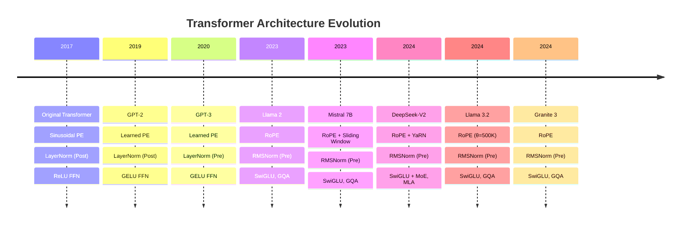

---

## 9. Key Takeaways

### 9.1 Llama 3.2-1B ရဲ့ Design Philosophy

1. **Efficiency First:** 1B parameters နဲ့ maximum performance ရဖို့ GQA + Weight Tying + RMSNorm
2. **Proven Components:** SwiGLU, RoPE, Pre-Norm — research-backed choices
3. **Edge-Ready:** Small model size + efficient KV cache → mobile/edge deployment suitable

### 9.2 Modern LLM Architecture Trends

```mermaid
graph TD
    subgraph Attention_Trend ["Attention Evolution"]
        MHA_T["MHA (GPT)"] --> GQA_T["GQA (Llama, Mistral)"]
        GQA_T --> MLA_T["MLA (DeepSeek)"]
        MHA_T --> SWA_T["+ Sliding Window (Mistral)"]
    end

    subgraph FFN_Trend ["FFN Evolution"]
        RELU_T["ReLU"] --> GELU_T["GELU (GPT-3)"]
        GELU_T --> SWIGLU_T["SwiGLU (Llama, all modern)"]
        SWIGLU_T --> MOE_T["+ MoE (DeepSeek, Mixtral)"]
    end

    subgraph Norm_Trend ["Normalization Evolution"]
        LN_T["LayerNorm Post"] --> LN_PRE_T["LayerNorm Pre (GPT-3)"]
        LN_PRE_T --> RMS_T["RMSNorm Pre (all modern)"]
    end

    subgraph Pos_Trend ["Position Encoding Evolution"]
        LEARN_T["Learned Absolute (GPT)"] --> ROPE_T["RoPE (Llama)"]
        ROPE_T --> ROPE_EXT["RoPE + Scaling (YaRN, NTK)"]
        ROPE_T --> ROPE_SWA["RoPE + SWA (Mistral)"]
    end

    style Attention_Trend fill:#1a1a2e,stroke:#e94560,stroke-width:2px
    style FFN_Trend fill:#1a1a2e,stroke:#00b894,stroke-width:2px
    style Norm_Trend fill:#1a1a2e,stroke:#0984e3,stroke-width:2px
    style Pos_Trend fill:#1a1a2e,stroke:#fdcb6e,stroke-width:2px
```

### 9.3 Summary Formula — Llama 3.2-1B Forward Pass

$$\boxed{
\begin{aligned}
h_0 &= W_E[\text{tokens}] \\
\text{For layer } l &= 0, \ldots, 15: \\
\quad \hat{h}_l &= \text{RMSNorm}(h_l) \\
\quad h_l' &= h_l + \text{GQA}(\hat{h}_l; W^Q_l, W^K_l, W^V_l, W^O_l, \text{RoPE}) \\
\quad \hat{h}_l' &= \text{RMSNorm}(h_l') \\
\quad h_{l+1} &= h_l' + W^{\text{down}}_l \left[\text{SiLU}(W^{\text{gate}}_l \hat{h}_l') \odot W^{\text{up}}_l \hat{h}_l'\right] \\
\text{logits} &= W_E^T \cdot \text{RMSNorm}(h_{16})
\end{aligned}
}$$

---

*Document generated from analysis of meta-llama/Llama-3.2-1B-Instruct notebook.*
