# 🔄 MCP Workflow — Server, Client, LLMs & Agents

> MCP (Model Context Protocol) ecosystem တွင် **Server**, **Client**, **LLM**, နှင့် **Agent** တို့ ဘယ်လိုပူးပေါင်းပြီး အလုပ်လုပ်သည်ကို Mermaid diagrams နှင့်တကွ အပြည့်အစုံ ရှင်းပြထားပါသည်။

---

## 📑 မာတိကာ

- [🧩 Core Components](#-core-components)
- [🏗️ Architecture Overview](#️-architecture-overview)
- [🔁 Connection Lifecycle](#-connection-lifecycle)
- [🛠️ Tool Call Workflow](#️-tool-call-workflow)
- [📦 Resource Access Workflow](#-resource-access-workflow)
- [💬 Prompt Template Workflow](#-prompt-template-workflow)
- [🤖 Agentic Workflow](#-agentic-workflow)
- [🔄 Multi-Server Architecture](#-multi-server-architecture)
- [🧠 LLM Decision Loop](#-llm-decision-loop)
- [🌐 Real-World Use Case — Travel Agent](#-real-world-use-case--travel-agent)
- [🔐 Security & Trust Boundaries](#-security--trust-boundaries)
- [📊 Message Flow — Protocol Level](#-message-flow--protocol-level)
- [⚡ Transport Layer](#-transport-layer)
- [🏭 Production Deployment](#-production-deployment)

---

## 🧩 Core Components

MCP Ecosystem တွင် အဓိက component ၄ ခု ရှိပါသည် —

| Component | Role | ဥပမာ |
|-----------|------|-------|
| **🧠 LLM** | ဉာဏ်ရည်တုမော်ဒယ် — စဉ်းစားခြင်း၊ ဆုံးဖြတ်ခြင်း | Claude, GPT, Gemini, Llama |
| **📱 Host / Application** | LLM ကို user နှင့် ချိတ်ဆက်ပေးသော app | Claude Desktop, VS Code, Cursor, Cline |
| **🔌 MCP Client** | Server နှင့် protocol connection ထိန်းသိမ်းသူ | Host app အတွင်း built-in |
| **⚙️ MCP Server** | External tools, data, services expose လုပ်သူ | GitHub, Filesystem, Database servers |
| **🤖 Agent** | LLM + Tools ပေါင်းစပ်ပြီး autonomous task execute လုပ်သူ | AI Coding Agent, Research Agent |

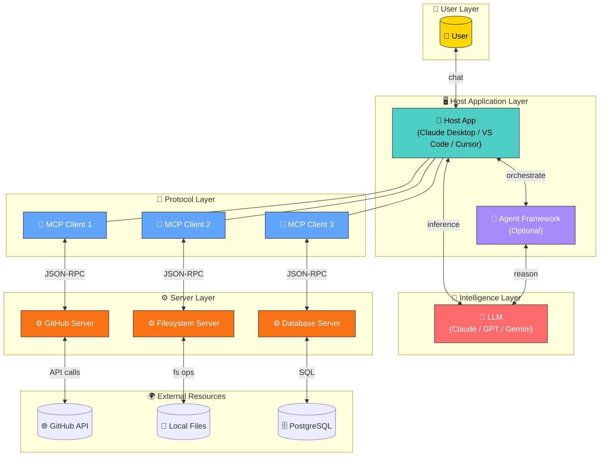
```mermaid
graph TB
    subgraph "👤 User Layer"
        U[("👤 User")]
    end

    subgraph "🖥️ Host Application Layer"
        H["📱 Host App<br/>(Claude Desktop / VS Code / Cursor)"]
        A["🤖 Agent Framework<br/>(Optional)"]
    end

    subgraph "🧠 Intelligence Layer"
        LLM["🧠 LLM<br/>(Claude / GPT / Gemini)"]
    end

    subgraph "🔌 Protocol Layer"
        C1["🔌 MCP Client 1"]
        C2["🔌 MCP Client 2"]
        C3["🔌 MCP Client 3"]
    end

    subgraph "⚙️ Server Layer"
        S1["⚙️ GitHub Server"]
        S2["⚙️ Filesystem Server"]
        S3["⚙️ Database Server"]
    end

    subgraph "🌍 External Resources"
        R1[("🌐 GitHub API")]
        R2[("📂 Local Files")]
        R3[("🗄️ PostgreSQL")]
    end

    U <-->|"chat"| H
    H <-->|"orchestrate"| A
    H <-->|"inference"| LLM
    A <-->|"reason"| LLM
    H --- C1 & C2 & C3
    C1 <-->|"JSON-RPC"| S1
    C2 <-->|"JSON-RPC"| S2
    C3 <-->|"JSON-RPC"| S3
    S1 <-->|"API calls"| R1
    S2 <-->|"fs ops"| R2
    S3 <-->|"SQL"| R3

    style U fill:#FFD700,stroke:#333,color:#000
    style LLM fill:#FF6B6B,stroke:#333,color:#fff
    style H fill:#4ECDC4,stroke:#333,color:#000
    style A fill:#A78BFA,stroke:#333,color:#fff
    style C1 fill:#60A5FA,stroke:#333,color:#fff
    style C2 fill:#60A5FA,stroke:#333,color:#fff
    style C3 fill:#60A5FA,stroke:#333,color:#fff
    style S1 fill:#F97316,stroke:#333,color:#fff
    style S2 fill:#F97316,stroke:#333,color:#fff
    style S3 fill:#F97316,stroke:#333,color:#fff
```

### Component တစ်ခုချင်းစီ၏ တာဝန်

#### 🧠 LLM (Large Language Model)

- User ၏ intent ကို နားလည်ခြင်း
- မည်သည့် tool ကို ခေါ်ရမည် ဆုံးဖြတ်ခြင်း
- Tool result များကို ခွဲခြမ်းစိတ်ဖြာခြင်း
- Final response ဖန်တီးခြင်း
- **⚠️ LLM သည် tool ကို ကိုယ်တိုင် execute မလုပ်ပါ** — Host/Client မှတစ်ဆင့်သာ

#### 📱 Host Application

- User interface ဖြစ်ခြင်း
- MCP Clients များ ဖန်တီး/စီမံခြင်း
- LLM ၏ tool call requests များကို routing လုပ်ခြင်း
- Security policies enforce လုပ်ခြင်း (user consent)
- Server ၏ capabilities discover လုပ်ခြင်း

#### 🔌 MCP Client

- Server နှင့် 1:1 stateful connection ထိန်းသိမ်းခြင်း
- JSON-RPC 2.0 messages ပို့/လက်ခံခြင်း
- Capability negotiation လုပ်ခြင်း
- Server ၏ tools/resources/prompts lists cache လုပ်ခြင်း

#### ⚙️ MCP Server

- Tools, Resources, Prompts expose လုပ်ခြင်း
- External systems နှင့် integrate လုပ်ခြင်း
- Security boundaries enforce လုပ်ခြင်း
- Lightweight & composable ဖြစ်ခြင်း

---

## 🏗️ Architecture Overview

### Layered Architecture

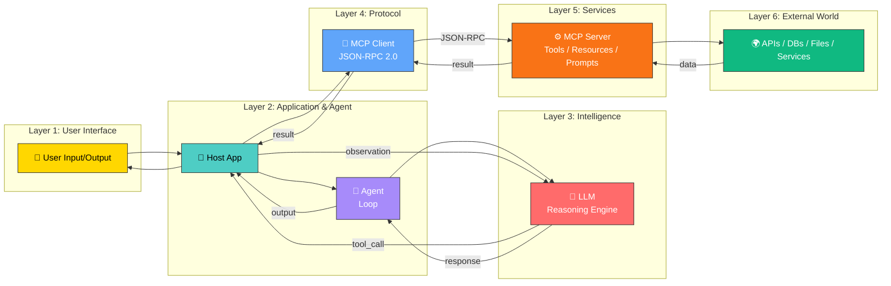
```mermaid
graph LR
    subgraph "Layer 1: User Interface"
        UI["👤 User Input/Output"]
    end

    subgraph "Layer 2: Application & Agent"
        HOST["📱 Host App"]
        AGENT["🤖 Agent<br/>Loop"]
    end

    subgraph "Layer 3: Intelligence"
        LLM["🧠 LLM<br/>Reasoning Engine"]
    end

    subgraph "Layer 4: Protocol"
        CLIENT["🔌 MCP Client<br/>JSON-RPC 2.0"]
    end

    subgraph "Layer 5: Services"
        SERVER["⚙️ MCP Server<br/>Tools / Resources / Prompts"]
    end

    subgraph "Layer 6: External World"
        EXT["🌍 APIs / DBs / Files / Services"]
    end

    UI --> HOST
    HOST --> AGENT
    AGENT --> LLM
    LLM -->|"tool_call"| HOST
    HOST --> CLIENT
    CLIENT -->|"JSON-RPC"| SERVER
    SERVER --> EXT
    EXT -->|"data"| SERVER
    SERVER -->|"result"| CLIENT
    CLIENT -->|"result"| HOST
    HOST -->|"observation"| LLM
    LLM -->|"response"| AGENT
    AGENT -->|"output"| HOST
    HOST --> UI

    style UI fill:#FFD700,stroke:#333,color:#000
    style HOST fill:#4ECDC4,stroke:#333,color:#000
    style AGENT fill:#A78BFA,stroke:#333,color:#fff
    style LLM fill:#FF6B6B,stroke:#333,color:#fff
    style CLIENT fill:#60A5FA,stroke:#333,color:#fff
    style SERVER fill:#F97316,stroke:#333,color:#fff
    style EXT fill:#10B981,stroke:#333,color:#fff
```

---

## 🔁 Connection Lifecycle

MCP connection ၏ lifecycle — initialization မှ shutdown အထိ —

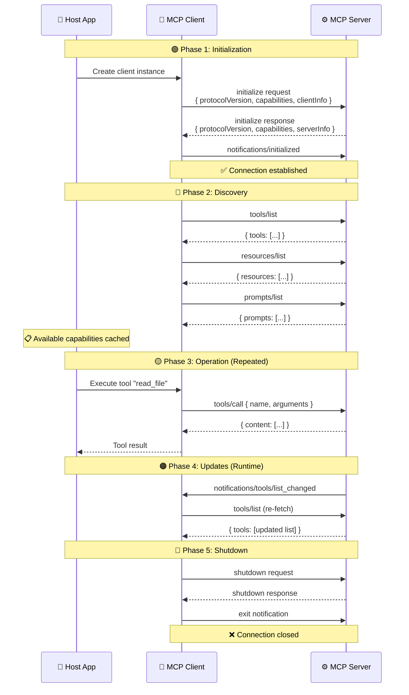
```mermaid
sequenceDiagram
    participant H as 📱 Host App
    participant C as 🔌 MCP Client
    participant S as ⚙️ MCP Server

    Note over H,S: 🟢 Phase 1: Initialization
    H->>C: Create client instance
    C->>S: initialize request<br/>{ protocolVersion, capabilities, clientInfo }
    S-->>C: initialize response<br/>{ protocolVersion, capabilities, serverInfo }
    C->>S: notifications/initialized
    Note over C,S: ✅ Connection established

    Note over H,S: 🔵 Phase 2: Discovery
    C->>S: tools/list
    S-->>C: { tools: [...] }
    C->>S: resources/list
    S-->>C: { resources: [...] }
    C->>S: prompts/list
    S-->>C: { prompts: [...] }
    Note over H: 📋 Available capabilities cached

    Note over H,S: 🟡 Phase 3: Operation (Repeated)
    H->>C: Execute tool "read_file"
    C->>S: tools/call { name, arguments }
    S-->>C: { content: [...] }
    C-->>H: Tool result

    Note over H,S: 🟠 Phase 4: Updates (Runtime)
    S->>C: notifications/tools/list_changed
    C->>S: tools/list (re-fetch)
    S-->>C: { tools: [updated list] }

    Note over H,S: 🔴 Phase 5: Shutdown
    C->>S: shutdown request
    S-->>C: shutdown response
    C->>S: exit notification
    Note over C,S: ❌ Connection closed
```

### Lifecycle Phases ရှင်းလင်းချက်

| Phase | Description |
|-------|-------------|
| **Initialize** | Protocol version negotiation, capability exchange |
| **Discovery** | Server ၏ tools/resources/prompts list ရယူခြင်း |
| **Operation** | Tool calls, resource reads, prompt gets — main work phase |
| **Updates** | Server-side changes notification (dynamic capabilities) |
| **Shutdown** | Graceful disconnection |

---

## 🛠️ Tool Call Workflow

User တစ်ယောက် tool တစ်ခုကို သုံးတဲ့အခါ ဘာတွေဖြစ်သလဲ —

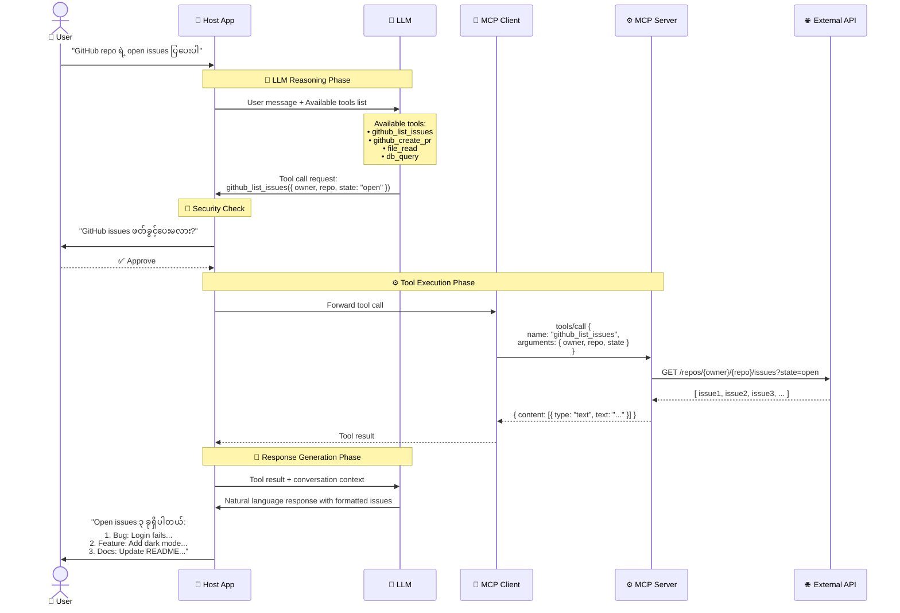
```mermaid
sequenceDiagram
    actor User as 👤 User
    participant Host as 📱 Host App
    participant LLM as 🧠 LLM
    participant Client as 🔌 MCP Client
    participant Server as ⚙️ MCP Server
    participant API as 🌐 External API

    User->>Host: "GitHub repo ရဲ့ open issues ပြပေးပါ"

    Note over Host,LLM: 🧠 LLM Reasoning Phase
    Host->>LLM: User message + Available tools list
    Note over LLM: Available tools:<br/>• github_list_issues<br/>• github_create_pr<br/>• file_read<br/>• db_query

    LLM->>Host: Tool call request:<br/>github_list_issues({ owner, repo, state: "open" })

    Note over Host: 🔐 Security Check
    Host->>User: "GitHub issues ဖတ်ခွင့်ပေးမလား?"
    User-->>Host: ✅ Approve

    Note over Host,Server: ⚙️ Tool Execution Phase
    Host->>Client: Forward tool call
    Client->>Server: tools/call {<br/>  name: "github_list_issues",<br/>  arguments: { owner, repo, state }<br/>}
    Server->>API: GET /repos/{owner}/{repo}/issues?state=open
    API-->>Server: [ issue1, issue2, issue3, ... ]
    Server-->>Client: { content: [{ type: "text", text: "..." }] }
    Client-->>Host: Tool result

    Note over Host,LLM: 🧠 Response Generation Phase
    Host->>LLM: Tool result + conversation context
    LLM->>Host: Natural language response with formatted issues

    Host->>User: "Open issues ၃ ခုရှိပါတယ်:<br/>1. Bug: Login fails...<br/>2. Feature: Add dark mode...<br/>3. Docs: Update README..."
```

### Tool Call Flow ၏ အဆင့်များ

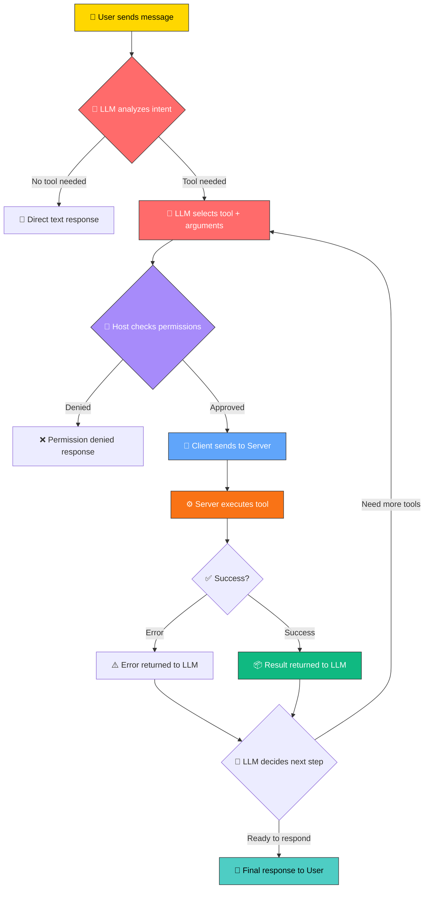
```mermaid
flowchart TD
    A["👤 User sends message"] --> B{"🧠 LLM analyzes intent"}
    B -->|"No tool needed"| C["📝 Direct text response"]
    B -->|"Tool needed"| D["🔧 LLM selects tool + arguments"]
    D --> E{"🔐 Host checks permissions"}
    E -->|"Denied"| F["❌ Permission denied response"]
    E -->|"Approved"| G["🔌 Client sends to Server"]
    G --> H["⚙️ Server executes tool"]
    H --> I{"✅ Success?"}
    I -->|"Error"| J["⚠️ Error returned to LLM"]
    I -->|"Success"| K["📦 Result returned to LLM"]
    J --> L{"🧠 LLM decides next step"}
    K --> L
    L -->|"Need more tools"| D
    L -->|"Ready to respond"| M["💬 Final response to User"]

    style A fill:#FFD700,stroke:#333,color:#000
    style B fill:#FF6B6B,stroke:#333,color:#fff
    style D fill:#FF6B6B,stroke:#333,color:#fff
    style E fill:#A78BFA,stroke:#333,color:#fff
    style G fill:#60A5FA,stroke:#333,color:#fff
    style H fill:#F97316,stroke:#333,color:#fff
    style K fill:#10B981,stroke:#333,color:#fff
    style M fill:#4ECDC4,stroke:#333,color:#000
```

---

## 📦 Resource Access Workflow

MCP Resources (data/content) ကို access လုပ်ပုံ —

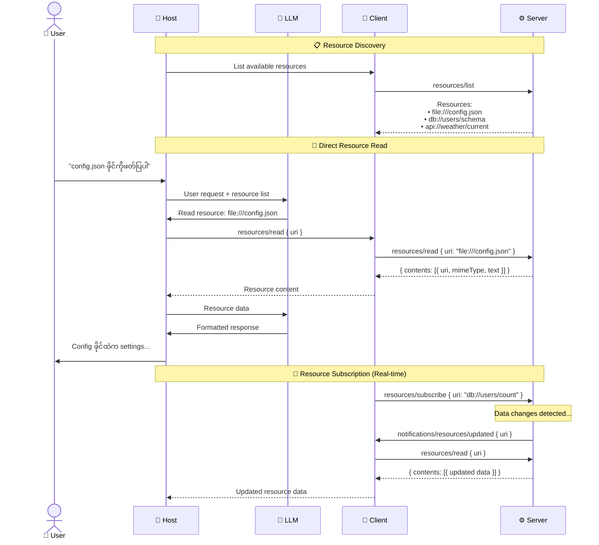
```mermaid
sequenceDiagram
    actor User as 👤 User
    participant Host as 📱 Host
    participant LLM as 🧠 LLM
    participant Client as 🔌 Client
    participant Server as ⚙️ Server

    Note over Host,Server: 📋 Resource Discovery
    Host->>Client: List available resources
    Client->>Server: resources/list
    Server-->>Client: Resources:<br/>• file:///config.json<br/>• db://users/schema<br/>• api://weather/current

    Note over Host,Server: 📖 Direct Resource Read
    User->>Host: "config.json ဖိုင်ကိုဖတ်ပြပါ"
    Host->>LLM: User request + resource list
    LLM->>Host: Read resource: file:///config.json
    Host->>Client: resources/read { uri }
    Client->>Server: resources/read { uri: "file:///config.json" }
    Server-->>Client: { contents: [{ uri, mimeType, text }] }
    Client-->>Host: Resource content
    Host->>LLM: Resource data
    LLM->>Host: Formatted response
    Host->>User: Config ဖိုင်ထဲက settings...

    Note over Host,Server: 🔔 Resource Subscription (Real-time)
    Client->>Server: resources/subscribe { uri: "db://users/count" }
    Note over Server: Data changes detected...
    Server->>Client: notifications/resources/updated { uri }
    Client->>Server: resources/read { uri }
    Server-->>Client: { contents: [{ updated data }] }
    Client-->>Host: Updated resource data
```

### Resources vs Tools ကွာခြားချက်

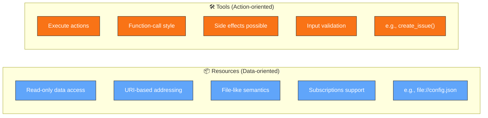
```mermaid
graph LR
    subgraph "📦 Resources (Data-oriented)"
        R1["Read-only data access"]
        R2["URI-based addressing"]
        R3["File-like semantics"]
        R4["Subscriptions support"]
        R5["e.g., file://config.json"]
    end

    subgraph "🛠️ Tools (Action-oriented)"
        T1["Execute actions"]
        T2["Function-call style"]
        T3["Side effects possible"]
        T4["Input validation"]
        T5["e.g., create_issue()"]
    end

    style R1 fill:#60A5FA,stroke:#333,color:#fff
    style R2 fill:#60A5FA,stroke:#333,color:#fff
    style R3 fill:#60A5FA,stroke:#333,color:#fff
    style R4 fill:#60A5FA,stroke:#333,color:#fff
    style R5 fill:#60A5FA,stroke:#333,color:#fff
    style T1 fill:#F97316,stroke:#333,color:#fff
    style T2 fill:#F97316,stroke:#333,color:#fff
    style T3 fill:#F97316,stroke:#333,color:#fff
    style T4 fill:#F97316,stroke:#333,color:#fff
    style T5 fill:#F97316,stroke:#333,color:#fff
```

---

## 💬 Prompt Template Workflow

Server-defined prompt templates ကို သုံးပုံ —

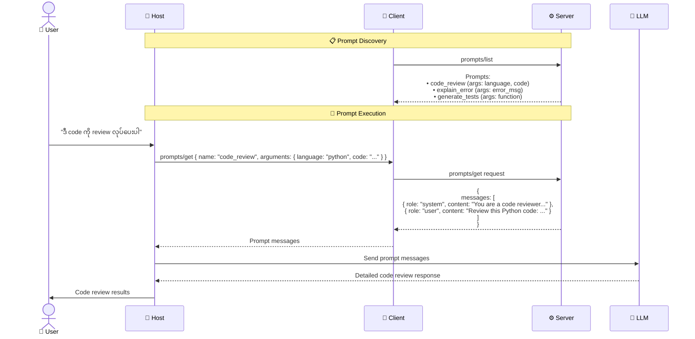
```mermaid
sequenceDiagram
    actor User as 👤 User
    participant Host as 📱 Host
    participant Client as 🔌 Client
    participant Server as ⚙️ Server
    participant LLM as 🧠 LLM

    Note over Host,Server: 📋 Prompt Discovery
    Client->>Server: prompts/list
    Server-->>Client: Prompts:<br/>• code_review (args: language, code)<br/>• explain_error (args: error_msg)<br/>• generate_tests (args: function)

    Note over Host,Server: 💬 Prompt Execution
    User->>Host: "ဒီ code ကို review လုပ်ပေးပါ"
    Host->>Client: prompts/get { name: "code_review", arguments: { language: "python", code: "..." } }
    Client->>Server: prompts/get request
    Server-->>Client: {<br/>  messages: [<br/>    { role: "system", content: "You are a code reviewer..." },<br/>    { role: "user", content: "Review this Python code: ..." }<br/>  ]<br/>}
    Client-->>Host: Prompt messages
    Host->>LLM: Send prompt messages
    LLM-->>Host: Detailed code review response
    Host->>User: Code review results
```

---

## 🤖 Agentic Workflow

Agent သည် LLM + Tools ပေါင်းစပ်ပြီး autonomous loop ဖြင့် complex tasks ကို ဖြေရှင်းပါသည် —

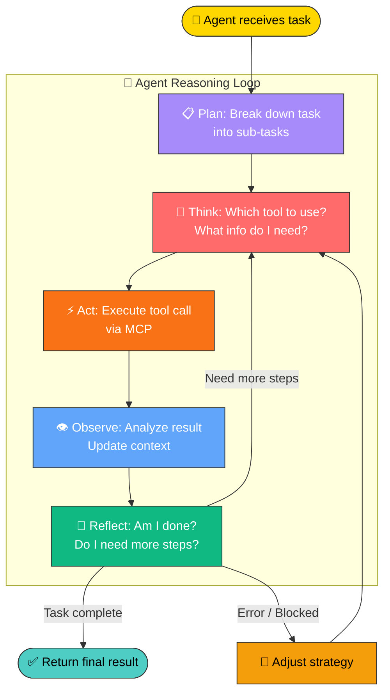
```mermaid
flowchart TD
    START(["🚀 Agent receives task"]) --> PLAN

    subgraph "🧠 Agent Reasoning Loop"
        PLAN["📋 Plan: Break down task<br/>into sub-tasks"]
        THINK["🤔 Think: Which tool to use?<br/>What info do I need?"]
        ACT["⚡ Act: Execute tool call<br/>via MCP"]
        OBSERVE["👁️ Observe: Analyze result<br/>Update context"]
        REFLECT["🔄 Reflect: Am I done?<br/>Do I need more steps?"]
    end

    PLAN --> THINK
    THINK --> ACT
    ACT --> OBSERVE
    OBSERVE --> REFLECT
    REFLECT -->|"Need more steps"| THINK
    REFLECT -->|"Task complete"| DONE(["✅ Return final result"])
    REFLECT -->|"Error / Blocked"| RETRY["🔧 Adjust strategy"]
    RETRY --> THINK

    style START fill:#FFD700,stroke:#333,color:#000
    style PLAN fill:#A78BFA,stroke:#333,color:#fff
    style THINK fill:#FF6B6B,stroke:#333,color:#fff
    style ACT fill:#F97316,stroke:#333,color:#fff
    style OBSERVE fill:#60A5FA,stroke:#333,color:#fff
    style REFLECT fill:#10B981,stroke:#333,color:#fff
    style DONE fill:#4ECDC4,stroke:#333,color:#000
    style RETRY fill:#F59E0B,stroke:#333,color:#000
```

### Agentic Loop — Detailed Sequence

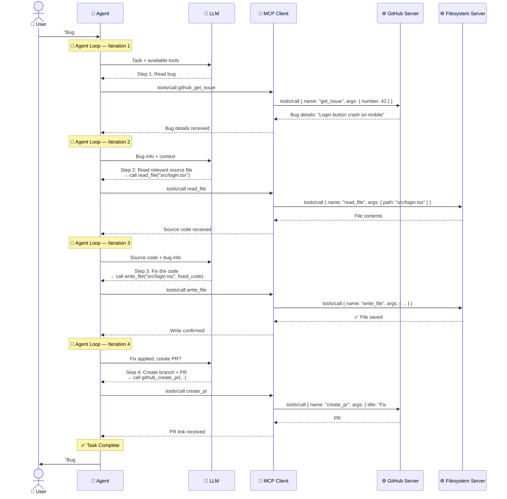
```mermaid
sequenceDiagram
    actor User as 👤 User
    participant Agent as 🤖 Agent
    participant LLM as 🧠 LLM
    participant Client as 🔌 MCP Client
    participant S1 as ⚙️ GitHub Server
    participant S2 as ⚙️ Filesystem Server

    User->>Agent: "Bug #42 ကို fix ပြီး PR တင်ပေးပါ"

    Note over Agent: 🔄 Agent Loop — Iteration 1
    Agent->>LLM: Task + available tools
    LLM-->>Agent: Step 1: Read bug #42 details<br/>→ call github_get_issue(42)
    Agent->>Client: tools/call github_get_issue
    Client->>S1: tools/call { name: "get_issue", args: { number: 42 } }
    S1-->>Client: Bug details: "Login button crash on mobile"
    Client-->>Agent: Bug details received

    Note over Agent: 🔄 Agent Loop — Iteration 2
    Agent->>LLM: Bug info + context
    LLM-->>Agent: Step 2: Read relevant source file<br/>→ call read_file("src/login.tsx")
    Agent->>Client: tools/call read_file
    Client->>S2: tools/call { name: "read_file", args: { path: "src/login.tsx" } }
    S2-->>Client: File contents
    Client-->>Agent: Source code received

    Note over Agent: 🔄 Agent Loop — Iteration 3
    Agent->>LLM: Source code + bug info
    LLM-->>Agent: Step 3: Fix the code<br/>→ call write_file("src/login.tsx", fixed_code)
    Agent->>Client: tools/call write_file
    Client->>S2: tools/call { name: "write_file", args: { ... } }
    S2-->>Client: ✅ File saved
    Client-->>Agent: Write confirmed

    Note over Agent: 🔄 Agent Loop — Iteration 4
    Agent->>LLM: Fix applied, create PR?
    LLM-->>Agent: Step 4: Create branch + PR<br/>→ call github_create_pr(...)
    Agent->>Client: tools/call create_pr
    Client->>S1: tools/call { name: "create_pr", args: { title: "Fix #42", ... } }
    S1-->>Client: PR #99 created
    Client-->>Agent: PR link received

    Note over Agent: ✅ Task Complete
    Agent->>User: "Bug #42 ကို fix ပြီး PR #99 တင်ပေးပြီးပါပြီ!"
```

### Agent Types နှင့် MCP Integration

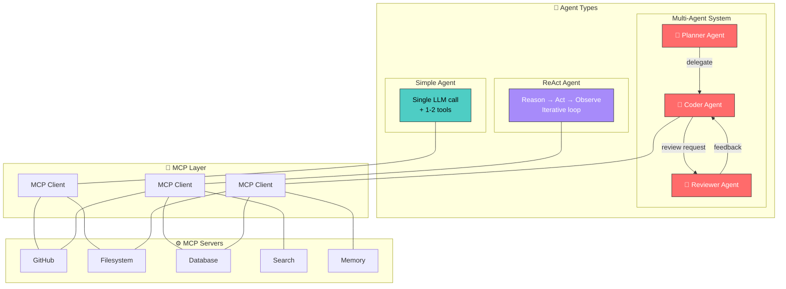
```mermaid
graph TB
    subgraph "🤖 Agent Types"
        subgraph "Simple Agent"
            SA["Single LLM call<br/>+ 1-2 tools"]
        end

        subgraph "ReAct Agent"
            RA["Reason → Act → Observe<br/>Iterative loop"]
        end

        subgraph "Multi-Agent System"
            MA1["🤖 Planner Agent"]
            MA2["🤖 Coder Agent"]
            MA3["🤖 Reviewer Agent"]
            MA1 -->|"delegate"| MA2
            MA2 -->|"review request"| MA3
            MA3 -->|"feedback"| MA2
        end
    end

    subgraph "🔌 MCP Layer"
        MC1["MCP Client"]
        MC2["MCP Client"]
        MC3["MCP Client"]
    end

    subgraph "⚙️ MCP Servers"
        MS1["GitHub"]
        MS2["Filesystem"]
        MS3["Database"]
        MS4["Search"]
        MS5["Memory"]
    end

    SA --- MC1
    RA --- MC2
    MA2 --- MC3
    MC1 --- MS1 & MS2
    MC2 --- MS1 & MS3 & MS4
    MC3 --- MS2 & MS3 & MS5

    style SA fill:#4ECDC4,stroke:#333,color:#000
    style RA fill:#A78BFA,stroke:#333,color:#fff
    style MA1 fill:#FF6B6B,stroke:#333,color:#fff
    style MA2 fill:#FF6B6B,stroke:#333,color:#fff
    style MA3 fill:#FF6B6B,stroke:#333,color:#fff
```

---

## 🔄 Multi-Server Architecture

Host app တစ်ခုက MCP servers အများကြီးနှင့် တစ်ပြိုင်နက် ချိတ်ဆက်နိုင်ပါသည် —

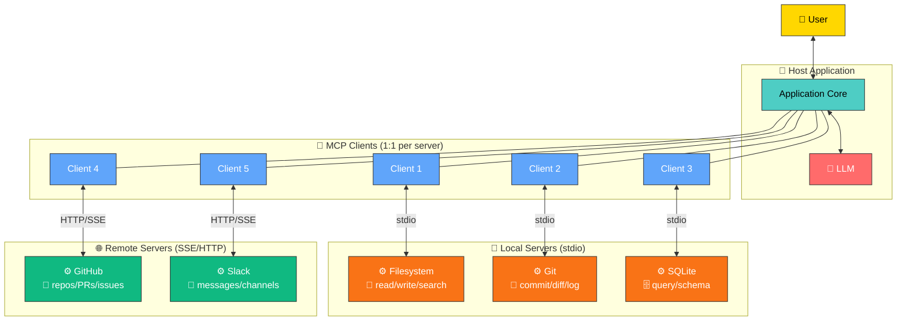
```mermaid
graph TB
    USER["👤 User"] <--> HOST

    subgraph HOST_APP["📱 Host Application"]
        HOST["Application Core"]
        LLM["🧠 LLM"]
        HOST <--> LLM
    end

    subgraph CLIENTS["🔌 MCP Clients (1:1 per server)"]
        C1["Client 1"]
        C2["Client 2"]
        C3["Client 3"]
        C4["Client 4"]
        C5["Client 5"]
    end

    subgraph LOCAL["📂 Local Servers (stdio)"]
        S1["⚙️ Filesystem<br/>📂 read/write/search"]
        S2["⚙️ Git<br/>🔀 commit/diff/log"]
        S3["⚙️ SQLite<br/>🗄️ query/schema"]
    end

    subgraph REMOTE["🌐 Remote Servers (SSE/HTTP)"]
        S4["⚙️ GitHub<br/>🐙 repos/PRs/issues"]
        S5["⚙️ Slack<br/>💬 messages/channels"]
    end

    HOST --- C1 & C2 & C3 & C4 & C5
    C1 <-->|"stdio"| S1
    C2 <-->|"stdio"| S2
    C3 <-->|"stdio"| S3
    C4 <-->|"HTTP/SSE"| S4
    C5 <-->|"HTTP/SSE"| S5

    style USER fill:#FFD700,stroke:#333,color:#000
    style HOST fill:#4ECDC4,stroke:#333,color:#000
    style LLM fill:#FF6B6B,stroke:#333,color:#fff
    style C1 fill:#60A5FA,stroke:#333,color:#fff
    style C2 fill:#60A5FA,stroke:#333,color:#fff
    style C3 fill:#60A5FA,stroke:#333,color:#fff
    style C4 fill:#60A5FA,stroke:#333,color:#fff
    style C5 fill:#60A5FA,stroke:#333,color:#fff
    style S1 fill:#F97316,stroke:#333,color:#fff
    style S2 fill:#F97316,stroke:#333,color:#fff
    style S3 fill:#F97316,stroke:#333,color:#fff
    style S4 fill:#10B981,stroke:#333,color:#fff
    style S5 fill:#10B981,stroke:#333,color:#fff
```

### Tool Aggregation — LLM ၏ tool selection

LLM သည် connected servers အားလုံး၏ tools ကို **unified list** အနေနှင့် မြင်ပါသည် —

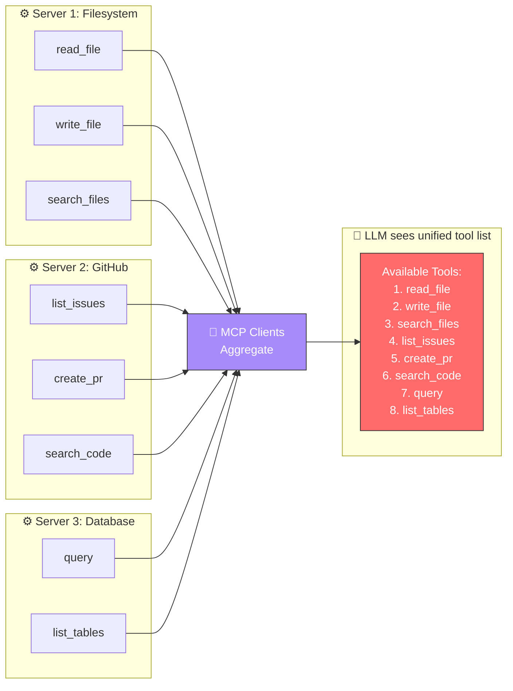
```mermaid
graph LR
    subgraph "⚙️ Server 1: Filesystem"
        T1["read_file"]
        T2["write_file"]
        T3["search_files"]
    end

    subgraph "⚙️ Server 2: GitHub"
        T4["list_issues"]
        T5["create_pr"]
        T6["search_code"]
    end

    subgraph "⚙️ Server 3: Database"
        T7["query"]
        T8["list_tables"]
    end

    AGG["🔌 MCP Clients<br/>Aggregate"]

    T1 & T2 & T3 --> AGG
    T4 & T5 & T6 --> AGG
    T7 & T8 --> AGG

    AGG --> LLM_VIEW

    subgraph "🧠 LLM sees unified tool list"
        LLM_VIEW["Available Tools:<br/>1. read_file<br/>2. write_file<br/>3. search_files<br/>4. list_issues<br/>5. create_pr<br/>6. search_code<br/>7. query<br/>8. list_tables"]
    end

    style AGG fill:#A78BFA,stroke:#333,color:#fff
    style LLM_VIEW fill:#FF6B6B,stroke:#333,color:#fff
```

---

## 🧠 LLM Decision Loop

LLM က tool call ဘယ်လို ဆုံးဖြတ်သလဲ —

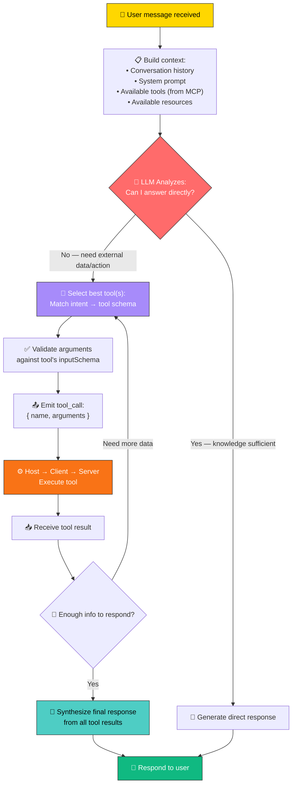
```mermaid
flowchart TD
    INPUT["📨 User message received"] --> CONTEXT["📋 Build context:<br/>• Conversation history<br/>• System prompt<br/>• Available tools (from MCP)<br/>• Available resources"]

    CONTEXT --> ANALYZE{"🧠 LLM Analyzes:<br/>Can I answer directly?"}

    ANALYZE -->|"Yes — knowledge sufficient"| DIRECT["💬 Generate direct response"]
    ANALYZE -->|"No — need external data/action"| SELECT

    SELECT["🔧 Select best tool(s):<br/>Match intent → tool schema"] --> VALIDATE["✅ Validate arguments<br/>against tool's inputSchema"]

    VALIDATE --> CALL["📤 Emit tool_call:<br/>{ name, arguments }"]
    CALL --> EXECUTE["⚙️ Host → Client → Server<br/>Execute tool"]
    EXECUTE --> RESULT["📥 Receive tool result"]

    RESULT --> ENOUGH{"🧠 Enough info to respond?"}
    ENOUGH -->|"Need more data"| SELECT
    ENOUGH -->|"Yes"| SYNTHESIZE["📝 Synthesize final response<br/>from all tool results"]
    SYNTHESIZE --> RESPOND["💬 Respond to user"]

    DIRECT --> RESPOND

    style INPUT fill:#FFD700,stroke:#333,color:#000
    style ANALYZE fill:#FF6B6B,stroke:#333,color:#fff
    style SELECT fill:#A78BFA,stroke:#333,color:#fff
    style EXECUTE fill:#F97316,stroke:#333,color:#fff
    style SYNTHESIZE fill:#4ECDC4,stroke:#333,color:#000
    style RESPOND fill:#10B981,stroke:#333,color:#fff
```

### Tool Selection Logic — ဥပမာ

```
User: "production database ထဲက users table ရဲ့ row count ပြပေး"

🧠 LLM Reasoning:
  ├── Intent: query database for row count
  ├── Available tools scan:
  │   ├── ❌ read_file — file system, not database
  │   ├── ❌ github_search — GitHub, not database
  │   ├── ✅ db_query — matches! can run SQL
  │   └── ❌ web_search — not needed
  ├── Selected: db_query
  ├── Arguments: { sql: "SELECT COUNT(*) FROM users" }
  └── Emit: tool_call("db_query", { sql: "SELECT COUNT(*) FROM users" })
```

---

## 🌐 Real-World Use Case — Travel Agent

MCP servers အများကြီး ပေါင်းသုံးပြီး travel planning agent တစ်ခု ဘယ်လိုအလုပ်လုပ်သလဲ —

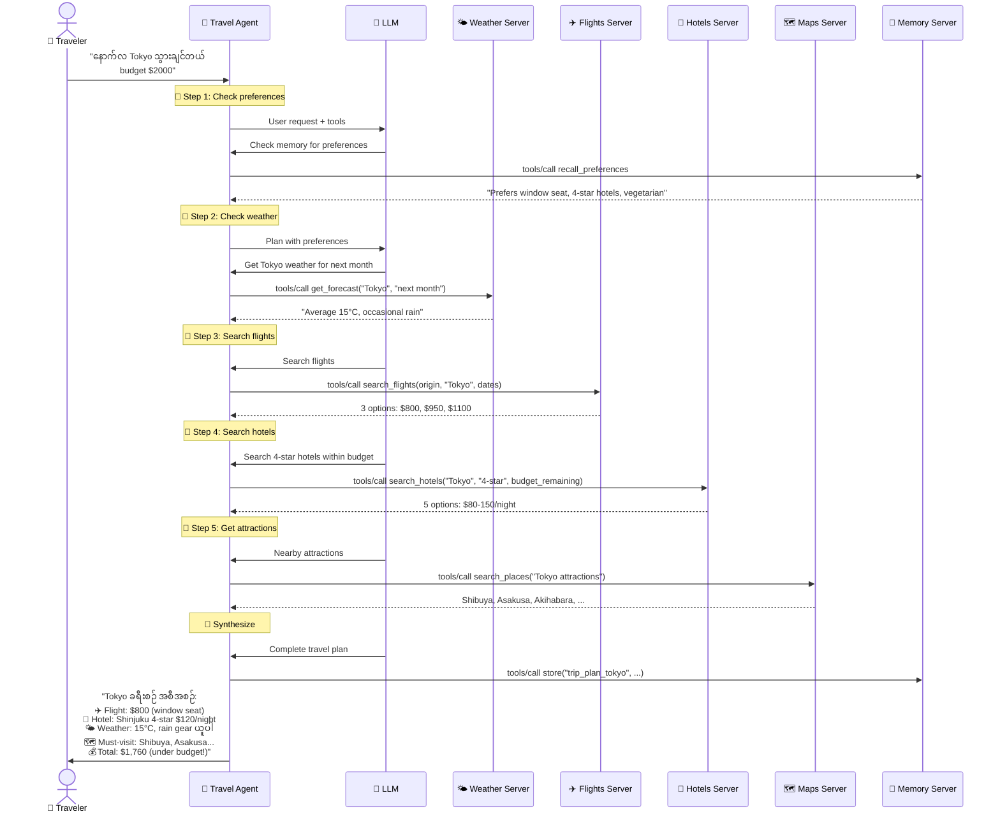
```mermaid
sequenceDiagram
    actor User as 👤 Traveler
    participant Agent as 🤖 Travel Agent
    participant LLM as 🧠 LLM
    participant Weather as 🌤️ Weather Server
    participant Flights as ✈️ Flights Server
    participant Hotels as 🏨 Hotels Server
    participant Maps as 🗺️ Maps Server
    participant Memory as 🧠 Memory Server

    User->>Agent: "နောက်လ Tokyo သွားချင်တယ်<br/>budget $2000"

    Note over Agent: 🔄 Step 1: Check preferences
    Agent->>LLM: User request + tools
    LLM->>Agent: Check memory for preferences
    Agent->>Memory: tools/call recall_preferences
    Memory-->>Agent: "Prefers window seat, 4-star hotels, vegetarian"

    Note over Agent: 🔄 Step 2: Check weather
    Agent->>LLM: Plan with preferences
    LLM->>Agent: Get Tokyo weather for next month
    Agent->>Weather: tools/call get_forecast("Tokyo", "next month")
    Weather-->>Agent: "Average 15°C, occasional rain"

    Note over Agent: 🔄 Step 3: Search flights
    LLM->>Agent: Search flights
    Agent->>Flights: tools/call search_flights(origin, "Tokyo", dates)
    Flights-->>Agent: 3 options: $800, $950, $1100

    Note over Agent: 🔄 Step 4: Search hotels
    LLM->>Agent: Search 4-star hotels within budget
    Agent->>Hotels: tools/call search_hotels("Tokyo", "4-star", budget_remaining)
    Hotels-->>Agent: 5 options: $80-150/night

    Note over Agent: 🔄 Step 5: Get attractions
    LLM->>Agent: Nearby attractions
    Agent->>Maps: tools/call search_places("Tokyo attractions")
    Maps-->>Agent: Shibuya, Asakusa, Akihabara, ...

    Note over Agent: 📝 Synthesize
    LLM->>Agent: Complete travel plan
    Agent->>Memory: tools/call store("trip_plan_tokyo", ...)

    Agent->>User: "Tokyo ခရီးစဉ် အစီအစဉ်:<br/>✈️ Flight: $800 (window seat)<br/>🏨 Hotel: Shinjuku 4-star $120/night<br/>🌤️ Weather: 15°C, rain gear ယူပါ<br/>🗺️ Must-visit: Shibuya, Asakusa...<br/>💰 Total: $1,760 (under budget!)"
```

---

## 🔐 Security & Trust Boundaries

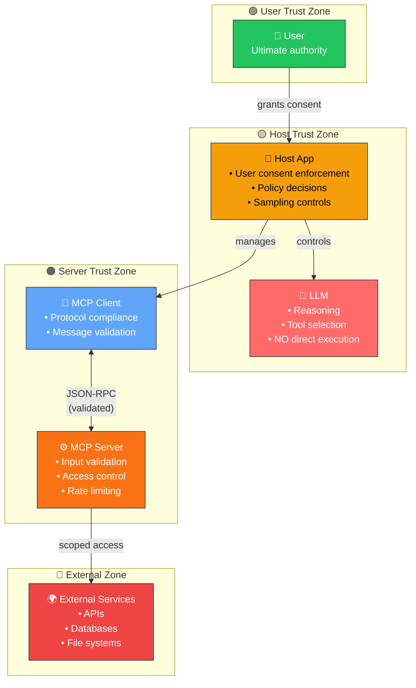
```mermaid
graph TB
    subgraph TRUST_USER["🟢 User Trust Zone"]
        USER["👤 User<br/>Ultimate authority"]
    end

    subgraph TRUST_HOST["🟡 Host Trust Zone"]
        HOST["📱 Host App<br/>• User consent enforcement<br/>• Policy decisions<br/>• Sampling controls"]
        LLM["🧠 LLM<br/>• Reasoning<br/>• Tool selection<br/>• NO direct execution"]
    end

    subgraph TRUST_SERVER["🟠 Server Trust Zone"]
        CLIENT["🔌 MCP Client<br/>• Protocol compliance<br/>• Message validation"]
        SERVER["⚙️ MCP Server<br/>• Input validation<br/>• Access control<br/>• Rate limiting"]
    end

    subgraph TRUST_EXT["🔴 External Zone"]
        EXT["🌍 External Services<br/>• APIs<br/>• Databases<br/>• File systems"]
    end

    USER -->|"grants consent"| HOST
    HOST -->|"controls"| LLM
    HOST -->|"manages"| CLIENT
    CLIENT <-->|"JSON-RPC<br/>(validated)"| SERVER
    SERVER -->|"scoped access"| EXT

    style USER fill:#22C55E,stroke:#333,color:#fff
    style HOST fill:#F59E0B,stroke:#333,color:#000
    style LLM fill:#FF6B6B,stroke:#333,color:#fff
    style CLIENT fill:#60A5FA,stroke:#333,color:#fff
    style SERVER fill:#F97316,stroke:#333,color:#fff
    style EXT fill:#EF4444,stroke:#333,color:#fff
```

### Security Rules

| Rule | Description |
|------|-------------|
| **User Consent** | Sensitive operations (file write, API calls) → user approval လိုအပ်ခြင်း |
| **Principle of Least Privilege** | Server တစ်ခုစီ ၎င်း၏ scope အတွင်းသာ access ရခြင်း |
| **LLM Cannot Execute** | LLM သည် tool ကို ကိုယ်တိုင်မခေါ်နိုင် — Host မှတစ်ဆင့်သာ |
| **Input Validation** | Server သည် tool arguments ကို schema ဖြင့် validate လုပ်ခြင်း |
| **No Cross-Server Access** | Server တစ်ခုသည် အခြား server ၏ data ကို access မလုပ်နိုင်ခြင်း |
| **Transport Security** | Remote servers → TLS/HTTPS encryption |

---

## 📊 Message Flow — Protocol Level

JSON-RPC 2.0 messages တကယ် ဘယ်လိုသွားသလဲ —

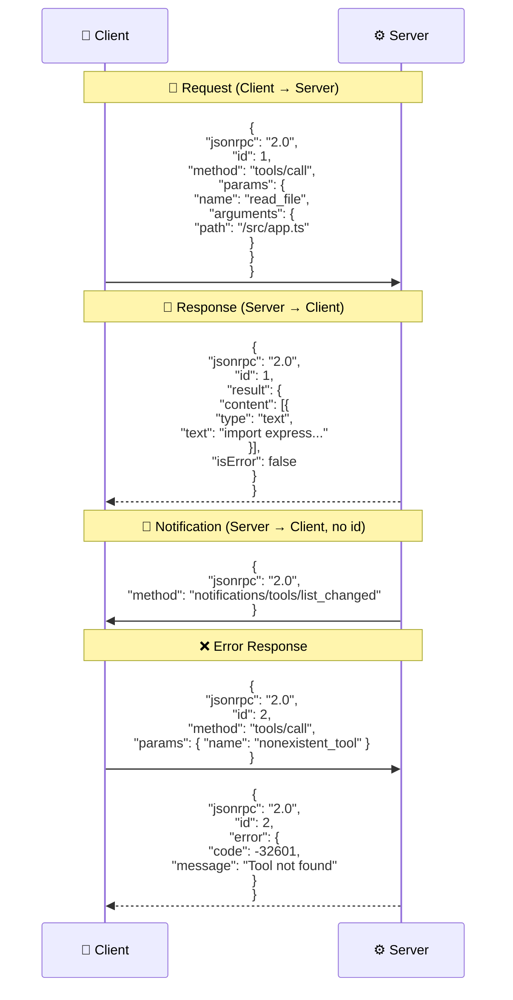
```mermaid
sequenceDiagram
    participant C as 🔌 Client
    participant S as ⚙️ Server

    Note over C,S: 📨 Request (Client → Server)
    C->>S: {<br/>  "jsonrpc": "2.0",<br/>  "id": 1,<br/>  "method": "tools/call",<br/>  "params": {<br/>    "name": "read_file",<br/>    "arguments": {<br/>      "path": "/src/app.ts"<br/>    }<br/>  }<br/>}

    Note over C,S: 📩 Response (Server → Client)
    S-->>C: {<br/>  "jsonrpc": "2.0",<br/>  "id": 1,<br/>  "result": {<br/>    "content": [{<br/>      "type": "text",<br/>      "text": "import express..."<br/>    }],<br/>    "isError": false<br/>  }<br/>}

    Note over C,S: 🔔 Notification (Server → Client, no id)
    S->>C: {<br/>  "jsonrpc": "2.0",<br/>  "method": "notifications/tools/list_changed"<br/>}

    Note over C,S: ❌ Error Response
    C->>S: {<br/>  "jsonrpc": "2.0",<br/>  "id": 2,<br/>  "method": "tools/call",<br/>  "params": { "name": "nonexistent_tool" }<br/>}
    S-->>C: {<br/>  "jsonrpc": "2.0",<br/>  "id": 2,<br/>  "error": {<br/>    "code": -32601,<br/>    "message": "Tool not found"<br/>  }<br/>}
```

---

## ⚡ Transport Layer

MCP သည် transport protocol ၂ မျိုးကို support လုပ်ပါသည် —

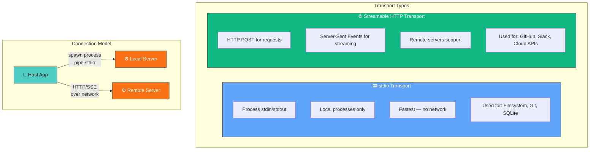
```mermaid
graph TB
    subgraph "Transport Types"
        subgraph STDIO["📟 stdio Transport"]
            P1["Process stdin/stdout"]
            P2["Local processes only"]
            P3["Fastest — no network"]
            P4["Used for: Filesystem, Git, SQLite"]
        end

        subgraph SSE["🌐 Streamable HTTP Transport"]
            H1["HTTP POST for requests"]
            H2["Server-Sent Events for streaming"]
            H3["Remote servers support"]
            H4["Used for: GitHub, Slack, Cloud APIs"]
        end
    end

    subgraph "Connection Model"
        CM["📱 Host App"]
        CM -->|"spawn process<br/>pipe stdio"| LOCAL["⚙️ Local Server"]
        CM -->|"HTTP/SSE<br/>over network"| REMOTE["⚙️ Remote Server"]
    end

    style STDIO fill:#60A5FA,stroke:#333,color:#fff
    style SSE fill:#10B981,stroke:#333,color:#fff
    style LOCAL fill:#F97316,stroke:#333,color:#fff
    style REMOTE fill:#F97316,stroke:#333,color:#fff
    style CM fill:#4ECDC4,stroke:#333,color:#000
```

### Transport Comparison

| Feature | stdio | Streamable HTTP |
|---------|-------|-----------------|
| **Speed** | ⚡ Fastest | 🔄 Network dependent |
| **Setup** | Simple process spawn | HTTP server required |
| **Location** | Local only | Local + Remote |
| **Security** | Process isolation | TLS + Auth tokens |
| **Streaming** | Native stdin/stdout | SSE (Server-Sent Events) |
| **Use Case** | Dev tools, local files | Cloud APIs, shared services |

---

## 🏭 Production Deployment

Production environment တွင် MCP ကို deploy လုပ်ပုံ —

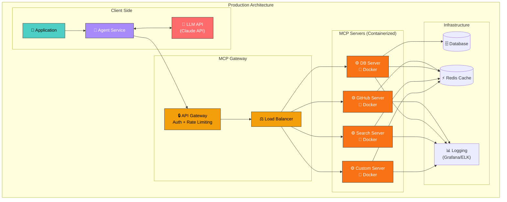
```mermaid
graph TB
    subgraph "Production Architecture"
        subgraph "Client Side"
            APP["📱 Application"]
            AG["🤖 Agent Service"]
            LLM_API["🧠 LLM API<br/>(Claude API)"]
        end

        subgraph "MCP Gateway"
            GW["🔒 API Gateway<br/>Auth + Rate Limiting"]
            LB["⚖️ Load Balancer"]
        end

        subgraph "MCP Servers (Containerized)"
            S1["⚙️ GitHub Server<br/>🐳 Docker"]
            S2["⚙️ DB Server<br/>🐳 Docker"]
            S3["⚙️ Search Server<br/>🐳 Docker"]
            S4["⚙️ Custom Server<br/>🐳 Docker"]
        end

        subgraph "Infrastructure"
            DB[("🗄️ Database")]
            CACHE[("⚡ Redis Cache")]
            LOG["📊 Logging<br/>(Grafana/ELK)"]
        end
    end

    APP --> AG
    AG <--> LLM_API
    AG --> GW
    GW --> LB
    LB --> S1 & S2 & S3 & S4
    S2 --> DB
    S1 & S2 & S3 & S4 --> CACHE
    S1 & S2 & S3 & S4 --> LOG

    style APP fill:#4ECDC4,stroke:#333,color:#000
    style AG fill:#A78BFA,stroke:#333,color:#fff
    style LLM_API fill:#FF6B6B,stroke:#333,color:#fff
    style GW fill:#F59E0B,stroke:#333,color:#000
    style LB fill:#F59E0B,stroke:#333,color:#000
    style S1 fill:#F97316,stroke:#333,color:#fff
    style S2 fill:#F97316,stroke:#333,color:#fff
    style S3 fill:#F97316,stroke:#333,color:#fff
    style S4 fill:#F97316,stroke:#333,color:#fff
```

---

## 📝 Summary — အကျဉ်းချုပ်

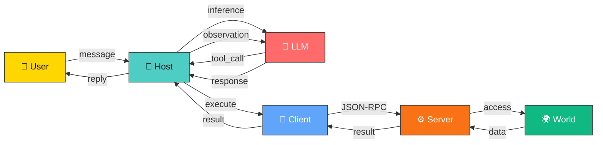
```mermaid
graph LR
    A["👤 User"] -->|"message"| B["📱 Host"]
    B -->|"inference"| C["🧠 LLM"]
    C -->|"tool_call"| B
    B -->|"execute"| D["🔌 Client"]
    D -->|"JSON-RPC"| E["⚙️ Server"]
    E -->|"access"| F["🌍 World"]
    F -->|"data"| E
    E -->|"result"| D
    D -->|"result"| B
    B -->|"observation"| C
    C -->|"response"| B
    B -->|"reply"| A

    style A fill:#FFD700,stroke:#333,color:#000
    style B fill:#4ECDC4,stroke:#333,color:#000
    style C fill:#FF6B6B,stroke:#333,color:#fff
    style D fill:#60A5FA,stroke:#333,color:#fff
    style E fill:#F97316,stroke:#333,color:#fff
    style F fill:#10B981,stroke:#333,color:#fff
```

### Data Flow တစ်ခုလုံး (တစ်ကြောင်းတည်း)

```
👤 User → 📱 Host → 🧠 LLM → [tool_call] → 📱 Host → 🔌 Client → ⚙️ Server → 🌍 API
                                                                        ↩️ result
                              🧠 LLM ← [observation] ← 📱 Host ← 🔌 Client
                                    ↓
                              💬 Final Response → 📱 Host → 👤 User
```

### Key Takeaways

1. **LLM သည် ဉာဏ်ရည်** — ဘာလုပ်ရမလဲ ဆုံးဖြတ်သည်၊ ကိုယ်တိုင် execute မလုပ်
2. **Host သည် အုပ်ချုပ်သူ** — security, consent, routing စီမံသည်
3. **Client သည် သံတမန်** — Server နှင့် protocol level ချိတ်ဆက်သည်
4. **Server သည် ကျွမ်းကျင်သူ** — specific domain/tool ကို expose လုပ်သည်
5. **Agent သည် autonomous** — LLM + Tools loop ဖြင့် complex tasks ဖြေရှင်းသည်
6. **Protocol သည် standard** — JSON-RPC 2.0, transport-agnostic, composable

---

> **References:**  
> [MCP Specification](https://spec.modelcontextprotocol.io/) • [MCP Docs](https://modelcontextprotocol.io/) • [GitHub - MCP Servers](https://github.com/modelcontextprotocol/servers)
