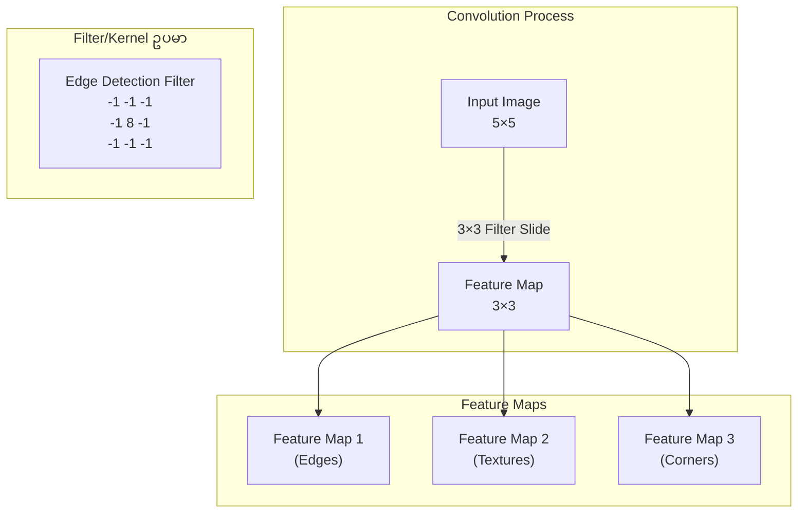
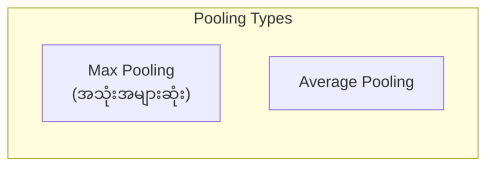
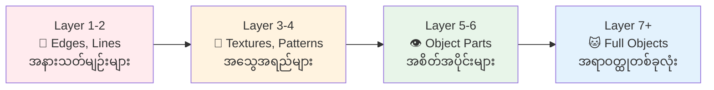
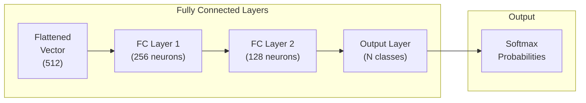
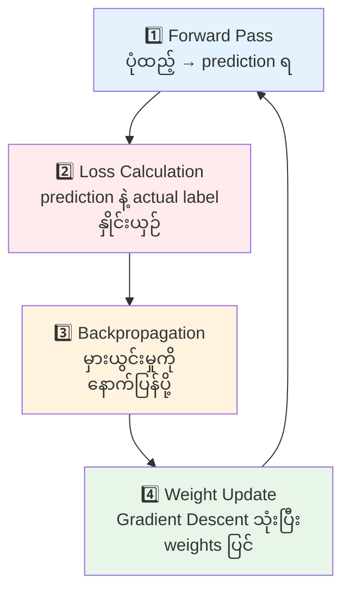
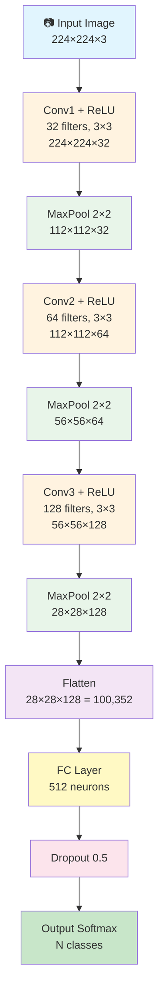

# Convolutional Neural Network (CNN) - အလုပ်လုပ်ပုံ အသေးစိတ်

## 1. CNN ဆိုတာ ဘာလဲ?

CNN (Convolutional Neural Network) ဆိုတာ **image (ဓာတ်ပုံ)** တွေကို process လုပ်ဖို့ အထူးဒီဇိုင်းလုပ်ထားတဲ့ Deep Learning model တစ်မျိုးဖြစ်ပါတယ်။ လူ့မျက်လုံးက ပုံတစ်ပုံကို ကြည့်တဲ့အခါ edge, texture, shape, object စတာတွေကို အဆင့်ဆင့် ခွဲခြားသိမြင်သလိုမျိုး CNN ကလည်း ဒီနည်းအတိုင်း အလုပ်လုပ်ပါတယ်။

---

## 2. CNN ရဲ့ Overall Architecture

```mermaid
graph LR
    A["🖼️ Input Image"] --> B["🔍 Convolutional Layer"]
    B --> C["⚡ Activation (ReLU)"]
    C --> D["📉 Pooling Layer"]
    D --> E["🔍 Conv + ReLU + Pool\n(ထပ်ခါထပ်ခါ)"]
    E --> F["📊 Flatten"]
    F --> G["🧠 Fully Connected Layer"]
    G --> H["📋 Output (Classification)"]

    style A fill:#e1f5fe
    style B fill:#fff3e0
    style C fill:#fce4ec
    style D fill:#e8f5e9
    style E fill:#fff3e0
    style F fill:#f3e5f5
    style G fill:#fff9c4
    style H fill:#c8e6c9
```



---

## 3. အဆင့်တိုင်း အသေးစိတ် ရှင်းလင်းချက်

### 3.1 Input Image (ပုံထည့်သွင်းခြင်း)

ပုံတစ်ပုံကို CNN ထဲ ထည့်တဲ့အခါ **pixel values** တွေပါတဲ့ **matrix (tensor)** အဖြစ် ပြောင်းပါတယ်။

| Image Type | Shape | ရှင်းလင်းချက် |
|-----------|-------|--------------|
| Grayscale | (H, W, 1) | Channel 1 ခုပဲ (အဖြူအမည်း) |
| Color (RGB) | (H, W, 3) | Red, Green, Blue channel 3 ခု |

**ဥပမာ:** 224×224 RGB ပုံ → `(224, 224, 3)` tensor

```
ပုံတစ်ပုံ (3x3 grayscale ဥပမာ):

┌─────┬─────┬─────┐
│ 150 │ 200 │  50 │
├─────┼─────┼─────┤
│ 100 │ 255 │  75 │
├─────┼─────┼─────┤
│  30 │ 180 │ 220 │
└─────┴─────┴─────┘

pixel values: 0 (အမည်း) မှ 255 (အဖြူ)
```

---

### 3.2 Convolutional Layer (Convolution အလွှာ) ⭐ အရေးအကြီးဆုံး

Convolution ဆိုတာ **filter (kernel)** ဟုခေါ်တဲ့ သေးငယ်တဲ့ matrix ကို input image ပေါ်မှာ **slide** လုပ်ရင်း feature တွေ ထုတ်ယူတဲ့ လုပ်ငန်းစဉ်ဖြစ်ပါတယ်။



#### Convolution တွက်ပုံ (Element-wise Multiplication + Sum)

```
Input (5×5):                    Filter (3×3):
┌────┬────┬────┬────┬────┐      ┌────┬────┬────┐
│  1 │  0 │  1 │  0 │  1 │      │  1 │  0 │  1 │
├────┼────┼────┼────┼────┤      ├────┼────┼────┤
│  0 │  1 │  0 │  1 │  0 │      │  0 │  1 │  0 │
├────┼────┼────┼────┼────┤      ├────┼────┼────┤
│  1 │  0 │  1 │  0 │  1 │      │  1 │  0 │  1 │
├────┼────┼────┼────┼────┤      └────┴────┴────┘
│  0 │  1 │  0 │  1 │  0 │
├────┼────┼────┼────┼────┤
│  1 │  0 │  1 │  0 │  1 │
└────┴────┴────┴────┴────┘

ပထမ position (top-left):
(1×1) + (0×0) + (1×1) + (0×0) + (1×1) + (0×0) + (1×1) + (0×0) + (1×1) = 5

Output Feature Map (3×3):
┌────┬────┬────┐
│  5 │  2 │  5 │
├────┼────┼────┤
│  2 │  5 │  2 │
├────┼────┼────┤
│  5 │  2 │  5 │
└────┴────┴────┘
```

#### အရေးကြီးတဲ့ Terms:

| Term | ရှင်းလင်းချက် |
|------|--------------|
| **Filter/Kernel** | Feature ထုတ်ယူတဲ့ weight matrix (3×3, 5×5, 7×7) |
| **Stride** | Filter ရွေ့တဲ့ အကွာအဝေး (stride=1 ဆို 1 pixel ချင်းရွေ့) |
| **Padding** | Input ပတ်ပတ်လည် 0 တွေထည့်ခြင်း (output size ထိန်းရန်) |
| **Feature Map** | Convolution ပြီးနောက် ရလာတဲ့ output |

#### Padding Types:

```
"Valid" (No Padding):           "Same" (Zero Padding):
Input: 5×5                      Input: 5×5 + padding
Filter: 3×3                     Filter: 3×3
Output: 3×3 (size ကျ)          Output: 5×5 (size တူ)

┌───────────┐                   0  0  0  0  0  0  0
│  x x x x x│                   0 ┌───────────┐ 0
│  x x x x x│                   0 │ x x x x x │ 0
│  x x x x x│                   0 │ x x x x x │ 0
│  x x x x x│                   0 │ x x x x x │ 0
│  x x x x x│                   0 │ x x x x x │ 0
└───────────┘                   0 │ x x x x x │ 0
                                0 └───────────┘ 0
                                 0  0  0  0  0  0  0
```

#### Output Size Formula:

$$\text{Output Size} = \frac{W - F + 2P}{S} + 1$$

- $W$ = Input width
- $F$ = Filter size
- $P$ = Padding
- $S$ = Stride

---

### 3.3 Activation Function (ReLU)

Convolution ပြီးရင် **non-linearity** ထည့်ဖို့ activation function သုံးပါတယ်။ အသုံးအများဆုံးက **ReLU (Rectified Linear Unit)** ဖြစ်ပါတယ်။

$$f(x) = \max(0, x)$$

```
ReLU: အနှုတ်ကိန်းတွေကို 0 ပြောင်း၊ အပေါင်းကိန်းတွေကို ဒီအတိုင်းထား

Before ReLU:              After ReLU:
┌─────┬─────┬─────┐      ┌─────┬─────┬─────┐
│  5  │ -3  │  2  │      │  5  │  0  │  2  │
├─────┼─────┼─────┤      ├─────┼─────┼─────┤
│ -1  │  4  │ -2  │  →   │  0  │  4  │  0  │
├─────┼─────┼─────┤      ├─────┼─────┼─────┤
│  3  │ -5  │  1  │      │  3  │  0  │  1  │
└─────┴─────┴─────┘      └─────┴─────┴─────┘
```

#### ဘာကြောင့် ReLU သုံးလဲ?
- **ရိုးရှင်းတယ်** - တွက်ရလွယ်
- **Vanishing Gradient Problem** ကို ဖြေရှင်းပေးတယ်
- Training **မြန်**တယ်

---

### 3.4 Pooling Layer (Downsampling)

Feature map ရဲ့ **size ကို လျှော့ချ**ပြီး အရေးကြီးတဲ့ feature တွေကိုပဲ ထိန်းထားတဲ့ အဆင့်ဖြစ်ပါတယ်။



#### Max Pooling (2×2, stride=2) ဥပမာ:

```
Input (4×4):                    Output (2×2):
┌─────┬─────┬─────┬─────┐      ┌─────┬─────┐
│  1  │  3  │  2  │  4  │      │     │     │
├─────┼─────┤─────┼─────┤  →   │  6  │  8  │
│  5  │  6  │  7  │  8  │      │     │     │
├─────┼─────┼─────┼─────┤      ├─────┼─────┤
│  3  │  2  │  1  │  0  │      │     │     │
├─────┼─────┤─────┼─────┤      │  3  │  4  │
│  1  │  1  │  3  │  4  │      │     │     │
└─────┴─────┴─────┴─────┘      └─────┴─────┘

max(1,3,5,6)=6   max(2,4,7,8)=8
max(3,2,1,1)=3   max(1,0,3,4)=4
```

#### Pooling ရဲ့ အကျိုးကျေးဇူးများ:
- **Computation လျှော့ချ** - parameter နည်းသွား
- **Translation Invariance** - object ရဲ့ တည်နေရာ အနည်းငယ် ပြောင်းလဲလည်း မှတ်မိနိုင်
- **Overfitting လျှော့ချ**

---

### 3.5 Feature Hierarchy (Feature အဆင့်ဆင့်)

CNN layer များ ပိုများလာတာနဲ့အမျှ ရှာတွေ့တဲ့ feature တွေက ပိုရှုပ်ထွေးလာပါတယ်။



```
Layer 1: Edge Detection     → | / — \
Layer 2: Texture Detection  → 🔲🔳 patterns
Layer 3: Object Parts       → 👁️ 👃 👄 (မျက်လုံး၊ နှာခေါင်း)
Layer 4: Full Object        → 🐱 😊 🚗 (ကြောင်, လူ, ကား)
```

---

### 3.6 Flatten Layer

Pooling ပြီးသား 2D feature maps တွေကို **1D vector** အဖြစ် ဖြန့်ချပါတယ်။ Fully Connected Layer ထဲ ထည့်ဖို့ လိုအပ်ပါတယ်။

```
Feature Maps (2×2×3):              Flattened Vector (12×1):

Channel 1:  Channel 2:  Channel 3:     ┌───┐
┌───┬───┐  ┌───┬───┐  ┌───┬───┐       │ 5 │
│ 5 │ 3 │  │ 2 │ 1 │  │ 4 │ 6 │       │ 3 │
├───┼───┤  ├───┼───┤  ├───┼───┤  →    │ 8 │
│ 8 │ 1 │  │ 7 │ 4 │  │ 9 │ 2 │       │ 1 │
└───┴───┘  └───┴───┘  └───┴───┘       │ 2 │
                                        │ 1 │
                                        │ 7 │
                                        │ 4 │
                                        │ 4 │
                                        │ 6 │
                                        │ 9 │
                                        │ 2 │
                                        └───┘
```

---

### 3.7 Fully Connected (Dense) Layer

Flatten ပြီးသား vector ကို **classification** လုပ်တဲ့ အဆင့်ဖြစ်ပါတယ်။ ရိုးရိုး Neural Network လိုပဲ neuron တိုင်း ချိတ်ဆက်ထားပါတယ်။



---

### 3.8 Output Layer (Softmax)

နောက်ဆုံး layer မှာ **Softmax** function သုံးပြီး class တစ်ခုချင်းဆီအတွက် **probability** ထုတ်ပေးပါတယ်။

$$\sigma(z_i) = \frac{e^{z_i}}{\sum_{j=1}^{K} e^{z_j}}$$

```
ဥပမာ: ကြောင်/ခွေး/ငှက် ခွဲခြားခြင်း

Output Probabilities:
┌──────────┬──────────┐
│  ကြောင်   │   0.85   │ ████████░░  85% ✓ (အများဆုံး)
├──────────┼──────────┤
│  ခွေး     │   0.10   │ █░░░░░░░░░  10%
├──────────┼──────────┤
│  ငှက်     │   0.05   │ ░░░░░░░░░░   5%
└──────────┴──────────┘

ပေါင်းလဒ် = 1.00 (100%)
→ ဒီပုံက "ကြောင်" ဖြစ်တယ်ဆို ခန့်မှန်း
```

---

## 4. Training Process (လေ့ကျင့်ပုံ)



### Training Steps:

1. **Forward Pass** - ပုံကို CNN ထဲ ဖြတ်သန်းစေပြီး prediction ရယူ
2. **Loss Calculation** - prediction နဲ့ actual label ကို **Cross-Entropy Loss** နဲ့ နှိုင်းယှဉ်
3. **Backpropagation** - loss ကနေ gradient တွေ တွက်ပြီး filter weights တွေဆီ နောက်ပြန်ပို့
4. **Weight Update** - **Gradient Descent** (Adam, SGD) သုံးပြီး weights/filters ကို update

$$\text{Cross-Entropy Loss} = -\sum_{i=1}^{C} y_i \log(\hat{y}_i)$$

$$w_{new} = w_{old} - \alpha \cdot \frac{\partial L}{\partial w}$$

- $\alpha$ = Learning Rate
- $\frac{\partial L}{\partial w}$ = Loss ရဲ့ weight အပေါ် gradient

---

## 5. CNN Full Pipeline Summary



---

## 6. အသုံးများတဲ့ CNN Architectures

| Architecture | Year | Layers | Key Innovation |
|-------------|------|--------|---------------|
| **LeNet-5** | 1998 | 5 | CNN ရဲ့ ဖခင်၊ digit recognition |
| **AlexNet** | 2012 | 8 | ReLU + Dropout + GPU training |
| **VGGNet** | 2014 | 16/19 | 3×3 filter သေးသေးသုံး |
| **GoogLeNet** | 2014 | 22 | Inception module |
| **ResNet** | 2015 | 50/101/152 | Skip connections |
| **EfficientNet** | 2019 | varies | Compound scaling |

---

## 7. Key Concepts Summary

```
CNN = Feature Extraction (Conv layers) + Classification (FC layers)

Feature Extraction:
┌──────────────────────────────────────────────┐
│  [Conv → ReLU → Pool] × N                    │
│  low-level features → high-level features    │
└──────────────────────────────────────────────┘
                    ↓
Classification:
┌──────────────────────────────────────────────┐
│  Flatten → FC → Dropout → Softmax            │
│  features → probabilities                     │
└──────────────────────────────────────────────┘
```

### မှတ်သားရန်:
- **Convolution** = Feature ထုတ်ယူ (filter/kernel slides over image)
- **ReLU** = Non-linearity ထည့် (negative → 0)
- **Pooling** = Size လျှော့ + important features ထိန်း
- **Flatten** = 2D → 1D vector ပြောင်း
- **Fully Connected** = Classification လုပ်
- **Softmax** = Probability output ထုတ်
- **Backpropagation** = Weights သင်ယူပြင်ဆင်
